# AgentSkill（渐进式披露工作流）

## 0. 这一套解决什么问题

同一套工作流，覆盖：
- 科研：方向模糊→检索→头脑风暴→可验证/可复现 idea；或对已有 idea 审查打分并给修改建议；或协助实现并验证。
- 工程：从零搭建或接手不完整代码；做架构/选型；细拆任务；编码与测试；评审打分。
- 写作：教程/文档/论文/报告；先对齐受众与风格；图示丰富；引用可追溯；最后做一致性与可运行性验证。
- 简单任务：直达执行，但保留最小验证与影响说明。

核心方法：**先路由，再按需加载规则**（渐进式披露）。

默认输出语言：简体中文（术语保留英文）。

---

## 1. 目录结构（模块化）

```text
AgentSkill/
├── SKILL.md
├── State.md
├── stages/
│   ├── router/SKILL.md
│   ├── brainstorm/SKILL.md
│   ├── research/SKILL.md
│   ├── plan/SKILL.md
│   ├── execute/SKILL.md
│   ├── validate/SKILL.md
│   ├── review/SKILL.md
│   └── write/SKILL.md
├── library/
│   ├── 00-index.md
│   └── *.md
├── examples/
│   ├── _index.md
│   └── */
└── templates/
    ├── State.template.md
    ├── Plan.template.md
    ├── Task.template.md
    ├── AcceptanceContract.template.md
    ├── ReproProtocol-Research.template.md
    ├── ReproProtocol-Software.template.md
    ├── ReproProtocol-Writing.template.md
    ├── ReviewRubric-Research.template.md
    ├── ReviewRubric-Software.template.md
    └── ReviewRubric-Writing.template.md
```

> 规则：除 Router 外，不要一次性阅读所有 stages；只读“下一步需要的那一个”。

---

## 2. 全局硬约束（写在最前面）

### 2.1 证据优先

没有新鲜证据，不得宣称：完成/通过/修复/正确/可复现。

### 2.2 进度与记忆必须落盘

长期事实写进 `State.md`，不要只留在对话里：
- 约束/偏好/决策/风险/证据入口

### 2.2.1 每轮启动协议（Anti-drift Boot，必须执行）

> 目的：防止“跑着跑着忘了 skill/忘了门禁/忘了 Plan/Task”的漂移问题；让长任务能跨多轮稳定推进。

每一轮（每条用户新消息）都必须按顺序执行：
1) **读取 `State.md`（如存在）**：刷新当前 Track/Level/边界/执行授权/阻塞点/下一步。
2) **先 Router 再行动**：按 `stages/router/SKILL.md` 路由出“唯一下一阶段”，再只加载那一个 stage 的规则。
3) **把“当前模式”写清**（L2/L3 强制）：
   - 每次对外回复开头必须带一行回执，避免误判进入执行：
     - `【Mode】<Plan/Execute/Write/Validate/Review> | Level=<L?> | ExecutionAuth=<required/received/not_required>`
4) **Plan/Task 是契约**：
   - 一旦存在 `Plan.md`/`Task.md`，它们就是“本轮的可执行规范”（SDD 的 spec）。
   - 执行阶段的任何代码/文档改动都必须能映射到 Task（否则先回 Plan 更新 Plan/Task，再请求授权）。
5) **严格执行授权口令**：
   - 为避免误判：进入 Execute/Write 的唯一授权口令是用户**单独回复** **`开始执行`**（建议独立消息或独立一行）。
   - 不得从“确认/继续/好的/ok/收到/你看着办”等语句推断授权。
6) **每轮结束必须写“可续跑状态”**：
   - 更新 `State.md`：Progress（做到哪）、Risks/Assumptions（变了什么）、Evidence Index（新证据）、以及 **Next Action（下一步要做什么）**。

7) **上下文压缩/交接摘要不是停机信号**：
   - 对话历史变短、出现“交接摘要/压缩总结”等请求时：把它视为“维护工件”，不是任务完成。
   - 摘要输出必须同时给出 **Resumption Block**（可续跑块）：
     - 当前 Mode/Level/ExecutionAuth
     - 当前任务组（Task Group）与检查点（checkpoint/milestone/final）
     - Next Action（下一步 1–3 个动作，按顺序）
     - Blockers（阻塞点与最小输入）
     - Remaining（Task.md 中未完成项的计数或列表入口）
   - 默认策略：摘要写完继续推进未完成任务（遵守 Plan/Task 与执行授权门禁）；只有当用户明确写出“仅输出摘要”或“暂停”时才停止推进。

#### Boot → 门禁 → 恢复（示意图）

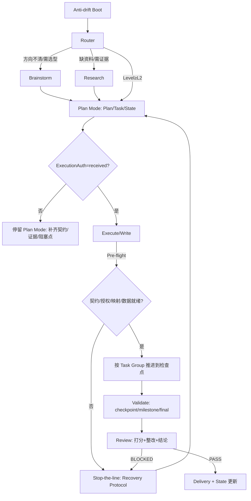

### 2.3 避免“兜底代码/无意义小函数”（Software）

- 默认禁止在实现中引入“兜底/降级”逻辑来掩盖错误或偷换验收。
- 需要兜底时：必须在 Plan 阶段与用户对齐并落盘（触发条件 → 行为 → 成本/副作用 → 对验收的影响 → 如何验证/如何观测）；执行阶段不得擅自新增。
- 小函数拆分必须带来可读性/复用性/测试性收益，否则不拆。

### 2.4 边界与禁区

- **禁止执行阶段擅自降级**：
  - 不得在 Execute/Write 阶段擅自降低验收标准、弱化需求、删减范围来“让任务看起来完成”。
  - 需求/验收变化必须回到 Plan：更新 Plan/Task/（L3）验收契约，并写入 Decision Log。
- **禁止执行阶段擅自兜底**：
  - Plan 中未明确且用户未确认的兜底/降级策略，一律不得在实现里偷偷加入。
  - 遇到不可实现/缺依赖/环境不满足：必须停止推进并报告阻塞点，等待用户决策（继续补齐依赖 / 修改验收 / 明确兜底策略）。

### 2.4.1 违规恢复协议（Recovery Protocol，必须执行）

> 目的：当发生“越权执行/偏离 Plan/Task/跳过真数据门禁/无证据宣称通过”等事故时，立刻把系统拉回可控状态。

一旦发现任一违规（或用户指出违规）：
1) **立刻停止推进**：不继续写代码/不继续扩范围/不继续补“看起来能跑”的兜底。
2) **按类型处理**：
   - 未授权执行（ExecutionAuth!=received 但发生了改动）：
     - 标记为事故；在 `State.md` Decision Log 记录“发生了什么 + 影响范围 + 回滚/补救计划”
     - 回到 Plan Mode：补齐 Plan/Task，并重新走授权门禁（用户单独回复 `开始执行`）
   - 偏离 Plan/Task（做了未约定的改动/偷换验收/擅自降级）：
     - 回到 Plan：更新验收/边界/Task，并请求用户确认变更（不要在 Execute 里硬改）
   - 验证门禁违规（例如 synthetic 未经确认、无证据宣称通过）：
     - Validate 结论只能是 `missing/failed`，回到 Plan/Execute 补齐数据与证据
3) **把“可续跑状态”落盘**：State.md 必须写清 Next Action（下一步 1–3 个动作 + 阻塞点）。


### 2.5 图示规范（允许混用）

- Mermaid：默认首选（流程、系统关系、路由、状态机）
- PlantUML：适合类图/时序图（当读者关心对象关系或交互）
- ASCII/表格：对比表、参数表、异常/边界可读性

要求：每张图必须有图名/图注，说明它在解释什么。

---

## 2.6 Plan Mode（对齐模式）与执行授权（Execution Authorization）

> 目的：把“大任务先对齐再执行”写成硬门禁，避免边做边猜、边做边改导致返工爆炸。

### 2.6.1 两相系统（Plan Mode → Execution Mode）

当 Level ≥ L2（多步骤任务）：
- **默认处于 Plan Mode**：只允许“理解与对齐”，不进入真实执行。
- 为避免误判：只有当用户**单独回复** **`开始执行`**（建议独立消息或独立一行）后，才进入 **Execution Mode**。

Plan Mode 允许的动作（可做）：
1) 深读材料：用户文档/代码/数据说明（先读再动）
2) Research：高质量来源检索与来源落盘（必要时联网）
3) 规划落盘：生成/更新 `Plan.md` + `Task.md`（必要时补治理模板与验证矩阵）

Plan Mode 禁止的动作（不可做）：
- 改动目标代码/配置/生产环境
- 除 `Plan.md`/`Task.md`/`State.md`/治理模板外，修改任何“交付物”（代码/脚本/配置/文档/实验产物）
- 进入长时间训练/长时间运行（除非仅用于获取必须证据，且用户已授权执行）
- 任何破坏性操作（删除、覆盖、迁移）与不可逆行为

Execution Mode 的规则（授权后必须做到）：
- **按 Task 一次性推进到完成**：不在中途反复要求用户做选择；只有“阻塞/风险授权/范围变更”才停下。
- **按“任务组→验证检查点”的节奏推进**：
  - Task.md 的小任务必须归入清晰的“大标题/任务组”（例如按组件/里程碑分组）。
  - 在同一任务组内可以连续完成多个小任务；当到达该组的 **Validate Checkpoint** 时再统一验证并落盘证据。
  - 里程碑完成后做一次 **Milestone Validate**（更宽的回归/性能/规范检查）。
  - 全部任务完成后做 **Final Validate → Review → Delivery Report**（总验证与总评审）。

### 2.6.2 执行授权的落盘要求（必须）

执行授权不是一句口头承诺，必须落盘成可复查记录（Plan/State 二选一也行，但建议两处都有）：

```text
Execution Authorization
- status: required | received | not_required
- token: 开始执行
- time: YYYY-MM-DD HH:MM
- scope: 本次允许执行的范围/目录/环境
```

---

## 2.7 软件工程工程观（思想 / 意识 / 方法 / 架构）

> 这一节不是“额外补充”，而是这套工作流的底层操作系统：让任务在规模变大、领域变广时仍然可控。

### 思想：工程 = 可验证的改变（Evidence-driven change）

- 先定义**可验收**的断言（Acceptance / AC-XXX），再实现。
- 先跑最短反馈回路，再扩展（迭代与反馈优先于长计划）。
- 任何“完成/通过/正确/可复现”的说法，必须能指向证据入口（State.md Evidence Index）。

参考落点：
- `library/requirements-acceptance.md`
- `library/testing-verification.md`

### 意识：复杂度是头号敌人（Complexity awareness）

- 工作代码不等于好工程；要为未来变更投资（战略性，而不是战术堆砌）。
- 把复杂度压到模块内部（deep modules / information hiding），避免信息泄漏与浅封装。
- 默认不写兜底/降级来掩盖错误；确需兜底时，必须在 Plan 中写清并经用户确认（触发条件/成本/对验收影响/验证方式）。

参考落点：
- `library/complexity-modularity.md`

### 方法：短回路 + 门禁 + 返工策略（Process with gates）

- 把任务拆成可在一次迭代内验收的最小单元（Task）。
- 每轮都要：Execute → Validate（证据）→ Review（打分+整改）。
- 门禁优先级：
  - **validation failed**：必须 BLOCKED 返工复评
  - **validation missing**：必须提醒风险，由用户决定是否返工（默认建议补齐）

参考落点：
- `library/iteration-feedback.md`
- `library/project-governance.md`

### 架构：架构是决策的集合（Architecture as decisions）

- 先明确 stakeholders & concerns，再谈方案；先明确质量属性（performance/reliability/security/maintainability...），再谈框架。
- 用 ADR（Decision Log）把取舍显式化，避免“隐形架构”。
- 用架构描述（组件边界、依赖方向、关键交互路径）让讨论可落盘、可复查。

参考落点：
- `library/architecture-tradeoffs.md`

### 工程实践的最小闭环（图）

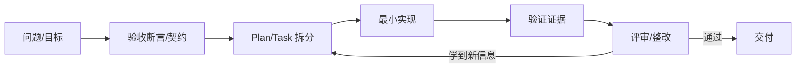

**SVG（精排版）**：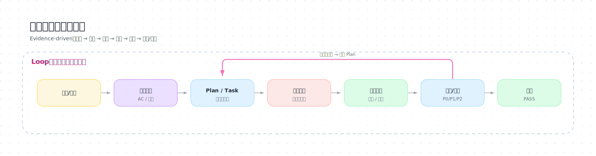

---

## 2.8 SWEBOK 视角（把软件工程知识域落到阶段）

> 目的：把“软件工程方法论”变成可执行动作，而不是抽象口号。

| SWEBOK 知识域（示例） | 在本工作流的落点 | 主要工件 |
|---|---|---|
| Requirements（需求） | Brainstorm / Plan | Plan（验收标准/AC-XXX） |
| Architecture（架构） | Brainstorm / Plan | Decision Log + 架构图 |
| Design（设计） | Plan / Execute | Task（边界/接口/约束） |
| Construction（构建） | Execute | 代码/脚本/实现产物 + 最小验证证据 |
| Testing（测试） | Validate | 证据入口（命令/日志） |
| Quality（质量） | Review | 评分与整改清单 |
| Security（安全） | Router / Plan / Validate | 风险门禁 + 安全检查 |
| Management（管理） | Plan / Review | 里程碑/依赖/变更控制 |
| Operations（运维） | Plan / Execute / Validate | 运行边界、诊断路径、健康检查 |
| Maintenance（维护） | Review / Plan | 变更控制、模块边界、决策记录 |

对应的可执行清单在：`library/00-index.md`。

---

## 3. 总体架构（图）

### 3.1 组件关系

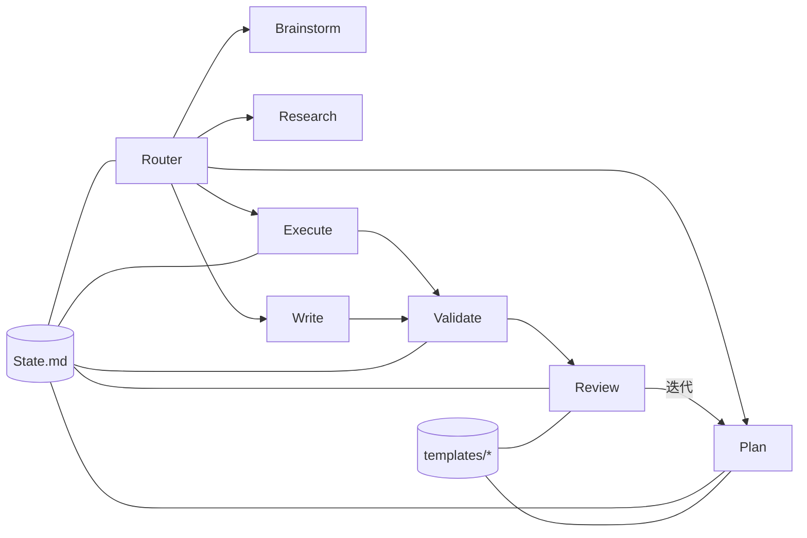

**SVG（精排版）**：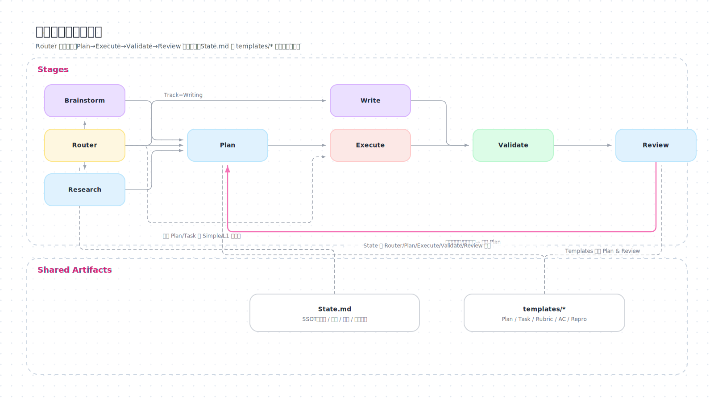

### 3.2 主流程（从输入到交付）

```mermaid
flowchart TD
  U[用户输入/材料] --> R[Router: Track×WorkType×Level×风险]
  R -->|方向不清| BS[Brainstorm]
  R -->|缺资料/需证据| RS[Research]
  R -->|L2/L3| PL[Plan: Plan.md + Task.md]
  R -->|Simple/L1| EX0[Execute(轻量)]

  BS --> PL
  RS --> PL
  PL --> G{执行授权: 开始执行?}
  G -->|否| HOLD[停留 Plan Mode: 继续对齐/补材料/补 Plan]
  G -->|是| EX[Execute / Write]
  EX --> VA[Validate]
  VA --> RV[Review]
  RV -->|PASS| DONE[交付 + 更新 State]
  RV -->|BLOCKED| EX
  RV -->|NEEDS_USER_DECISION| ASK[提醒风险 + 征询是否返工]
  ASK -->|返工| PL
  ASK -->|接受现状| DONE
```

**SVG（精排版）**：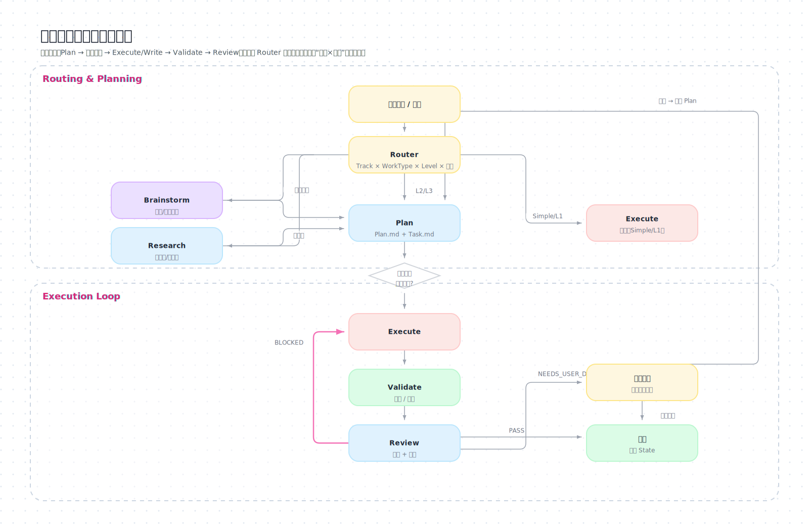

### 3.3 工件关系（State / Plan / Task / Evidence）

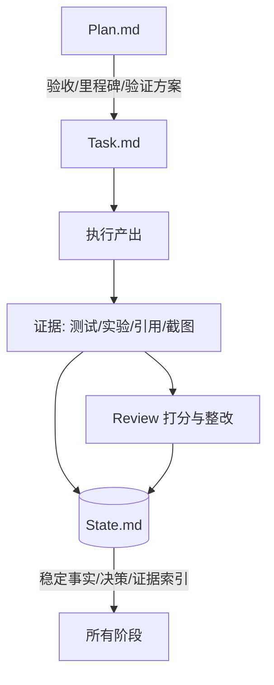

**SVG（精排版）**：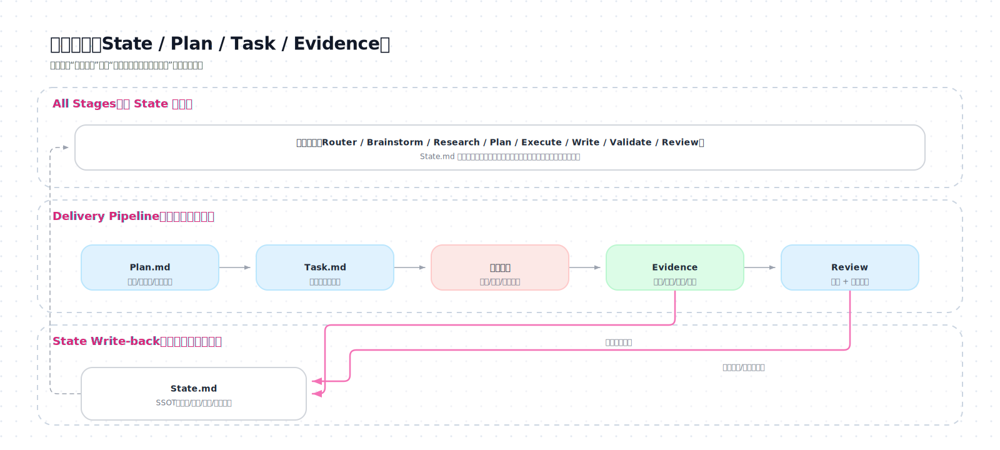

### 3.4 门禁：验证 × 评分

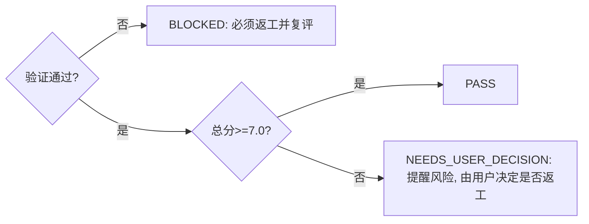

**SVG（精排版）**：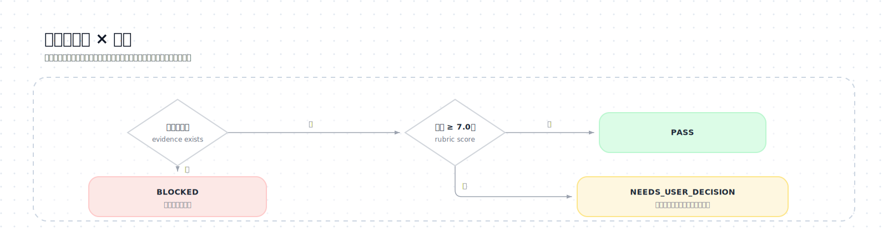

---

## 3.5 状态机（阶段如何串起来）

> 说明：这张图解决“逻辑没串起来”的问题：阶段不是散点，而是有限状态机（FSM）。

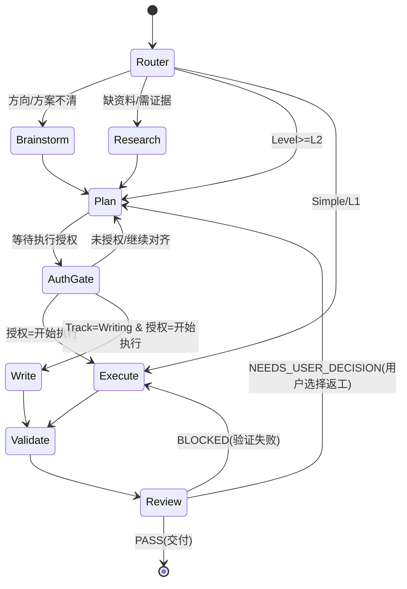

**SVG（精排版）**：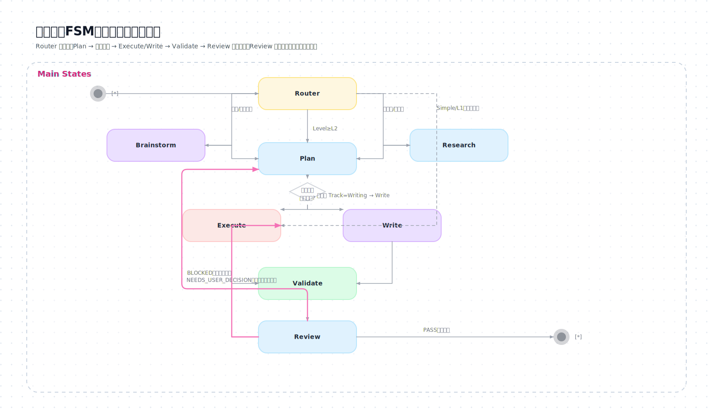

---

## 3.6 阶段契约总表（输入/输出/门禁一眼看懂）

| Stage | 主要输入 | 主要输出 | 必更工件 | 关键门禁 |
|---|---|---|---|---|
| Router | 用户输入、State（如有） | Track/WorkType/Level/下一阶段/风险/ExecutionAuth | L2/L3 更新 State | 风险命中先停下确认 |
| Brainstorm | 路由结果、约束 | 候选方案+推荐+MVP/MVE | State(决策/风险) | 结论必须可落盘到 Plan |
| Research | 问题陈述、约束 | 来源清单+Research Brief | State(Evidence) | 关键结论必须可追溯来源 |
| Plan | 目标/材料/研究输出 | Plan+Task（L3 含 AC） | State(进度/证据入口) | L2/L3 无 Plan/Task 不进 Execute；未授权不进 Execute/Write；L3 无 AC 不进 Execute |
| Execute | Task/Plan/State | 工件产出+检查点验证 | Task+State | 需已授权；一次一个任务组（到检查点）+证据落盘 |
| Write | Plan(受众/结构) | 文档+图示+引用 | State(Evidence) | 需已授权；引用可追溯、示例可运行 |
| Validate | 交付物+验证方案 | 证据+通过/失败 | State(Evidence) | 无证据不宣称通过 |
| Review | 交付物+证据 | 分数+整改+结论 | State(进度) | 验证失败=BLOCKED 必返工；总分<7 提醒并由用户决定 |

---

## 3.7 工件流转不变量（协议，防止“断链”）

这些规则用于把逻辑“锁死”，避免阶段之间各说各话：

1) **State 是唯一长期真相（SSOT）**
   - 约束/边界/偏好/决策/风险/证据入口都写进 `State.md`。

2) **L2/L3：先 Plan/Task，后 Execute**
   - 没有 Plan/Task 不进入 Execute。
   - Plan 必须包含：验收标准 + 验证方案（否则无法判断完成）。

2.1) **L2/L3：默认 Plan Mode，必须显式授权才执行**
   - 为避免误判：用户未**单独回复** `开始执行`（建议独立消息或独立一行）前：不得进入 Execute/Write。
   - 授权必须落盘（Plan/State 的 Execution Authorization 记录）。

3) **L3：必须有验收契约（Acceptance Contract）**
   - AC-XXX 断言集合必须落盘（可用模板 `templates/AcceptanceContract.template.md`）。
   - Task 必须挂接 AC-XXX（至少一个任务负责让断言可验收）。

4) **任何“通过/完成”都必须绑定证据**
   - 证据入口写入 `State.md` 的 Evidence Index。
   - 没有证据，不得宣称通过。

5) **返工规则优先级：验证 > 分数**
   - Validate 失败：Review 必须给出 BLOCKED，并返工复评。
   - Validate 通过但总分 < 7：必须提醒用户风险，由用户决定是否返工。

6) **范围变化必须回到 Plan**
   - 新需求/范围变化：先更新 Plan（含验收契约）与 Task，再进入 Execute。

---

## 4. 渐进式披露：如何“只读下一步”

### 4.1 固定入口

每次接到用户新输入：
1) 先读并执行：`stages/router/SKILL.md`
2) Router 决定下一步只读一个 stage：Brainstorm / Research / Plan / Execute / Write / Validate / Review

### 4.2 常见路由结果

- 方向模糊（科研/工程/写作）→ `Brainstorm` → `Plan`
- 缺资料/需要引用/需要基线 → `Research` → `Plan`
- 多步骤实现 → `Plan` →（执行授权：`开始执行`）→ `Execute/Write` → `Validate` → `Review`
- 简单任务 → `Execute(轻量)` → `Validate(最小)` → `Review(可选)`

---

## 5. 四类典型场景（从这里对照）

### 场景1：科研
- 模糊方向：Router → Research → Brainstorm → Plan →（执行授权：`开始执行`）→ Execute → Validate → Review
- 审查 idea：Router → Review（必要时补 Research）
- 实现方案：Router → Plan →（执行授权：`开始执行`）→ Execute → Validate → Review

### 场景2：软件开发
- 从零：Router → Brainstorm → Plan →（执行授权：`开始执行`）→ Execute → Validate → Review
- 接手代码：Router → Research → Plan →（执行授权：`开始执行`）→ Execute → Validate → Review

### 场景3：文档/教程/论文
- Router →（Research 按需）→ Plan →（执行授权：`开始执行`）→ Write → Validate → Review

### 场景4：简单任务
- Router → Execute（轻量）→ Validate（最小证据）

---

## 6. 下一步该读哪个文件（索引）

- 路由入口：`stages/router/SKILL.md`
- 方案构思：`stages/brainstorm/SKILL.md`
- 资料检索：`stages/research/SKILL.md`
- 计划与拆任务：`stages/plan/SKILL.md`
- 实施：`stages/execute/SKILL.md`
- 验证证据：`stages/validate/SKILL.md`
- 评审打分：`stages/review/SKILL.md`
- 写作交付：`stages/write/SKILL.md`

---

## 6.1 参考检查表（library）

当你需要“工程门禁/检查表/参考资料映射”时：先读 `library/00-index.md`，再按触发条件定位到具体清单。

当你需要“用户诉求落点审计（这条需求写到了哪里）”时：读 `library/traceability.md`。

---

## 6.1.1 模板（templates）

当你需要把软件工程方法“落盘成工件”时，按需使用模板：

- 验收契约：`templates/AcceptanceContract.template.md`
- 复现协议：`templates/ReproProtocol-*.template.md`
- 交付回执（固定格式）：`templates/DeliveryReport.template.md`
- Ops Runbook（运行/监控/排障）：`templates/Ops-Runbook.template.md`
- Stakeholders & Concerns：`templates/Stakeholders-Concerns.template.md`
- Quality Attributes：`templates/Quality-Attributes.template.md`
- ADR：`templates/ADR.template.md`（或写入 State.md Decision Log）
- 论文写作：
  - Literature Review Matrix：`templates/Literature-Review-Matrix.template.md`
  - Paper Outline：`templates/Paper-Outline.template.md`

这些模板在 L3（或高风险）才强制；其它情况下按需启用。

---

## 6.2 端到端演练包（examples）

当你觉得流程抽象、想看“从输入到证据到评分”的完整串联：读 `examples/_index.md`。

---

## 7. 版本化与 Plan/Task 约定（维护者）

当需要迭代这套 AgentSkill：
- 新建语义版本目录：`vX.Y.Z/`
- 在该目录下生成并维护：`Plan.md` 与 `Task.md`
- 先更新 Plan/Task，再修改 `SKILL.md`、`stages/*`、`templates/*`

---

## 8. 迷你演练（把流程跑一遍）

### 8.1 科研：方向模糊 → 可验证 idea

路由：Research + L2/L3

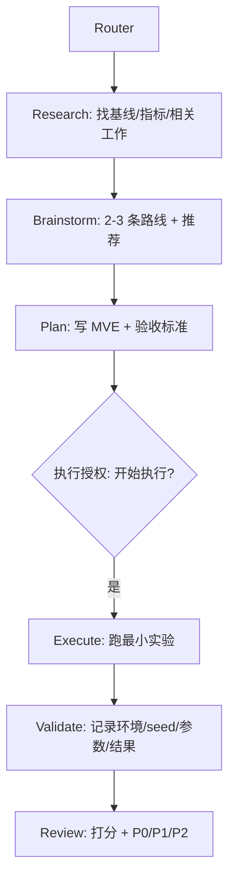

**SVG（精排版）**：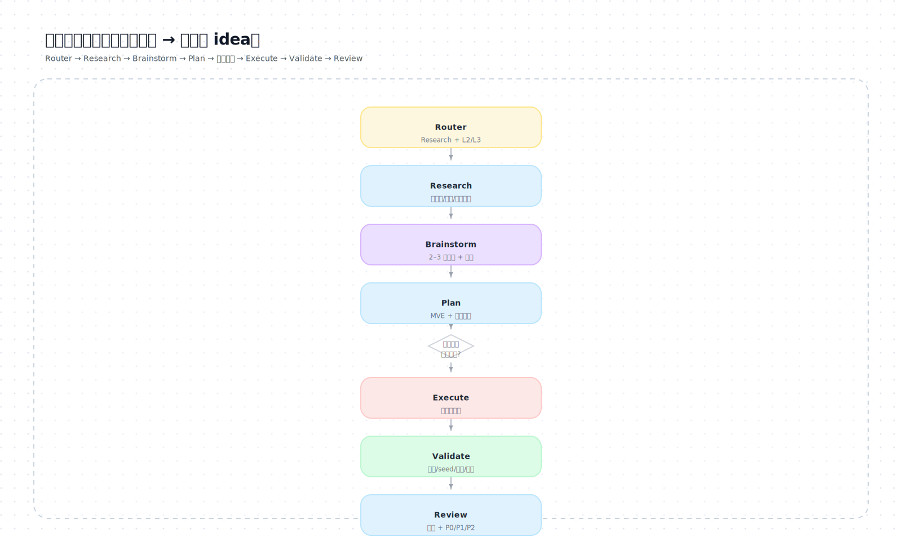

输出要点（最少）：Research Question、Hypothesis、Metrics、Baselines、MVE、复现要素。

### 8.2 科研：已有 idea → 审查打分 + 修改建议

路由：Research + L1/L2（通常直接进入 Review；缺证据则先 Research/Validate）

结果必须包含：总分、每维度证据、整改清单、是否需要返工复评。

### 8.3 软件：从零搭建/实现

路由：Software + L2/L3

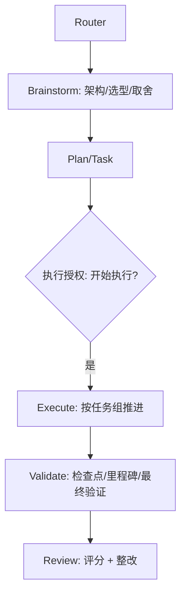

**SVG（精排版）**：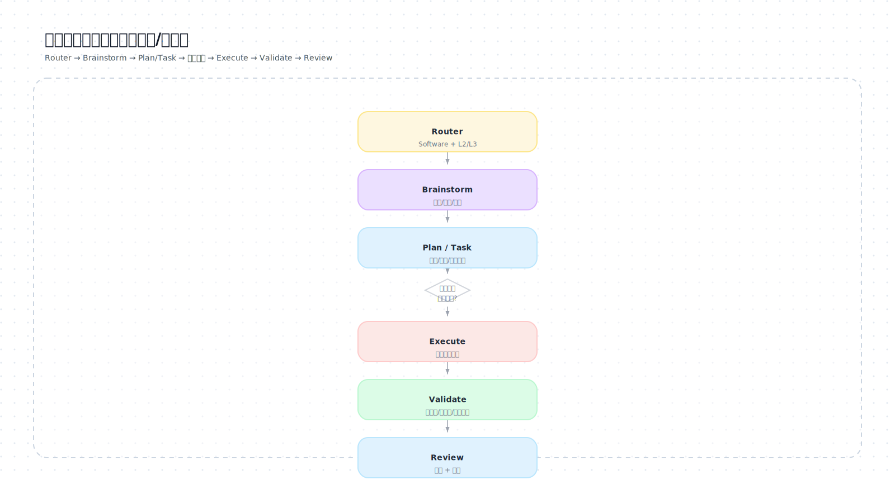

检查点：避免擅自兜底/降级掩盖错误（兜底必须在 Plan 中明示且经用户确认）；避免无意义函数拆分；验证证据写入 State。

### 8.4 写作：教程/文档

路由：Writing + L2/L3

```mermaid
flowchart TD
  R[Router] --> RS[Research(按需): 补来源]
  RS --> PL[Plan: 受众/结构/图示清单]
  PL --> G{执行授权: 开始执行?}
  G -->|是| WR[Write: 先结构后段落]
  WR --> VA[Validate: 引用/示例/一致性]
  VA --> RV[Review: 打分 + 整改]
```

**SVG（精排版）**：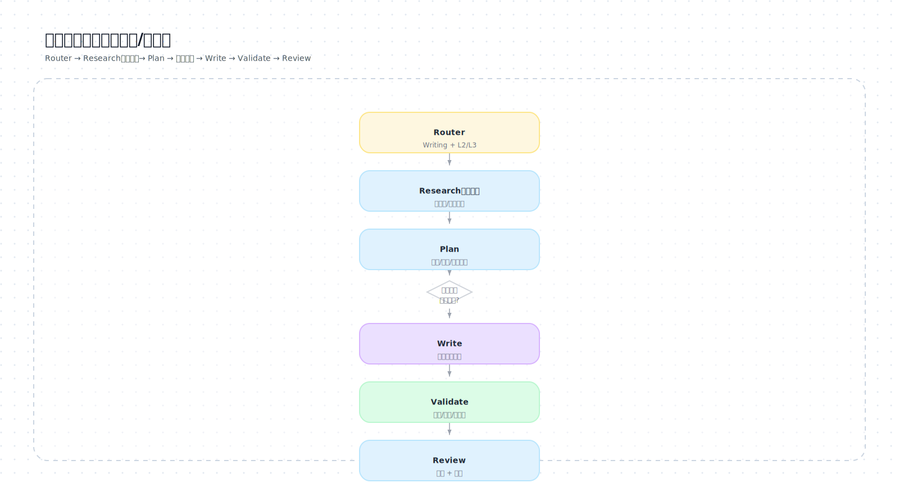

要求：至少 1 张总览图；关键结论可追溯来源；示例可运行（如有）。

### 8.5 简单任务：小脚本/小改动

路由：Simple + L1

```text
Router → Execute(轻量) → Validate(最小证据)
```

最低要求：做了什么、影响范围、最小验证方式。

---

## 9. 图示混用示例（可选）

### 9.1 PlantUML（时序图示例）

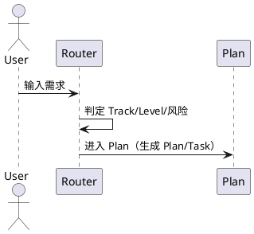

### 9.2 ASCII（小对比表补位）

```text
L1: 1-3 步、影响小、可直达执行
L2: 多步骤、必须 Plan/Task
L3: 项目级、必须 State+Plan+Task+证据索引
```
