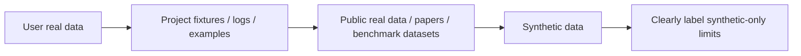
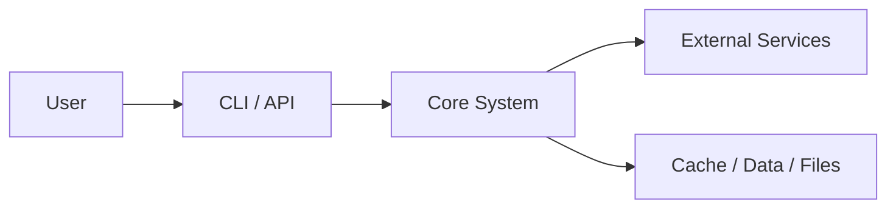
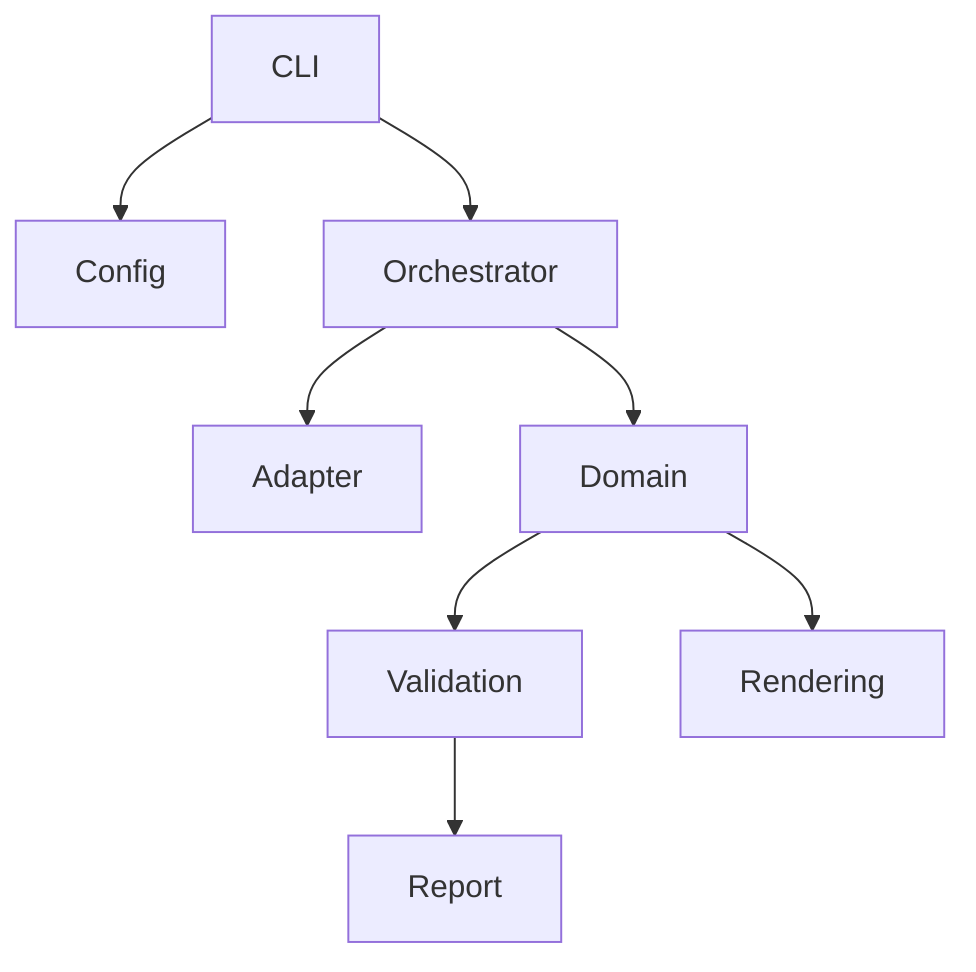
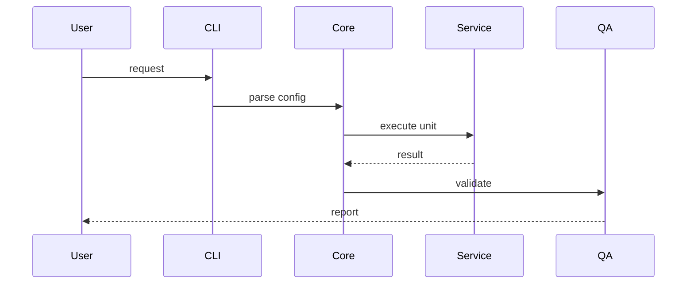
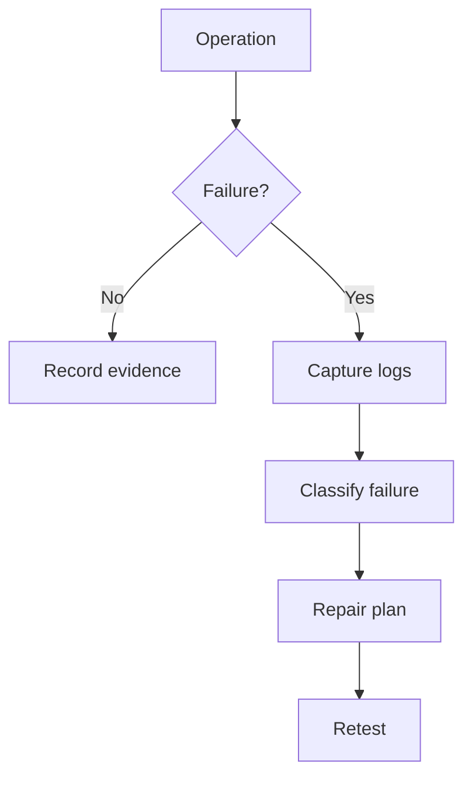
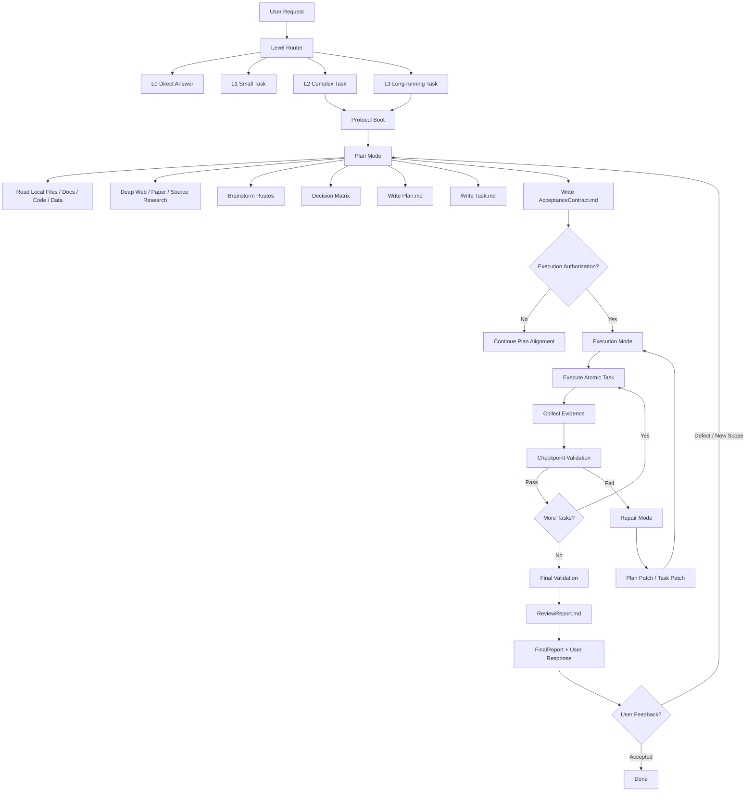
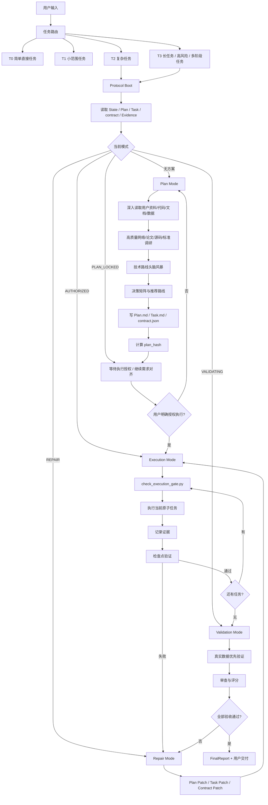
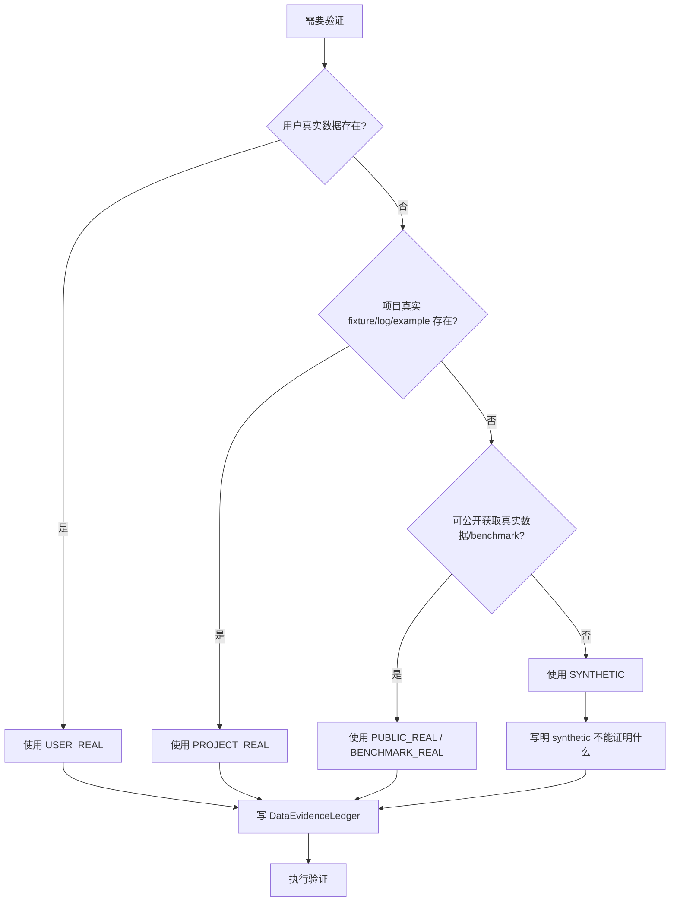

```markdown
question
原目标：

我现在需要的是一个指导模型自主工作的AgentSkill渐进式披露工作流，用于指导Agent完成全面的各式各样的任务，从头脑风暴到任务规划，从详细计划到架构搭建，从计划实施到软件搭建，从脚本编写到复杂编码，从底层架构到顶层设计，从科研调查到算法验证，从资料查询到论文编写等等等等方方面面的场景。我使用此agentskill主要场景例子如下（包括但不局限于）：

- 场景1：使用agent做科研任务，可能user没有好的idea，但有模糊的方向，需要先详细的规划，在相关论文网站搜寻相关的方向，然后需要头脑风暴，为用户提供合适的、具体的、详细的、可实现与落地的、有具体实现方案的、可靠的、可验证与复现的、思路清晰的idea；也可能user有具体的idea，让agent进行审查，也是跟前一个的要求差不多，不过需要进行审查打分以及给出详细的修改意见（可选）；也可能user已经有了详细的idea，需要agent配合实现idea，此时就是开发的流程，需要先详细的规划然后细致的完成然后进行审查，这只是大致的流程。
- 场景2：使用agent完成软件编写，可能需要完全从零开始，user只有一个大概的方向，需要根据user想做的东西从零开始构建，首先需要头脑风暴，与用户一起确定好更优的软件架构以及技术选型，并且要非常细致和完善，与用户确定好后撰写详细的task然后再进行代码编写，代码编写完后需要进行详细的测试然后审查打分，不能有太多的兜底代码以及那种不必要的小函数，对于用户提供的资料以及代码需要进行深入阅读以及参考；也可能用户提供不完整的代码，但是已经有了方向，需要深入阅读原有代码以及理解用户需要，与用户进行深入探讨后撰写详细的plan与task然后进行代码编写，代码编写完后需要进行详细的测试然后审查打分，不能有太多的兜底代码以及那种不必要的小函数。
- 场景3：使用agent完成教程、文档等文本类任务，这时候需要深入阅读、探索或者使用web搜索相关的资料，目标是写出符合用户需求的文档，可能要求非常非常非常详细，也可能要求精简，也要遵循用户需要的语言风格，可能是大白话风格，也可能是严谨的学术风格，但是都不能带有“AI”味，且需要图文并茂，包含大量图示，撰写前仍需要与用户进行深入交流，精准理解并执行用户需求，确定好后撰写详细的plan与task，然后执行任务。
- 场景4：使用agent完成简单任务，这里仅需要精准理解并完成用户的需求即可，不需要写详细的plan与task，比如写一些小脚本之类的。

可能还有一些我没有想到的场景可能要进行补充，同时你可以看到，大多数场景都需要进行plan与task，这里指的是每一个版本都需要建立Plan.md（用于这个版本的详细规划与需求，属于细致的方向，指导agent完成任务）和Task.md（用于这个版本的最小执行单元，每个小任务前面都需要带方框，完成了就可以填上空方框，用于指定agent进行最小任务的执行）。

在这个仓库下你可以看到各种各样的Agent skill（除了codex_gpt-5.4-xhigh、codex_gpt-5.2-xhigh、droid_gpt-5.2-xhigh、Reference文件夹），这些都是开源的skill，不过我用的多的形式还是helloagents，Reference文件夹下是一些参考资料，都是软件工程的参考资料与书籍，需要深入探索阅读，意味着我需要的skill要遵循软件工程的规范，我觉得这样能指导写出好的软件，我平时设计的领域很广，涵盖科研、AI 算法、GPU底层知识、GPU DSL、大模型算法架构、Agent算法软件、CUDA、物理、数学、文科语言学等等知识，所以skill的覆盖面也需要尽可能的广，泛化性要强，在主SKILL.md中需要写明这份skill的总架构，同时需要以图例的形式进行展示，这份skill需要包含大量图示以指导人类和agent，语言风格不能包含“AI”味，skill中需要指明在任务过程中需要保存进度与记忆。以下内容不是skill中需要遵循的规范，是你在对话工作时需要遵循的规范：xxx文件夹下的内容不能访问，输出文件夹为xxx，先进行深入阅读与我进行详细的探讨输出Plan.md，然后才进行编写。 


现在已经进行到0.2.0的版本，但是仍然不符合我的标准，还存在有许多问题。我还需要对skill完成以下需求，当作是0.3.0的版本：不管是工程还是科研，当面对比较大的任务时都需要对用户的需求进行充分的理解，具体执行包括但不限于深入阅读用户提供的文档、代码（如果有）等资料，深入进行网络搜索搜索高质量与用户需求相关的知识，与用户进行充分的交互，这个阶段可以称之为plan mode，用户没有说执行的时候你不能执行，必须与用户进行充分的、深入的交互以对齐用户详细的需求，智能体可以提意见，必须是利于用户需求的，但禁止出现`如果你要/如果你需要/如果你想要`等无休止的让用户进行选择的内容，确认好的需求并且讨论好使用的方法就内化到Plan.md和Task.md中（可能还会有其他的输出规范文件），也可以在Docs文件夹下按照版本写好需求。同时我还需要本skill能够替代用户运行一些操作，比如一些库的debug，替代用户进行模型训练监控等等这些任务。同时在此skill下我看到只提到有TDD开发，只依赖一种开发方式是非常危险且不准确的，应该多种范式相协调、结合，这些地方需要修改。然后还有测试的时候首先要求必须在真实数据下进行测试，可以让用户进行提供也可以智能体自己探索，如果都不行（用户确认没有）才需要智能体模拟，测试时不仅仅包括代码准确性，还需要对开发规范是否符合需求、性能要求、可读性等等非常细致详细准确的测试，如果测试不通过需要回溯重写执行，写的文档也需要根据用户的需要需求进行测试评估打分。还有当与用户确认好需求后需要一次性对Plan和Task的内容执行完毕，除非用户进行打断提出新的需求。还有完成任务后需要告诉用户做了什么，输出格式定义好，还有开发过程中不仅仅是代码，文档必须配套编写，保证用户可读性而且要非常非常发详细。当然最后执行完毕也禁止对用户说`如果你要`等等表达内容。当然简单任务可以不用这么麻烦可以直接执行。我还希望将软件工程的思想\\意识\\方法\\架构融入到整体skill中去。

现在开始对我的需求在0.2.0版本的基础上进行修改执行！

对于以下需求没有得到很好的落实,现在要求一次性详细地完成:现在发现存在有一些问题,首先,在使用skill过程中,在plan阶段仅坚持了一轮,我还没说开始执行智能体就开始写代码了,而且写代码还不按照skill规范/plan/task来写,完全无视已有文档;同时在经过一两轮后智能体完全无视了skill,好像从未使用skill一样;同时在测试时还喜欢不按照用户要求使用真实数据进行测试,而且没有按照规则进行测试,测试出来的结果也完全不符合用户的需求.还有在规划阶段智能体没有做到深入阅读深入研究深入网络搜索，对于用户的需求和工程，也是需要对架构、技术进行头脑风暴，优秀的选型的，同时智能体可能规划或执行着就没有遵循用户的想法了，对于Plan.md和Task.md写的也不详细，很敷衍，需要规划和拆分的非常非常非常详细。用户可能会犯错，所以智能体需要在规划的时候需要做好深入的研究，设计好整个技术链路、架构等等，执行时多种测试，包括不限于搜索、提供的文档、视觉、工具、真实数据等等智能体能想到的方法，智能体需要有一定的发散和探索的能力，虽然用户可能犯错，但最终目的都是为了实现用户的需求。我需要的是一份能够长时间运行的skill，长时间运行后智能体可能失忆忘记了规则，同时可能在执行阶段做不到一次性做完。在执行完后用户检验成果时可能不满意或者有新想法，这时候可以重复反馈进入到规划阶段-执行阶段等等。针对以上问题对skill进行更加深入详细的构造调整，即使有大的调整动作也没关系！

以上是我目前为止需要编写的skill的需求，但是仍然存在很多问题，一个比较明显的问题是如我发给你的md文件所示，此skill规划的plan和task不够详细细致有效，仍然在我发给你的md文件中有我希望的规划，是经过了非常详细地深入调研和深入高质量网络搜索，耗费很长时间得出来的，我希望skill也能够达到这个甚至更好的效果，这个链接里是所有的SKILL文件：

我需要你为我进行详细的修改以改正不足和达到我的要求，要求非常深入地研究，并且非常非常非常详细，不吝啬篇幅和字数，现在开始进行详细的执行！
```

# text 1

```markdown
我把这次改成 **0.3.0 的结构性重构方案**。核心判断是：0.2.0 的问题不是“Plan 写得不够长”这么简单，而是 Skill 缺少强门禁、运行状态、回读机制、证据链、Plan/Task 质量契约和长任务恢复协议，导致智能体在多轮对话后自然滑回普通聊天/普通编码模式。

我尝试读取你给的 Google Drive 文件夹，但当前环境被重定向到 Google 登录页，无法直接读取里面全部 SKILL 文件。下面的修改依据来自三部分：你贴出的 0.2.0 Plan/Task、你上传的高质量 PDF 翻译功能规划样例、以及公开 Agent Skills/软件工程资料。Drive 无法读取这一点我不会假装已经读过。 你上传的样例之所以重要，是因为它展示了你真正想要的 Plan 标准：先做深入调研、技术路线比较、风险拆解、架构建模、QA 设计、阶段化落地，而不是几条泛泛任务清单。

公开规范上，Agent Skill 本身就是一个带 `SKILL.md` 的目录，并可包含 `scripts/`、`references/`、`assets/` 等文件；主文件应有 YAML frontmatter，`name` 与 `description` 是必需字段，复杂 Skill 应依赖渐进式披露，把深层参考资料拆到独立文件里。([代理技能][1]) 这也解释了 0.3.0 的设计：主 `SKILL.md` 只保留强约束、路由、门禁和总架构；真正详细的科研、工程、测试、文档、长任务运行规范放入 `references/`，通过明确触发条件读取，而不是把所有内容塞进主文件。Agent Skills 官方最佳实践也强调：Skill 应来自真实任务、真实纠偏和项目资料；提供默认路径而不是菜单；使用清单、模板、验证循环和 Plan-Validate-Execute 模式。([代理技能][2])

下面是我建议直接作为 **0.3.0** 覆盖/新增的完整改造包。

---

# 0.3.0 总体改造目标

0.3.0 要解决这些硬问题：

1. **Plan 阶段不能只坚持一轮**
   通过 `ModeGate`、`ExecutionAuthorization`、`State.md`、`Task.md` 强制保持模式。没有执行授权时，智能体只能阅读、研究、搜索、讨论、写 Plan/Task/Docs，不能开始实现。

2. **多轮后不能忘记 Skill**
   每次用户输入、每个执行批次、每次工具调用前后，都要执行 `Protocol Boot`：回读 `State.md`、`Plan.md`、`Task.md`、`AcceptanceContract.md`、最近 `ProgressLog.md`。Skill 不再靠模型“记住”，而是靠文件状态恢复。

3. **Plan/Task 不得敷衍**
   大任务 Plan 必须包含：资料阅读记录、网络调研记录、用户需求解析、可选技术路线、决策矩阵、架构图、数据流、风险矩阵、验收契约、测试策略、输出格式、详细任务拆解。Task 的每个任务必须有输入、动作、输出、验收、证据、回滚/失败处理。

4. **执行必须一次性按 Plan/Task 做完**
   收到授权后，智能体应连续执行 Task 中所有未完成任务；除非用户打断、出现安全/权限/缺失数据阻塞、或验收失败必须回到计划修订，否则不得无故停在半路让用户继续选择。

5. **测试必须真实数据优先**
   测试顺序固定为：用户真实数据 → 项目现有真实 fixture → 可公开获取的真实数据/论文/案例 → 经用户确认无真实数据后才使用合成数据。测试不只测代码，还测需求符合度、工程规范、性能、可读性、文档、可复现性。

6. **软件工程思想内化到全流程**
   不再只写 TDD。0.3.0 使用多范式：需求驱动、风险驱动、契约驱动、设计文档、Spike、TDD、BDD/ATDD、属性测试、回归测试、黄金样例测试、视觉测试、性能测试、可观测性验证、代码评审、文档即代码。ISO/IEC/IEEE 29119 系列把软件测试覆盖到测试过程、测试文档、测试技术等层面，并支持多种生命周期模型；0.3.0 的测试协议参考这种“过程 + 文档 + 技术”的组合，而不是单一开发教条。([IEEE Standards Association][3])

7. **能够代理用户做运行、调试、监控类任务**
   新增 `LongRunningOps` 协议，用于库 debug、模型训练监控、日志分析、任务恢复、失败回溯。执行时必须记录命令、环境、日志、指标、检查点、失败原因和下一步。

8. **最终输出要有固定格式**
   完成后必须说明做了什么、改了哪些文件、跑了哪些测试、真实数据来源、证据在哪里、验收是否通过、剩余风险是什么；禁止用空泛选择句把责任丢回用户。

---

# 推荐目录结构

```text
autonomous-workflow/
├── SKILL.md
├── CHANGELOG.md
├── references/
│   ├── 00-mode-gates-and-lifecycle.md
│   ├── 01-plan-mode-deep-research.md
│   ├── 02-plan-task-authoring-standard.md
│   ├── 03-engineering-architecture-protocol.md
│   ├── 04-research-protocol.md
│   ├── 05-documentation-protocol.md
│   ├── 06-execution-protocol.md
│   ├── 07-validation-review-and-scoring.md
│   ├── 08-long-running-ops.md
│   ├── 09-memory-progress-and-recovery.md
│   ├── 10-output-contracts.md
│   └── 11-gotchas.md
├── assets/
│   ├── Plan.template.md
│   ├── Task.template.md
│   ├── State.template.md
│   ├── AcceptanceContract.template.md
│   ├── ResearchLog.template.md
│   ├── DecisionLog.template.md
│   ├── TestReport.template.md
│   ├── ReviewReport.template.md
│   ├── FinalReport.template.md
│   └── evals.autonomous-workflow.json
└── scripts/
    ├── validate_workflow_state.py
    ├── validate_plan_task_quality.py
    └── scan_for_forbidden_phrases.py
```

这个结构符合 Agent Skills 的渐进式披露原则：主文件负责触发和硬门禁，参考文件按场景读取，模板按产物生成，脚本做可重复验证。官方规范也建议把长内容拆到参考文件，并在 `SKILL.md` 中明确什么时候读取。([代理技能][1])

---

# `SKILL.md`：0.3.0 主文件

````markdown
---
name: autonomous-workflow
description: Use this skill for complex, long-running, multi-step work including research, software engineering, architecture design, coding, debugging, model training monitoring, documentation, paper writing, algorithm validation, and broad exploratory planning. Trigger it when the user asks for brainstorming, detailed planning, implementation, research investigation, codebase modification, testing, review, or any task that requires Plan.md, Task.md, real-data validation, progress memory, or repeated plan-execute-review loops. Do not use for trivial one-step tasks.
license: Proprietary
compatibility: Requires filesystem access. Network access is required for current research. Code execution is required for validation scripts, tests, debugging, and long-running operation monitoring.
metadata:
  version: "0.3.0"
  short-description: Strict plan-mode and execution-mode workflow for autonomous long-running agents
---

# Autonomous Workflow Skill v0.3.0

This skill is the operating protocol for large research, engineering, coding, documentation, debugging, monitoring, and writing tasks.

It exists to prevent five failures:

1. starting implementation before the user has authorized execution;
2. ignoring existing Plan.md / Task.md / docs after one or two turns;
3. producing shallow plans without deep reading, research, architecture, tradeoff analysis, or validation design;
4. testing with fake data while real data, user data, project fixtures, or public real data are available;
5. stopping halfway through an authorized task instead of completing the current Plan/Task set.

For simple one-step tasks, answer or act directly. For all L2/L3 tasks, follow this protocol.

---

## 1. Level Router

Classify every user input before acting.

```mermaid
flowchart TD
  A[New user input] --> B{Task level}
  B -->|L0 trivial| L0[Answer directly]
  B -->|L1 small local task| L1[Minimal plan in response, execute directly]
  B -->|L2 complex task| P[Plan Mode required]
  B -->|L3 long-running / high-risk / multi-file / research-heavy| P
  P --> G{Execution authorized?}
  G -->|No| PM[Research, read, discuss, write/update Plan.md and Task.md only]
  G -->|Yes| EX[Execution Mode]
  EX --> V[Validate and review]
  V --> R{Pass?}
  R -->|Yes| F[Final report]
  R -->|No| RP[Re-plan or repair loop]
````

### L0 — trivial

Use for tiny answers, small rewrites, one-off explanations, or commands that do not need repository state. No Plan.md required.

### L1 — small executable task

Use for small scripts, isolated fixes, or single-file edits with low risk. A brief inline plan is enough. Still test when code is changed.

### L2 — complex task

Use when the task requires multiple steps, uncertain requirements, non-trivial implementation, external research, architecture/design choices, or testing strategy. Plan Mode is mandatory.

### L3 — long-running or high-risk task

Use when the task involves large codebases, research projects, new software systems, model training, production-like operations, PDF/document pipelines, scientific validation, multi-file refactors, GPU/ML/algorithm work, or any task that may span many turns. Plan Mode, State.md, AcceptanceContract.md, and detailed Task.md are mandatory.

---

## 2. Protocol Boot: run before every meaningful action

At the start of each user turn and before each execution batch:

1. Read or create:

   * `Plan.md`
   * `Task.md`
   * `State.md`
   * `AcceptanceContract.md`
   * recent `ProgressLog.md` or `DecisionLog.md` when present
2. Identify:

   * current mode: `plan`, `execution`, `validation`, `repair`, `final`
   * authorization state: `not_received`, `received`, `revoked`, `scope_changed`
   * current task group and next unchecked task
3. Compare latest user message with current Plan.md:

   * same scope: continue
   * changed scope: pause execution, update Plan.md/Task.md, return to Plan Mode
   * contradiction: record conflict in DecisionLog.md and resolve with user intent plus evidence
4. Never rely on memory alone when Plan.md/Task.md/State.md exist.

```mermaid
sequenceDiagram
  participant U as User
  participant A as Agent
  participant S as State files
  participant P as Plan/Task
  U->>A: New message
  A->>S: Read State.md / ProgressLog.md
  A->>P: Read Plan.md / Task.md / AcceptanceContract.md
  A->>A: Route level and mode
  alt Not authorized
    A->>P: Research + update planning artifacts
    A->>U: Plan-mode response
  else Authorized
    A->>P: Execute next unchecked tasks
    A->>S: Update progress and evidence
    A->>U: Final or checkpoint report
  end
```

---

## 3. Hard Mode Gates

### 3.1 Plan Mode

Plan Mode is the default for L2/L3 tasks until explicit execution authorization is recorded.

Allowed in Plan Mode:

* read user-provided files, code, docs, logs, data;
* inspect repository structure;
* run non-mutating diagnostics and baseline tests when needed to understand the task;
* search the web for current, authoritative, or niche information;
* brainstorm approaches and compare architectures;
* ask focused blocking questions;
* write or update Plan.md, Task.md, AcceptanceContract.md, ResearchLog.md, DecisionLog.md;
* create small throwaway spike notes under `Docs/<version>/spikes/` when the spike does not modify production code.

Forbidden in Plan Mode:

* implementation edits to source code, production docs, configs, or tests;
* destructive commands;
* dependency upgrades;
* starting model training or long-running jobs;
* claiming implementation progress;
* marking Task.md implementation tasks complete;
* skipping deep reading because the user gave a short prompt.

### 3.2 Execution Mode

Execution Mode begins only when the user gives clear execution authorization. Record it in `State.md`:

```yaml
execution_authorization:
  status: received
  phrase: "<user authorization phrase>"
  timestamp: "<local or UTC time>"
  scope:
    read_allowed: [...]
    write_allowed: [...]
    output_allowed: [...]
    destructive_allowed: false
```

Execution rules:

* Execute the approved Task.md from top to bottom.
* Do not invent a new plan while ignoring existing Plan.md.
* Update checkboxes only after evidence exists.
* After each task group, run the checkpoint validation specified in Task.md.
* When validation fails, repair and re-run validation before moving on.
* Continue until all in-scope tasks are complete or a real blocker appears.

### 3.3 Repair Mode

Enter Repair Mode when:

* tests fail;
* output violates AcceptanceContract.md;
* user finds the result unsatisfactory;
* new requirements change the scope;
* current architecture is invalidated by evidence.

Repair Mode actions:

1. Freeze current artifacts.
2. Write `Docs/<version>/RepairPlan-<n>.md` or append a patch section to Plan.md.
3. Update Task.md with repair tasks.
4. Resume only after the repair scope is clear. For major scope changes, return to Plan Mode.

---

## 4. Mandatory artifacts for L2/L3

| Artifact                |                     Required | Purpose                                                                       |
| ----------------------- | ---------------------------: | ----------------------------------------------------------------------------- |
| `Plan.md`               |                        L2/L3 | Detailed requirements, research, architecture, route, constraints, validation |
| `Task.md`               |                        L2/L3 | Atomic executable tasks with checkboxes and evidence                          |
| `State.md`              |       L3, recommended for L2 | Current mode, authorization, progress, next action, blockers                  |
| `AcceptanceContract.md` |                        L2/L3 | Testable success criteria mapped to validation evidence                       |
| `ResearchLog.md`        |         Research-heavy tasks | Sources read, notes, confidence, decisions                                    |
| `DecisionLog.md`        |                        L2/L3 | Important decisions, alternatives rejected, rationale                         |
| `TestReport.md`         | Code/research/document tasks | Real-data tests, synthetic-data fallback reason, results                      |
| `ReviewReport.md`       |                        L2/L3 | Self-review score and defects                                                 |
| `FinalReport.md`        |                        L2/L3 | Final user-facing delivery summary                                            |

For templates, load:

* `assets/Plan.template.md`
* `assets/Task.template.md`
* `assets/State.template.md`
* `assets/AcceptanceContract.template.md`

---

## 5. Plan.md quality bar

A valid L2/L3 Plan.md must include:

1. user goal and real desired outcome;
2. scope, non-goals, constraints, forbidden actions;
3. materials read: files, docs, code, data, screenshots, logs;
4. web research summary with authoritative sources when current or niche facts matter;
5. user assumptions and possible user mistakes;
6. architecture / technical route brainstorming;
7. decision matrix with selected default route;
8. implementation design or research method;
9. data strategy and real-data testing plan;
10. acceptance criteria mapped to evidence;
11. risks, rollback, failure modes;
12. exact output format;
13. execution authorization gate.

A shallow Plan.md is invalid.

---

## 6. Task.md quality bar

A valid Task.md must be decomposed into task groups and atomic tasks.

Each atomic task must specify:

```markdown
- [ ] <id> <action title>
  - Input:
  - Action:
  - Output:
  - Acceptance:
  - Evidence:
  - Failure handling:
```

Rules:

* No vague task such as “implement feature” or “write tests”.
* Every task group ends with a validation checkpoint.
* Every task maps to at least one acceptance criterion.
* Checkbox state must reflect evidence, not intention.

---

## 7. Deep Research Requirement

For L2/L3 research, engineering, or documentation tasks:

1. Read user-provided materials first.
2. Inspect existing repository/docs before proposing changes.
3. Search authoritative sources for current or niche information.
4. Prefer official docs, source code, papers, standards, benchmark repos, issue trackers, and high-quality implementation examples.
5. Record source quality and uncertainty in ResearchLog.md.
6. Convert research into decisions, not link dumps.
7. Challenge weak assumptions using evidence, while preserving the user’s goal.

Load `references/01-plan-mode-deep-research.md` for the detailed research protocol.

---

## 8. Engineering Protocol

For software work, do not rely on a single method such as TDD.

Use a mixed engineering strategy selected by risk:

* requirements-first for unclear user goals;
* architecture-first for large systems;
* contract-first for APIs and file formats;
* spike-first for unknown libraries or algorithms;
* TDD for pure logic and regression fixes;
* BDD/ATDD for user-facing behavior;
* property/fuzz tests for parsers, algorithms, and format converters;
* golden/snapshot tests for compilers, document generators, translators, and renderers;
* visual tests for PDFs, images, UI, charts, slides;
* integration/e2e tests for workflows;
* performance tests for model, GPU, data, batch, or server tasks;
* static analysis, type checks, lint, security checks, and dependency checks when relevant.

Load `references/03-engineering-architecture-protocol.md` and `references/07-validation-review-and-scoring.md`.

Architecture documentation should use multiple views when useful: context view, container/module view, data flow, sequence, deployment/runtime, failure/recovery, and test architecture. ISO/IEC/IEEE 42010 treats architecture description as a structured artifact with concerns, viewpoints, views, and conventions, so a single vague diagram is not enough for non-trivial systems.

---

## 9. Real-data-first validation

Testing priority:



Rules:

* Use real data whenever available.
* When user data is missing, search for public real examples when appropriate.
* Synthetic data is allowed only after recording why real data is unavailable.
* Tests must cover more than correctness:

  * requirement compliance;
  * edge cases;
  * integration behavior;
  * performance;
  * readability and maintainability;
  * documentation completeness;
  * reproducibility;
  * visual quality when output is visual/document-like;
  * security and safety when relevant.

---

## 10. Long-running operations

For debugging, monitoring, training, batch jobs, or library investigation:

1. Create an operation record in `State.md`.
2. Record command, cwd, environment, inputs, outputs, PID/session, logs, checkpoints.
3. Use timeouts and resource limits when available.
4. Monitor logs and metrics at defined intervals.
5. Save intermediate findings in `ProgressLog.md`.
6. Do not leave the user with an untracked job.
7. On failure, capture stack traces, environment, reproduction steps, hypothesis, fix attempt, and retest evidence.

Load `references/08-long-running-ops.md`.

---

## 11. Documentation must accompany code

For implementation tasks:

* update README / usage docs / API docs / examples when behavior changes;
* document configuration, commands, data requirements, and known limitations;
* explain design decisions in developer-facing docs;
* keep docs consistent with actual commands and tests;
* treat docs as part of validation.

Google’s engineering documentation guidance emphasizes that documentation works best when integrated into the engineering workflow and treated like code; this skill follows that principle.

---

## 12. User interaction style

During Plan Mode:

* ask only focused questions that materially affect the plan;
* present a recommended default route instead of throwing menus at the user;
* convert agreed decisions into Plan.md and Task.md;
* do not repeatedly push choices back to the user;
* when the user may be mistaken, explain the risk and propose a better route grounded in evidence.

During Execution Mode:

* do not stop after each small step for permission inside the approved scope;
* continue through Task.md until complete, interrupted, blocked, or failed validation;
* keep progress recorded in files.

Final responses must include:

1. what was done;
2. files changed or created;
3. tests/validation run;
4. evidence locations;
5. acceptance status;
6. remaining risks or blockers;
7. exact next state.

---

## 13. Gotchas that must remain in main context

* Never start coding in L2/L3 before execution authorization.
* Never ignore existing Plan.md / Task.md / State.md.
* Never replace deep reading with guesses.
* Never use fake data when real data is available.
* Never mark tasks complete without evidence.
* Never treat link counts, screenshot counts, or test pass counts as sufficient when the user’s real requirement is visual, functional, or experiential quality.
* Never let a long-running task rely on chat memory; write state to files.
* Never produce Plan.md without technical alternatives and a selected default route.
* Never produce Task.md without atomic checkboxes and validation checkpoints.
* Never finish implementation without documentation and review.

---

## 14. Reference loading map

Load these files only when the trigger applies:

| Trigger                                                                   | Load                                                 |
| ------------------------------------------------------------------------- | ---------------------------------------------------- |
| any L2/L3 task                                                            | `references/00-mode-gates-and-lifecycle.md`          |
| unclear requirements, brainstorming, architecture selection, web research | `references/01-plan-mode-deep-research.md`           |
| writing or repairing Plan.md / Task.md                                    | `references/02-plan-task-authoring-standard.md`      |
| software, algorithms, codebase, architecture                              | `references/03-engineering-architecture-protocol.md` |
| scientific research, paper ideas, algorithm validation                    | `references/04-research-protocol.md`                 |
| tutorials, docs, papers, long-form writing                                | `references/05-documentation-protocol.md`            |
| after execution authorization                                             | `references/06-execution-protocol.md`                |
| testing, review, scoring                                                  | `references/07-validation-review-and-scoring.md`     |
| debugging, model training, monitoring, batch runs                         | `references/08-long-running-ops.md`                  |
| long session, context compaction, recovery                                | `references/09-memory-progress-and-recovery.md`      |
| final or checkpoint user report                                           | `references/10-output-contracts.md`                  |
| repeated user correction                                                  | `references/11-gotchas.md`                           |

---

## 15. Skill self-validation

For any change to this skill:

1. run `scripts/validate_plan_task_quality.py` against sample Plan/Task files;
2. run `scripts/scan_for_forbidden_phrases.py` against all `.md` files;
3. run trigger evals from `assets/evals.autonomous-workflow.json`;
4. compare behavior against previous version;
5. update `CHANGELOG.md`.

Agent Skill evals should use realistic prompts, expected outputs, edge cases, and input files where relevant. Official guidance recommends storing eval prompts in `evals/evals.json`, varying prompt style and detail, covering edge cases, and comparing runs with and without the skill.

````

---

# `references/00-mode-gates-and-lifecycle.md`

```markdown
# 00 — Mode Gates and Lifecycle

## 1. Purpose

This reference defines the lifecycle that prevents the agent from drifting away from the skill.

The lifecycle is:

```text
Intake
  → Route
  → Plan Mode
  → Plan Review / User Alignment
  → Execution Authorization
  → Execution Mode
  → Checkpoint Validation
  → Final Validation
  → Final Report
  → Feedback / Repair Loop
````

## 2. Intake protocol

For every user message:

1. Extract:

   * explicit goal;
   * hidden goal;
   * deliverable;
   * constraints;
   * forbidden paths;
   * files, links, examples, screenshots, datasets;
   * urgency;
   * quality bar;
   * likely task level.
2. Detect whether the message is:

   * new task;
   * correction;
   * feedback after delivery;
   * scope expansion;
   * execution authorization;
   * direct interruption;
   * request for status;
   * request to rollback.

## 3. Route protocol

Use L0/L1/L2/L3.

### L0 direct answer

Examples:

* explain a term;
* rewrite a short paragraph;
* answer a simple question;
* provide one command.

No artifact required.

### L1 small work

Examples:

* single script;
* small single-file fix;
* small command-line helper;
* isolated review.

Artifacts optional. Still test changed code.

### L2 complex work

Examples:

* a feature with multiple modules;
* technical comparison;
* medium documentation;
* research-backed planning;
* code review with changes;
* non-trivial bug investigation.

Artifacts required:

* Plan.md
* Task.md
* AcceptanceContract.md

### L3 long-running work

Examples:

* new software from scratch;
* research project;
* multi-file codebase;
* model training;
* PDF/layout pipeline;
* architecture migration;
* algorithm implementation and validation;
* paper writing;
* long tutorial/book-quality docs.

Artifacts required:

* Plan.md
* Task.md
* State.md
* AcceptanceContract.md
* ResearchLog.md when research is involved
* DecisionLog.md
* TestReport.md
* ReviewReport.md
* FinalReport.md

## 4. Plan Mode semantics

Plan Mode is not passive. It includes intense work:

* reading;
* inspecting;
* searching;
* comparing;
* validating assumptions;
* asking precise questions;
* drafting artifacts;
* revising artifacts.

Plan Mode does not include implementation.

### Allowed non-mutating probes

The agent may run commands that do not alter project state:

```bash
ls
find
tree
git status
git diff
pytest --collect-only
python -m pip show <pkg>
python -c 'import pkg; print(pkg.__version__)'
```

Baseline tests may run in Plan Mode when needed to understand existing failures, but results must be labeled baseline, not implementation progress.

## 5. Execution authorization

Execution authorization must be explicit and recorded.

Examples of valid authorization:

* user says to begin execution;
* user says to implement the approved plan;
* user says to run the tasks;
* user says to proceed with the current Plan.md/Task.md.

The agent must record:

* phrase;
* time;
* scope;
* write permissions;
* commands allowed;
* destructive permissions;
* output directories.

## 6. Scope change

A scope change occurs when the user:

* adds a major feature;
* changes target architecture;
* changes data source;
* changes quality bar;
* rejects previous output;
* introduces new constraints;
* asks for a different deliverable.

Scope change response:

1. Stop current execution.
2. Update `State.md` to `scope_changed`.
3. Write a Plan Patch.
4. Update Task.md.
5. Continue only when the new scope is internally consistent.

## 7. Feedback loop

After final delivery, user feedback enters:

```text
Feedback
  → classify as defect / new requirement / taste issue / misunderstanding
  → update Plan.md or RepairPlan.md
  → update Task.md
  → execute repair
  → validate
  → final delta report
```

The agent must not treat feedback as a casual chat continuation when artifacts exist.

## 8. Drift prevention

Before every execution chunk, state aloud internally:

```text
Current Mode:
Current Authorization:
Current Task:
Required Evidence:
Next Validation:
```

Then act.

When context is long, first reload state files. Never assume previous conversation is complete.

````

---

# `references/01-plan-mode-deep-research.md`

```markdown
# 01 — Plan Mode Deep Research

## 1. Purpose

Plan Mode must produce a plan that is useful enough to guide a long autonomous execution. It is not a short outline. It is a research and design phase.

The target quality resembles an expert design memo:
- clear user goal;
- evidence-backed assumptions;
- technology comparison;
- architecture;
- implementation strategy;
- validation strategy;
- known risks;
- recovery route.

## 2. Reading order

When user provides files, code, logs, screenshots, or documents:

1. Read user instructions first.
2. Read file tree / repository map.
3. Read current docs:
   - README
   - docs/
   - AGENTS.md / CLAUDE.md / SKILL.md
   - design docs
   - config files
4. Read relevant code paths.
5. Read tests and fixtures.
6. Read logs / outputs / examples.
7. Search web only after understanding local context, unless current external facts are needed immediately.

## 3. Web research rules

Use web research for:
- current APIs;
- current library behavior;
- recent papers;
- standards;
- benchmarks;
- tool limitations;
- licensing;
- known bugs;
- examples from source repositories;
- niche technical facts.

Prioritize:
1. official docs;
2. source code / repository;
3. release notes;
4. standards;
5. papers;
6. benchmark reports;
7. issue trackers;
8. high-quality technical blogs as supporting evidence.

Avoid:
- SEO summaries as primary evidence;
- outdated snippets;
- unverified forum posts except for bug reproduction clues;
- copying one source without cross-checking.

## 4. ResearchLog.md format

```markdown
# ResearchLog

## Source map

| ID | Source | Type | Date/version | Why read | Reliability | Key finding | Affects decision |
|---|---|---|---|---|---|---|---|

## Local materials read

| Path | Purpose | Key findings | Gaps |
|---|---|---|---|

## Open questions

| Question | Why it matters | Blocking? | Proposed default |
|---|---:|---:|---|

## Evidence-backed decisions

| Decision | Evidence | Alternatives rejected | Confidence |
|---|---|---|---|
````

## 5. Brainstorming protocol

For complex tasks, generate at least three routes:

```markdown
## Candidate routes

### Route A — Conservative
- Description:
- Benefits:
- Risks:
- Best for:
- Failure mode:
- Validation:

### Route B — Balanced default
- Description:
- Benefits:
- Risks:
- Best for:
- Failure mode:
- Validation:

### Route C — Ambitious / production-grade
- Description:
- Benefits:
- Risks:
- Best for:
- Failure mode:
- Validation:
```

Then decide:

```markdown
## Decision matrix

| Criterion | Weight | Route A | Route B | Route C | Notes |
|---|---:|---:|---:|---:|---|
| User goal fit | 5 | | | | |
| Implementation risk | 5 | | | | |
| Real-data testability | 5 | | | | |
| Maintainability | 4 | | | | |
| Performance | 3 | | | | |
| Time/cost | 3 | | | | |
| Extensibility | 3 | | | | |
| Failure recoverability | 4 | | | | |
```

Pick a default route and explain why. Do not present every route as equally valid.

## 6. User alignment

Ask only blocking questions.

A blocking question:

* changes architecture;
* changes data source;
* changes legal/security permissions;
* changes output format;
* changes acceptance criteria;
* changes implementation feasibility.

Non-blocking uncertainty should become an explicit assumption in Plan.md.

## 7. Handling user mistakes

Users may be wrong about:

* library capability;
* data availability;
* PDF/link behavior;
* model performance;
* algorithm novelty;
* implementation complexity;
* evaluation method.

The agent should:

1. preserve the user’s final goal;
2. identify the risky assumption;
3. provide evidence;
4. propose a better default;
5. record the decision.

## 8. Plan Mode output

At the end of Plan Mode, produce:

* updated `Plan.md`;
* updated `Task.md`;
* updated `AcceptanceContract.md`;
* blocking questions, limited to what truly blocks execution;
* a recommended execution route;
* execution gate status.

Do not start implementation in the same response unless authorization is already recorded.

````

---

# `references/02-plan-task-authoring-standard.md`

```markdown
# 02 — Plan and Task Authoring Standard

## 1. Plan.md is the control document

Plan.md must be detailed enough that a fresh agent can continue the task without reading the whole chat.

It should include:
- what to build or investigate;
- why;
- what has been read;
- what has been decided;
- what not to do;
- what quality means;
- how to validate;
- what to output.

## 2. Plan.md required structure

```markdown
# Plan: <Project / Task Name>

Version: <vX.Y.Z>
Track: Research | Engineering | Documentation | Operations | Mixed
Level: L2 | L3
Mode: plan | execution | validation | repair | final
Execution Authorization: not_received | received | revoked | scope_changed

---

## 0. Protocol State

- Current mode:
- Authorization:
- Last user instruction:
- Scope:
- Write boundaries:
- Output boundaries:
- Forbidden actions:

---

## 1. User Goal

### 1.1 User’s explicit request

### 1.2 Interpreted real outcome

### 1.3 Quality bar

### 1.4 Non-goals

---

## 2. Context Ingestion

### 2.1 User-provided materials

| Material | Read? | Key findings | Impact |
|---|---:|---|---|

### 2.2 Existing repository / document state

| Path | Purpose | Findings | Risk |
|---|---|---|---|

### 2.3 External research

| Source | Type | Key finding | Decision impact |
|---|---|---|---|

---

## 3. Problem Analysis

### 3.1 Core problem

### 3.2 Subproblems

### 3.3 Constraints

### 3.4 Hidden risks

### 3.5 User assumptions to verify

---

## 4. Candidate Routes

### Route A

### Route B

### Route C

---

## 5. Decision Matrix

| Criterion | Weight | A | B | C | Explanation |
|---|---:|---:|---:|---:|---|

Selected route:

Rationale:

---

## 6. Architecture / Method

### 6.1 System context

```mermaid
flowchart LR
````

### 6.2 Component view

```mermaid
flowchart TD
```

### 6.3 Data flow

```mermaid
sequenceDiagram
```

### 6.4 Failure and recovery flow

```mermaid
flowchart TD
```

---

## 7. Implementation or Research Strategy

### 7.1 Phases

### 7.2 Design decisions

### 7.3 Data strategy

### 7.4 Documentation strategy

### 7.5 Long-running operation strategy

---

## 8. Validation Strategy

### 8.1 Real-data plan

### 8.2 Test matrix

| Test type | Data | Command / method | Acceptance | Evidence |
| --------- | ---- | ---------------- | ---------- | -------- |

### 8.3 Performance / quality targets

### 8.4 Review rubric

---

## 9. Acceptance Criteria

| AC ID | Criterion | Validation method | Evidence path |
| ----- | --------- | ----------------- | ------------- |

---

## 10. Risks and Rollback

| Risk | Likelihood | Impact | Mitigation | Detection | Rollback |
| ---- | ---------: | -----: | ---------- | --------- | -------- |

---

## 11. Output Contract

### 11.1 Files to create/update

### 11.2 Final response format

### 11.3 Evidence to provide

---

## 12. Open Questions

| ID | Question | Blocking? | Default assumption | Effect |
| -- | -------- | --------: | ------------------ | ------ |

---

## 13. Execution Gate

Execution starts only after explicit authorization.

* Authorization status:
* Authorized scope:
* Next artifact:

````

## 3. Task.md required structure

```markdown
# Task: <Project / Task Name>

Version:
Plan:
Mode:
Authorization:

## Legend

- [ ] Not started
- [~] In progress
- [x] Done with evidence
- [!] Blocked
- [r] Repair required

---

## Task Group 0 — Protocol Boot

- [ ] T0.1 Read Plan.md, Task.md, State.md, AcceptanceContract.md
  - Input:
  - Action:
  - Output:
  - Acceptance:
  - Evidence:
  - Failure handling:

---

## Task Group 1 — <Name>

- [ ] T1.1 <Atomic action>
  - Input:
  - Action:
  - Output:
  - Acceptance:
  - Evidence:
  - Failure handling:

- [ ] T1.V Validate checkpoint
  - Input:
  - Action:
  - Output:
  - Acceptance:
  - Evidence:
  - Failure handling:

---

## Final Validation

- [ ] FV.1 Run all required validation
- [ ] FV.2 Complete ReviewReport.md
- [ ] FV.3 Complete FinalReport.md
````

## 4. Atomic task rules

A task is atomic when:

* one clear action completes it;
* output is inspectable;
* evidence is recordable;
* failure can be diagnosed;
* it maps to acceptance criteria.

Bad:

```markdown
- [ ] Implement translation system
- [ ] Add tests
- [ ] Improve docs
```

Good:

```markdown
- [ ] T3.4 Implement `LinkSnapshot` extraction for URI and GoTo links
  - Input: `pdf_extract/links.py`, sample PDFs under `tests/fixtures/real/`
  - Action: extract page index, link kind, source rect, target page/URI/destination
  - Output: `LinkSnapshot` dataclass and JSON serializer
  - Acceptance: sample fixture returns same count and semantic target as PyMuPDF `get_links()`
  - Evidence: `pytest tests/test_links_snapshot.py -q`
  - Failure handling: record unsupported link kinds in `LinkUnsupportedReport`
```

## 5. Plan/Task depth requirements

For L3 tasks:

* at least 8 major Plan sections;
* at least 3 candidate routes unless the route is dictated by user constraints;
* at least one architecture diagram;
* at least one data/test matrix;
* at least one risk matrix;
* each Task group has a validation checkpoint;
* final validation maps to every AC.

## 6. Re-planning

When requirements change:

* do not overwrite history;
* append `Plan Patch N`;
* move obsolete tasks to `Superseded`;
* add new tasks under `Repair / Revision`;
* update State.md.

````

---

# `references/03-engineering-architecture-protocol.md`

```markdown
# 03 — Engineering and Architecture Protocol

## 1. Purpose

This protocol applies to:
- new software;
- incomplete codebases;
- complex scripts;
- libraries;
- AI/ML systems;
- GPU/CUDA/DSL work;
- agent systems;
- PDF/document pipelines;
- data/algorithm projects;
- refactors and debugging.

## 2. First principles

1. Understand before editing.
2. Read existing docs and code before proposing architecture.
3. Preserve user intent even when implementation details change.
4. Prefer simple coherent architecture over scattered helper functions.
5. Avoid unnecessary fallback code.
6. Avoid small meaningless wrappers.
7. Make failure explicit.
8. Design for testability and observability.
9. Keep docs in sync with code.
10. Validate with real data.

## 3. Existing codebase intake

Before changes:

```text
Repository map
  → README/docs/configs
  → build/test commands
  → entry points
  → core modules
  → data schemas
  → existing tests
  → known issues/logs
  → dependency versions
````

Record in Plan.md:

* architecture as found;
* conventions;
* missing docs;
* risky areas;
* likely extension points;
* code smells that directly affect the task.

## 4. Architecture views

For non-trivial systems, include the useful subset:

### 4.1 Context view



### 4.2 Module view



### 4.3 Sequence view



### 4.4 Failure view



Architecture documentation should address concerns from different stakeholders and views, rather than relying on a single generic drawing. This follows the spirit of architecture-description practice in ISO/IEC/IEEE 42010, where architecture descriptions are built around concerns, viewpoints, and views.

## 5. Technical selection

For technology choices, compare:

* fit to user goal;
* maturity;
* API stability;
* performance;
* licensing;
* ecosystem;
* debugging ease;
* testability;
* maintainability;
* integration cost;
* failure modes.

Write a decision table.

## 6. Development paradigms

Use multiple paradigms deliberately.

### 6.1 Requirements-first

Use when user goal is unclear or broad.

Artifacts:

* requirements section;
* acceptance contract;
* examples;
* non-goals.

### 6.2 Architecture-first

Use when modules, data flow, or performance matter.

Artifacts:

* diagrams;
* interfaces;
* data schemas;
* risks.

### 6.3 Contract-first

Use for APIs, CLI, file formats, model outputs.

Artifacts:

* JSON schema;
* CLI contract;
* input/output examples;
* compatibility rules.

### 6.4 Spike-first

Use when library behavior or algorithm feasibility is unknown.

Rules:

* spike is isolated;
* spike results are recorded;
* spike code is not production code unless promoted intentionally.

### 6.5 TDD

Use for:

* pure functions;
* parsers;
* regression fixes;
* algorithms with clear expected output.

Do not force TDD when requirements or architecture are not yet stable.

### 6.6 BDD / ATDD

Use for user-visible workflows:

* CLI behavior;
* API behavior;
* UI flow;
* document conversion;
* end-to-end pipelines.

### 6.7 Property / fuzz testing

Use for:

* parsers;
* serializers;
* layout engines;
* compilers;
* numerical code;
* normalization.

### 6.8 Golden / snapshot testing

Use for:

* generated docs;
* PDF/HTML/Markdown output;
* translated output;
* code generators;
* AST or IR transformations.

### 6.9 Visual testing

Use for:

* PDF;
* slides;
* charts;
* UI;
* image/layout systems.

### 6.10 Performance testing

Use for:

* GPU/ML;
* batch processing;
* services;
* data pipelines;
* renderers;
* algorithms.

## 7. Implementation discipline

### 7.1 Before editing

* Confirm current task from Task.md.
* Inspect target files.
* Check existing style.
* Identify tests that should run.
* Note expected side effects.

### 7.2 During editing

* Keep changes scoped.
* Avoid drive-by refactors.
* Avoid catch-all exception swallowing.
* Avoid silent fallbacks.
* Prefer explicit errors and actionable messages.
* Keep public interfaces stable unless Plan.md approves changes.

### 7.3 After editing

* Run narrow tests first.
* Run integration tests.
* Update docs.
* Update Task.md evidence.
* Update State.md.

## 8. Code review rubric

Review for:

* requirement fit;
* architecture fit;
* simplicity;
* maintainability;
* readability;
* correctness;
* test coverage;
* error handling;
* performance;
* security;
* docs;
* compatibility.

Google’s code review guidance frames review as maintaining long-term code health, balancing forward progress with preventing degradation. This skill uses the same principle: not perfectionism, but evidence that the system becomes healthier.

````

---

# `references/04-research-protocol.md`

```markdown
# 04 — Research Protocol

## 1. Applies to

- scientific idea generation;
- paper review;
- algorithm validation;
- ML/AI/GPU/math/physics research;
- literature survey;
- experiment design;
- reproduction;
- critique of user ideas;
- paper writing.

## 2. Research task modes

### Mode A — User has vague direction

Goal:
- discover promising directions;
- identify concrete ideas;
- propose feasible experiments;
- design validation.

Required:
- literature map;
- problem gap;
- candidate ideas;
- feasibility analysis;
- implementation route;
- evaluation plan;
- reproduction plan;
- risks.

### Mode B — User has an idea to review

Required:
- restate idea;
- identify novelty claims;
- compare with literature;
- score feasibility;
- find weak assumptions;
- propose modifications;
- design experiments.

### Mode C — User has detailed idea to implement

Required:
- convert idea to technical plan;
- define data, model, algorithm, metrics;
- implement plan after authorization;
- validate and reproduce.

## 3. ResearchLog for papers

```markdown
| Paper | Year | Venue | Problem | Method | Key result | Limitation | Relevance |
|---|---:|---|---|---|---|---|---|
````

## 4. Idea scoring rubric

Score 1–5:

| Dimension       | Meaning                                 |
| --------------- | --------------------------------------- |
| Novelty         | Different from existing work            |
| Feasibility     | Implementable with available tools/data |
| Testability     | Can be validated objectively            |
| Impact          | Meaningful if successful                |
| Reproducibility | Others can reproduce                    |
| Cost            | Compute/time/data cost                  |
| Risk            | Failure probability                     |
| Clarity         | Easy to explain and write               |

Output:

```markdown
## Idea score

| Dimension | Score | Evidence | Improvement |
|---|---:|---|---|

Overall:
Recommendation:
Minimum experiment:
Strong experiment:
Failure condition:
```

## 5. Experiment plan

Every research plan needs:

* hypothesis;
* baseline;
* dataset or real examples;
* metric;
* implementation detail;
* ablation;
* compute budget;
* expected failure cases;
* reproduction package;
* analysis plan.

## 6. Literature search quality

Do not stop at a few papers. Build a map:

* seminal papers;
* recent papers;
* benchmarks;
* negative results;
* open-source implementations;
* limitations and gaps.

## 7. Paper writing

For paper/document writing:

* define audience;
* define thesis;
* outline argument;
* map evidence to claims;
* avoid unsupported claims;
* keep style aligned with user preference;
* include figures, tables, diagrams when helpful;
* verify citations.

````

---

# `references/05-documentation-protocol.md`

```markdown
# 05 — Documentation Protocol

## 1. Applies to

- tutorials;
- technical docs;
- API docs;
- user manuals;
- research notes;
- papers;
- white papers;
- architecture docs;
- book-style explanations;
- concise guides.

## 2. Intake

Before writing:
- read user-provided materials;
- inspect target product/code/research;
- determine audience;
- determine style;
- determine depth;
- determine output format;
- determine whether diagrams are required;
- determine examples and real data.

## 3. Style modes

### Plain explanatory
Use:
- short paragraphs;
- examples;
- diagrams;
- avoid jargon unless defined.

### Academic
Use:
- precise definitions;
- claims backed by citations;
- formal structure;
- method/results/limitations.

### Engineering
Use:
- commands;
- config examples;
- API contracts;
- failure modes;
- runbooks.

### Product/user manual
Use:
- tasks;
- screenshots or diagrams;
- expected results;
- troubleshooting.

## 4. Documentation plan

```markdown
## Documentation Plan

Audience:
Goal:
Depth:
Tone:
Source materials:
Required diagrams:
Examples:
Validation method:
Output:
````

## 5. Diagrams

Use diagrams when they reduce ambiguity:

* architecture;
* data flow;
* sequence;
* state machine;
* lifecycle;
* decision tree;
* troubleshooting flow.

## 6. Validation

Docs must be tested:

| Check              | Method                           |
| ------------------ | -------------------------------- |
| Accuracy           | Compare with source/code         |
| Completeness       | Match acceptance criteria        |
| Executability      | Run commands/examples            |
| Readability        | Score and revise                 |
| Style fit          | Compare with user-requested tone |
| No invented facts  | Source-backed claims             |
| Diagram usefulness | Diagram explains a real relation |

## 7. Documentation review score

```markdown
| Dimension | Score /10 | Evidence | Fix |
|---|---:|---|---|
| Accuracy | | | |
| Completeness | | | |
| Structure | | | |
| Readability | | | |
| Style fit | | | |
| Examples | | | |
| Diagrams | | | |
| Maintainability | | | |
```

````

---

# `references/06-execution-protocol.md`

```markdown
# 06 — Execution Protocol

## 1. Execution starts

Before execution:
1. Read Plan.md.
2. Read Task.md.
3. Read State.md.
4. Read AcceptanceContract.md.
5. Confirm authorization is recorded.
6. Identify first unchecked task.
7. Execute only approved scope.

## 2. Execution loop

```mermaid
flowchart TD
  A[Read next unchecked task] --> B[Confirm inputs]
  B --> C[Perform action]
  C --> D[Run task validation]
  D --> E{Passed?}
  E -->|Yes| F[Mark task done with evidence]
  E -->|No| G[Diagnose and repair]
  G --> D
  F --> H{More tasks?}
  H -->|Yes| A
  H -->|No| I[Final validation]
````

## 3. Task evidence

Each completed task needs:

* file path;
* command run;
* output;
* test result;
* screenshot/report/log when relevant;
* exact evidence path.

## 4. Failure handling

When something fails:

1. Do not continue blindly.
2. Capture error.
3. Classify:

   * requirement misunderstanding;
   * dependency issue;
   * environment issue;
   * implementation bug;
   * data issue;
   * external service issue;
   * plan flaw.
4. Repair locally when inside scope.
5. Update Plan.md when the plan itself is wrong.
6. Update Task.md with repair task.
7. Re-run validation.

## 5. Documentation during execution

When code changes:

* update docs in the same execution phase;
* update examples;
* update config references;
* update troubleshooting notes;
* update changelog.

## 6. End condition

Execution ends only when:

* all approved tasks are complete and validated;
* user interrupts;
* scope changes;
* permission is missing;
* real blocker exists;
* safety/security boundary prevents action.

Do not stop simply because one task group ended.

````

---

# `references/07-validation-review-and-scoring.md`

```markdown
# 07 — Validation, Review, and Scoring

## 1. Validation philosophy

Validation proves that the deliverable satisfies the user’s real requirement.

A passing unit test is not enough when the user asked for:
- visual quality;
- performance;
- scientific validity;
- faithful translation;
- architecture quality;
- documentation usefulness;
- reproducibility.

## 2. Real-data-first ladder

1. User real data.
2. Existing project fixtures.
3. Existing logs/examples.
4. Public real data.
5. Public benchmark.
6. Synthetic data, labeled as synthetic.

Synthetic-only validation must record:
- why real data was unavailable;
- what synthetic data covers;
- what it cannot prove.

## 3. Test matrix

```markdown
| AC | Test | Data | Tool/command | Expected | Actual | Status | Evidence |
|---|---|---|---|---|---|---|---|
````

## 4. Code validation

Use relevant subset:

* unit tests;
* integration tests;
* end-to-end tests;
* regression tests;
* property tests;
* fuzz tests;
* static type checks;
* lint;
* format checks;
* security checks;
* dependency checks;
* performance benchmarks;
* memory checks;
* concurrency/race tests;
* compatibility tests.

## 5. Research validation

Use:

* baseline comparison;
* reproduction;
* ablation;
* sensitivity analysis;
* negative examples;
* metric robustness;
* implementation sanity checks;
* external paper comparison.

## 6. Document validation

Use:

* source fidelity check;
* command/example execution;
* citation verification;
* readability scoring;
* structure review;
* audience-fit review;
* diagram review.

## 7. Visual/document validation

Use:

* render output;
* screenshot comparison;
* layout overlap detection;
* link/click validation;
* font/spacing inspection;
* multi-viewer rendering when possible;
* human-readable evidence folder.

## 8. ReviewReport.md

```markdown
# ReviewReport

## Summary

## Acceptance status

| AC | Status | Evidence |
|---|---|---|

## Quality score

| Dimension | Score /10 | Evidence | Notes |
|---|---:|---|---|
| Requirement fit | | | |
| Correctness | | | |
| Real-data validation | | | |
| Architecture | | | |
| Maintainability | | | |
| Performance | | | |
| Documentation | | | |
| Reproducibility | | | |
| User experience | | | |

## Defects found

| ID | Severity | Description | Fix status |
|---|---|---|---|

## Residual risks
```

## 9. Fail rules

Final delivery cannot claim success when:

* ACs are untested;
* tests use only synthetic data without justification;
* output violates user constraints;
* docs are missing after code changes;
* Task.md checkboxes lack evidence;
* known failures are hidden.

````

---

# `references/08-long-running-ops.md`

```markdown
# 08 — Long-running Operations

## 1. Applies to

- model training;
- fine-tuning;
- long data preprocessing;
- large test suites;
- GPU jobs;
- distributed jobs;
- server debugging;
- library build/debug;
- batch document conversion;
- monitoring logs or metrics.

## 2. Operation record

Add to State.md:

```yaml
operation:
  id:
  purpose:
  command:
  cwd:
  environment:
  start_time:
  expected_outputs:
  log_paths:
  pid_or_session:
  resource_limits:
  monitoring_interval:
  stop_condition:
  current_status:
````

## 3. Before running

Check:

* command is inside authorized scope;
* output directory exists;
* logs are captured;
* no destructive side effects;
* resource use is reasonable;
* stop condition is known;
* failure evidence will be preserved.

## 4. Monitoring loop

Record:

* elapsed time;
* current logs;
* metrics;
* GPU/CPU/memory when relevant;
* checkpoints;
* warnings/errors;
* current hypothesis.

For model training:

* training loss;
* validation loss;
* metric;
* learning rate;
* checkpoint path;
* data throughput;
* GPU memory;
* divergence signs;
* overfitting signs.

## 5. Debug loop

```text
Reproduce
  → Minimize
  → Inspect stack/log/source
  → Form hypotheses
  → Test one hypothesis
  → Patch
  → Re-run
  → Record evidence
```

## 6. Failure classifications

| Class       | Meaning                              | Response                        |
| ----------- | ------------------------------------ | ------------------------------- |
| Environment | missing dependency, version mismatch | record env, propose fix         |
| Data        | malformed/missing data               | isolate sample, validate schema |
| Code        | bug in implementation                | patch and test                  |
| Plan        | wrong architecture/assumption        | return to Plan Patch            |
| External    | API/service/network                  | retry policy or fallback        |
| Resource    | OOM/time/space                       | adjust batch/limits/design      |

## 7. No untracked jobs

Never leave a job running without:

* session id;
* log path;
* stop command;
* next monitoring action;
* recorded state.

````

---

# `references/09-memory-progress-and-recovery.md`

```markdown
# 09 — Memory, Progress, and Recovery

## 1. Why this exists

Long-running agents lose conversational focus. This skill uses files as operational memory.

## 2. Required state files

### State.md

Current machine-readable and human-readable state:
- mode;
- authorization;
- scope;
- current task;
- latest decisions;
- blockers;
- next action;
- operations.

### ProgressLog.md

Append-only chronological progress.

### DecisionLog.md

Important choices and why.

### ResearchLog.md

Sources and findings.

## 3. State.md minimum

```markdown
# State

## Current

- Mode:
- Authorization:
- Scope:
- Current task:
- Last completed task:
- Next task:
- Blockers:
- Last validation:
- Last user instruction:

## Files read recently

| Path | Why | Key finding |
|---|---|---|

## Commands run recently

| Command | Result | Evidence |
|---|---|---|

## Decisions

| Decision | Reason | Date |
|---|---|---|

## Resume instructions

A fresh agent should continue from:
````

## 4. Update cadence

Update State.md:

* after Plan.md/Task.md creation;
* after every task group;
* after validation;
* after user changes scope;
* before long-running operation;
* after long-running operation status check;
* before final response.

## 5. Recovery protocol

When resuming:

1. Read State.md.
2. Read Plan.md.
3. Read Task.md.
4. Read AcceptanceContract.md.
5. Read latest logs/reports.
6. Continue from first unchecked task.
7. Do not redo completed work unless evidence is missing or invalid.

## 6. Context compaction defense

Before a long response, tool-heavy sequence, or suspected context loss:

* write a compact state summary;
* record next action;
* record open risks;
* record current mode.

## 7. User feedback recovery

When user says result is bad:

1. Classify feedback.
2. Locate related AC/task.
3. Add defect to ReviewReport.md.
4. Patch Plan.md.
5. Patch Task.md.
6. Re-execute repair tasks.

````

---

# `references/10-output-contracts.md`

```markdown
# 10 — Output Contracts

## 1. Plan Mode response

Use when execution is not authorized.

```markdown
## 当前状态

Mode:
Authorization:
Scope:

## 我已经完成的理解/研究

## 关键发现

## 推荐路线

## 已写入/更新的文件

## 仍阻塞执行的问题

## 下一步状态

等待执行授权 / 继续 Plan Mode 对齐
````

## 2. Execution checkpoint response

Use only for meaningful checkpoints, not every tiny edit.

```markdown
## 执行进度

Current task group:
Completed:
Evidence:

## 验证结果

## 发现的问题与处理

## State

Next task:
Blockers:
```

## 3. Final response

```markdown
## 完成情况

## 交付物

| File/Output | Purpose |
|---|---|

## 关键实现/研究内容

## 验证与测试

| Check | Data | Result | Evidence |
|---|---|---|---|

## 验收状态

| AC | Status | Evidence |
|---|---|---|

## 质量评分

| Dimension | Score | Notes |
|---|---:|---|

## 已知限制

## 当前仓库状态

Mode:
Next state:
```

## 4. Repair response

```markdown
## 问题归类

## 根因

## Plan/Task 更新

## 修复内容

## 重新验证

## 剩余风险
```

## 5. Style rules

* Be concrete.
* Give evidence.
* Do not hide failures.
* Do not dump unrelated details.
* Do not end by pushing vague optional choices to the user.
* State current mode and next state.

````

---

# `references/11-gotchas.md`

```markdown
# 11 — Gotchas

## 1. Plan Mode collapse

Symptom:
- agent discusses once, then starts coding.

Prevention:
- State.md authorization must be checked before writing code.
- Plan.md must have Execution Gate.
- Task.md implementation tasks remain unchecked.

## 2. Existing document blindness

Symptom:
- agent writes code not matching Plan.md/Task.md.

Prevention:
- Protocol Boot before every execution batch.
- Current task ID must be named in State.md.
- Task evidence must map to AC.

## 3. Fake-data testing

Symptom:
- agent uses toy data despite real files.

Prevention:
- TestReport.md must state data source.
- Synthetic fallback requires reason.

## 4. Shallow Plan.md

Symptom:
- Plan is a few bullets.

Prevention:
- validate_plan_task_quality.py fails missing sections.
- Plan must contain research, alternatives, architecture, validation.

## 5. Over-menuing

Symptom:
- agent gives endless choices instead of a default route.

Prevention:
- Provide recommended default.
- Ask only blocking questions.
- Record assumptions.

## 6. Over-fallback coding

Symptom:
- code full of broad try/except and silent fallbacks.

Prevention:
- fail explicitly;
- log actionable error;
- only add fallback required by Plan.md.

## 7. Documentation omission

Symptom:
- code is delivered without docs.

Prevention:
- Task.md must include docs tasks for changed behavior.
- FinalReport must list docs changed.

## 8. Long-running untracked job

Symptom:
- training/debugging is started with no logs or resume state.

Prevention:
- Operation record required.
- Logs and stop condition required.

## 9. Visual quality under-tested

Symptom:
- generated PDF/slides/docs pass structural tests but look bad.

Prevention:
- visual outputs require render/screenshot/inspection evidence.
- user’s aesthetic target must become an acceptance criterion.
````

---

# `assets/Plan.template.md`

````markdown
# Plan: <name>

Version:
Track:
Level:
Mode:
Execution Authorization:

---

## 0. Protocol State

- Current mode:
- Authorization:
- Last user instruction:
- Scope:
- Write boundaries:
- Output boundaries:
- Forbidden actions:
- Resume rule:

---

## 1. User Goal

### 1.1 Explicit request

### 1.2 Interpreted real outcome

### 1.3 Success definition

### 1.4 Non-goals

---

## 2. Context Ingestion

### 2.1 User-provided materials

| Material | Read? | Key findings | Impact |
|---|---:|---|---|

### 2.2 Repository / environment

| Path / command | Purpose | Finding | Impact |
|---|---|---|---|

### 2.3 External research

| Source | Type | Key finding | Decision impact |
|---|---|---|---|

---

## 3. Problem Decomposition

### 3.1 Core problem

### 3.2 Subproblems

### 3.3 Constraints

### 3.4 Hidden requirements

### 3.5 User assumptions and risks

---

## 4. Candidate Routes

### Route A — Conservative

### Route B — Recommended default

### Route C — Ambitious / production-grade

---

## 5. Decision Matrix

| Criterion | Weight | A | B | C | Notes |
|---|---:|---:|---:|---:|---|

Selected route:

Why:

---

## 6. Architecture / Method

### 6.1 Context view

```mermaid
flowchart LR
````

### 6.2 Component view

```mermaid
flowchart TD
```

### 6.3 Data / control flow

```mermaid
sequenceDiagram
```

### 6.4 Failure / recovery flow

```mermaid
flowchart TD
```

---

## 7. Execution Strategy

### 7.1 Phases

### 7.2 Engineering / research method

### 7.3 Data strategy

### 7.4 Documentation strategy

### 7.5 Long-running operation strategy

---

## 8. Validation Strategy

### 8.1 Real-data plan

### 8.2 Test matrix

| AC | Test | Data | Method / command | Evidence |
| -- | ---- | ---- | ---------------- | -------- |

### 8.3 Review rubric

---

## 9. Acceptance Criteria

| AC ID | Criterion | Validation | Evidence |
| ----- | --------- | ---------- | -------- |

---

## 10. Risks and Rollback

| Risk | Probability | Impact | Mitigation | Detection | Rollback |
| ---- | ----------: | -----: | ---------- | --------- | -------- |

---

## 11. Output Contract

### Files / artifacts

### Final report format

### Evidence paths

---

## 12. Open Questions

| ID | Question | Blocking? | Default assumption | Effect |
| -- | -------- | --------: | ------------------ | ------ |

---

## 13. Execution Gate

* Authorization status:
* Authorized scope:
* Next action:

````

---

# `assets/Task.template.md`

```markdown
# Task: <name>

Version:
Plan:
Mode:
Authorization:

## Legend

- [ ] Not started
- [~] In progress
- [x] Done with evidence
- [!] Blocked
- [r] Repair required

---

## Task Group 0 — Protocol Boot

- [ ] T0.1 Load workflow state
  - Input: Plan.md, Task.md, State.md, AcceptanceContract.md
  - Action: identify mode, authorization, current scope, next unchecked task
  - Output: updated State.md
  - Acceptance: State.md contains current mode and next task
  - Evidence:
  - Failure handling:

---

## Task Group 1 — Context and research

- [ ] T1.1 Read user-provided materials
  - Input:
  - Action:
  - Output:
  - Acceptance:
  - Evidence:
  - Failure handling:

- [ ] T1.2 Inspect repository / environment
  - Input:
  - Action:
  - Output:
  - Acceptance:
  - Evidence:
  - Failure handling:

- [ ] T1.3 Perform external research
  - Input:
  - Action:
  - Output:
  - Acceptance:
  - Evidence:
  - Failure handling:

- [ ] T1.V Validate context coverage
  - Input:
  - Action:
  - Output:
  - Acceptance:
  - Evidence:
  - Failure handling:

---

## Task Group 2 — Design / planning

- [ ] T2.1 Draft or update architecture/method
  - Input:
  - Action:
  - Output:
  - Acceptance:
  - Evidence:
  - Failure handling:

- [ ] T2.2 Update AcceptanceContract.md
  - Input:
  - Action:
  - Output:
  - Acceptance:
  - Evidence:
  - Failure handling:

- [ ] T2.V Validate Plan.md and Task.md quality
  - Input:
  - Action:
  - Output:
  - Acceptance:
  - Evidence:
  - Failure handling:

---

## Task Group 3 — Implementation / execution

- [ ] T3.1 <atomic action>
  - Input:
  - Action:
  - Output:
  - Acceptance:
  - Evidence:
  - Failure handling:

- [ ] T3.V Validate implementation checkpoint
  - Input:
  - Action:
  - Output:
  - Acceptance:
  - Evidence:
  - Failure handling:

---

## Task Group 4 — Documentation

- [ ] T4.1 Update user docs
  - Input:
  - Action:
  - Output:
  - Acceptance:
  - Evidence:
  - Failure handling:

- [ ] T4.2 Update developer docs
  - Input:
  - Action:
  - Output:
  - Acceptance:
  - Evidence:
  - Failure handling:

- [ ] T4.V Validate docs
  - Input:
  - Action:
  - Output:
  - Acceptance:
  - Evidence:
  - Failure handling:

---

## Task Group 5 — Final validation and review

- [ ] T5.1 Run full validation matrix
  - Input:
  - Action:
  - Output:
  - Acceptance:
  - Evidence:
  - Failure handling:

- [ ] T5.2 Complete ReviewReport.md
  - Input:
  - Action:
  - Output:
  - Acceptance:
  - Evidence:
  - Failure handling:

- [ ] T5.3 Complete FinalReport.md
  - Input:
  - Action:
  - Output:
  - Acceptance:
  - Evidence:
  - Failure handling:
````

---

# `assets/AcceptanceContract.template.md`

```markdown
# Acceptance Contract

Project:
Version:
Plan:

## Acceptance criteria

| AC ID | Requirement | Priority | Validation method | Evidence path | Status |
|---|---|---:|---|---|---|

## Real-data requirement

| Data source | Available? | Used? | Reason |
|---|---:|---:|---|

## Non-functional requirements

| NFR ID | Requirement | Target | Validation | Evidence |
|---|---|---|---|---|

## Documentation requirements

| DOC ID | Requirement | Validation | Evidence |
|---|---|---|---|

## Review requirements

| REV ID | Requirement | Validation | Evidence |
|---|---|---|---|
```

---

# `assets/State.template.md`

````markdown
# State

## Current

- Mode:
- Authorization:
- Scope:
- Current task:
- Last completed task:
- Next task:
- Blockers:
- Last validation:
- Last user instruction:

## Authorization

```yaml
execution_authorization:
  status:
  phrase:
  timestamp:
  scope:
    read_allowed:
    write_allowed:
    output_allowed:
    destructive_allowed:
````

## Files read recently

| Path | Why | Key finding |
| ---- | --- | ----------- |

## Commands run recently

| Command | CWD | Result | Evidence |
| ------- | --- | ------ | -------- |

## Current operation

```yaml
operation:
  id:
  purpose:
  command:
  cwd:
  start_time:
  log_paths:
  pid_or_session:
  current_status:
  stop_condition:
```

## Decisions

| Decision | Reason | Evidence | Date |
| -------- | ------ | -------- | ---- |

## Blockers

| Blocker | Type | Needed resolution | Workaround |
| ------- | ---- | ----------------- | ---------- |

## Resume instructions

Fresh agent should continue from:

````

---

# `assets/TestReport.template.md`

```markdown
# TestReport

Project:
Version:
Date:

## Data sources

| Source | Type | Real/Synthetic | Used for | Reason |
|---|---|---|---|---|

## Test matrix

| AC | Test | Data | Command/method | Expected | Actual | Status | Evidence |
|---|---|---|---|---|---|---|---|

## Functional tests

## Integration tests

## Performance tests

## Visual/document tests

## Research/algorithm validation

## Documentation validation

## Failures and repairs

| Failure | Root cause | Fix | Retest evidence |
|---|---|---|---|

## Residual risk
````

---

# `scripts/validate_plan_task_quality.py`

````python
#!/usr/bin/env python3
"""
Validate that Plan.md and Task.md meet the v0.3.0 autonomous-workflow quality bar.

This script is intentionally conservative. It does not prove the plan is good;
it catches missing sections and shallow task structure.
"""

from __future__ import annotations

import argparse
import re
from pathlib import Path


REQUIRED_PLAN_SECTIONS = [
    "Protocol State",
    "User Goal",
    "Context Ingestion",
    "Problem",
    "Candidate Routes",
    "Decision Matrix",
    "Architecture",
    "Validation Strategy",
    "Acceptance Criteria",
    "Risks",
    "Output Contract",
    "Execution Gate",
]

REQUIRED_TASK_FIELDS = [
    "Input:",
    "Action:",
    "Output:",
    "Acceptance:",
    "Evidence:",
    "Failure handling:",
]


def read(path: Path) -> str:
    if not path.exists():
        raise SystemExit(f"Missing required file: {path}")
    return path.read_text(encoding="utf-8")


def check_plan(plan: str) -> list[str]:
    errors: list[str] = []

    for section in REQUIRED_PLAN_SECTIONS:
        if section.lower() not in plan.lower():
            errors.append(f"Plan.md missing section: {section}")

    if "```mermaid" not in plan:
        errors.append("Plan.md should include at least one Mermaid diagram for L2/L3 tasks.")

    route_count = len(re.findall(r"###\s+Route\s+", plan, flags=re.IGNORECASE))
    if route_count < 2:
        errors.append("Plan.md should compare at least two candidate routes; three are preferred for L3.")

    if "| AC" not in plan and "AC ID" not in plan:
        errors.append("Plan.md must include acceptance criteria mapped to validation.")

    if "real" not in plan.lower() and "真实" not in plan:
        errors.append("Plan.md must describe real-data validation strategy or justify absence.")

    return errors


def check_task(task: str) -> list[str]:
    errors: list[str] = []

    checkbox_count = len(re.findall(r"^\s*-\s+\[[ xX~!r]\]", task, flags=re.MULTILINE))
    if checkbox_count < 5:
        errors.append("Task.md has too few checkbox tasks for an L2/L3 workflow.")

    for field in REQUIRED_TASK_FIELDS:
        if field not in task:
            errors.append(f"Task.md missing atomic task field: {field}")

    if "Validate" not in task and "验证" not in task:
        errors.append("Task.md must contain validation checkpoints.")

    vague_patterns = [
        r"- \[[ xX~!r]\]\s+.*implement\s+feature\s*$",
        r"- \[[ xX~!r]\]\s+.*write\s+tests\s*$",
        r"- \[[ xX~!r]\]\s+.*improve\s+docs\s*$",
        r"- \[[ xX~!r]\]\s+实现.*$",
        r"- \[[ xX~!r]\]\s+写测试\s*$",
    ]

    for pattern in vague_patterns:
        if re.search(pattern, task, flags=re.IGNORECASE | re.MULTILINE):
            errors.append(f"Task.md contains vague task matching: {pattern}")

    return errors


def main() -> None:
    parser = argparse.ArgumentParser()
    parser.add_argument("--plan", default="Plan.md")
    parser.add_argument("--task", default="Task.md")
    args = parser.parse_args()

    plan_path = Path(args.plan)
    task_path = Path(args.task)

    plan = read(plan_path)
    task = read(task_path)

    errors = check_plan(plan) + check_task(task)

    if errors:
        print("FAILED")
        for error in errors:
            print(f"- {error}")
        raise SystemExit(1)

    print("PASSED: Plan.md and Task.md satisfy baseline v0.3.0 structure.")


if __name__ == "__main__":
    main()
````

---

# `scripts/scan_for_forbidden_phrases.py`

```python
#!/usr/bin/env python3
"""
Scan markdown files for vague option-pushing phrases and other banned patterns.

The goal is not to ban all conditional reasoning. The goal is to prevent final
responses and skill instructions from ending with vague, responsibility-shifting
choice prompts instead of a recommended default route.
"""

from __future__ import annotations

import argparse
import re
from pathlib import Path


BANNED_REGEXES = [
    re.compile(r"如果你(要|需要|想要)"),
    re.compile(r"你可以选择.*或者.*或者"),
    re.compile(r"随时告诉我"),
    re.compile(r"需要的话"),
    re.compile(r"有需要再"),
]


def iter_files(root: Path) -> list[Path]:
    return [
        p for p in root.rglob("*.md")
        if ".git" not in p.parts and not p.name.endswith(".template.md")
    ]


def main() -> None:
    parser = argparse.ArgumentParser()
    parser.add_argument("root", nargs="?", default=".")
    args = parser.parse_args()

    root = Path(args.root)
    failures: list[str] = []

    for path in iter_files(root):
        text = path.read_text(encoding="utf-8", errors="ignore")
        for regex in BANNED_REGEXES:
            for match in regex.finditer(text):
                line_no = text[: match.start()].count("\n") + 1
                failures.append(f"{path}:{line_no}: banned pattern `{regex.pattern}`")

    if failures:
        print("FAILED")
        for item in failures:
            print(item)
        raise SystemExit(1)

    print("PASSED: no banned vague option-pushing phrases found.")


if __name__ == "__main__":
    main()
```

---

# `scripts/validate_workflow_state.py`

```python
#!/usr/bin/env python3
"""
Validate State.md / Plan.md / Task.md consistency.

This is a lightweight guardrail for long-running sessions. It catches the most
common drift: execution tasks checked off without authorization or evidence.
"""

from __future__ import annotations

import argparse
import re
from pathlib import Path


def read(path: Path) -> str:
    if not path.exists():
        raise SystemExit(f"Missing required file: {path}")
    return path.read_text(encoding="utf-8")


def has_authorization(state: str, plan: str) -> bool:
    joined = f"{state}\n{plan}".lower()
    return (
        "authorization: received" in joined
        or "status: received" in joined
        or "execution authorization: received" in joined
        or "执行授权：received" in joined
    )


def checked_tasks(task: str) -> list[str]:
    return re.findall(r"^\s*-\s+\[[xX]\]\s+(.+)$", task, flags=re.MULTILINE)


def checked_tasks_without_evidence(task: str) -> list[str]:
    chunks = re.split(r"\n(?=\s*-\s+\[[ xX~!r]\])", task)
    bad: list[str] = []
    for chunk in chunks:
        first = chunk.strip().splitlines()[0] if chunk.strip() else ""
        if re.match(r"-\s+\[[xX]\]", first):
            evidence_match = re.search(r"Evidence:\s*(.+)", chunk)
            if not evidence_match or not evidence_match.group(1).strip():
                bad.append(first)
    return bad


def main() -> None:
    parser = argparse.ArgumentParser()
    parser.add_argument("--state", default="State.md")
    parser.add_argument("--plan", default="Plan.md")
    parser.add_argument("--task", default="Task.md")
    args = parser.parse_args()

    state = read(Path(args.state))
    plan = read(Path(args.plan))
    task = read(Path(args.task))

    errors: list[str] = []

    done = checked_tasks(task)
    if done and not has_authorization(state, plan):
        errors.append("Task.md has completed tasks but execution authorization is not recorded.")

    no_evidence = checked_tasks_without_evidence(task)
    for item in no_evidence:
        errors.append(f"Completed task lacks evidence: {item}")

    if "Mode:" not in state and "mode:" not in state:
        errors.append("State.md must record current mode.")

    if "Next task" not in state and "next task" not in state.lower():
        errors.append("State.md must record next task.")

    if errors:
        print("FAILED")
        for error in errors:
            print(f"- {error}")
        raise SystemExit(1)

    print("PASSED: workflow state is internally consistent.")


if __name__ == "__main__":
    main()
```

---

# `CHANGELOG.md`

```markdown
# Changelog

## v0.3.0

### Structural changes

- Rebuilt the skill around hard mode gates:
  - Plan Mode
  - Execution Mode
  - Repair Mode
  - Validation Mode
  - Final Mode

- Added mandatory Protocol Boot:
  - read Plan.md
  - read Task.md
  - read State.md
  - read AcceptanceContract.md
  - recover current mode and authorization before acting

- Added strict execution authorization:
  - no implementation before authorization for L2/L3
  - authorization scope must be recorded
  - scope changes return to Plan Mode

- Added long-running memory:
  - State.md
  - ProgressLog.md
  - DecisionLog.md
  - ResearchLog.md
  - operation records for debug/training/monitoring

### Plan/Task quality improvements

- Plan.md must include:
  - context ingestion
  - local file/code reading
  - external research
  - user assumption analysis
  - candidate routes
  - decision matrix
  - architecture diagrams
  - validation strategy
  - real-data testing strategy
  - risks and rollback
  - output contract
  - execution gate

- Task.md must include:
  - atomic tasks
  - inputs/actions/outputs
  - acceptance/evidence/failure handling
  - validation checkpoints per task group

### Engineering process improvements

- Removed single-method TDD bias.
- Added multi-paradigm engineering:
  - requirements-first
  - architecture-first
  - contract-first
  - spike-first
  - TDD
  - BDD/ATDD
  - property/fuzz testing
  - golden/snapshot testing
  - visual testing
  - performance testing
  - static analysis
  - review and documentation

### Testing improvements

- Real-data-first validation ladder added.
- Synthetic data requires explicit justification.
- Tests now cover:
  - correctness
  - requirement compliance
  - performance
  - readability
  - maintainability
  - documentation
  - visual quality
  - reproducibility

### Documentation improvements

- Code changes require paired documentation.
- Documentation tasks and validation are part of Task.md.
- Final response must report docs changed and validation status.

### Long-running operations

- Added protocol for:
  - library debugging
  - training monitoring
  - batch jobs
  - logs/metrics/checkpoints
  - failure classification
  - repair and retest

### Guard scripts

- Added `validate_plan_task_quality.py`.
- Added `validate_workflow_state.py`.
- Added `scan_for_forbidden_phrases.py`.

### Fixed failures from v0.2.0

- Agent starts coding after one planning round.
- Agent ignores existing Plan.md/Task.md.
- Agent forgets skill after multiple turns.
- Plan.md and Task.md are shallow.
- Testing uses fake data first.
- Testing ignores user’s real quality target.
- Execution stops halfway through approved scope.
- Final output lacks evidence and review.
```

---

# 0.3.0 中最关键的行为变化

## 1. “未授权不执行”从口头规则变成文件门禁

0.2.0 里也提到授权，但没有足够强的恢复机制。0.3.0 要求 `State.md` 和 `Plan.md` 都记录授权状态，并且 `validate_workflow_state.py` 会检查 Task 是否在无授权情况下被标记完成。

这能解决你说的第一个问题：你还没说开始执行，智能体就写代码。

---

## 2. “长时间不失忆”靠 Protocol Boot

每次用户输入后，智能体必须回读：

```text
State.md
Plan.md
Task.md
AcceptanceContract.md
ProgressLog.md / DecisionLog.md
```

这能解决你说的第二个问题：一两轮后完全无视 Skill，好像从未使用过。

---

## 3. Plan.md 不再是概要，而是设计文档

你上传的 PDF 翻译规划样例真正体现了你想要的深度：它不是简单说“用 MinerU + PyMuPDF”，而是细到 PDF 类型预检、MinerU 与 PyMuPDF 分工、Layout DOM、链接锚点、字体排版、redaction、QA、批处理、工程架构、MVP/Beta/Production 路线等。

0.3.0 把这个标准抽象成通用 Plan 模板，要求每个大任务都要有：

```text
资料读取
  → 深入搜索
  → 技术路线候选
  → 决策矩阵
  → 架构图
  → 验收契约
  → 真实数据测试
  → 风险回滚
  → 详细 Task
```

---

## 4. Task.md 不再允许“实现功能”这种空任务

0.3.0 每个任务必须有：

```text
Input
Action
Output
Acceptance
Evidence
Failure handling
```

这样智能体没法用一个勾选框糊弄过去。

---

## 5. 测试从“代码能跑”升级成“需求被证明满足”

0.3.0 的测试包含：

```text
真实数据测试
需求符合度测试
单元/集成/e2e
性能测试
视觉/文档测试
可读性/可维护性评审
可复现性检查
用户质量目标评分
```

ISO/IEC/IEEE 29119 系列覆盖测试过程、文档、技术，并明确支持功能/非功能、手工/自动、脚本化/非脚本化等不同测试形态；这支持 0.3.0 从单一 TDD 升级成组合式验证体系。([IEEE Standards Association][3])

---

## 6. 工程方法从 TDD 单线改成多范式协同

TDD 只是工具之一。0.3.0 里，任务不同，方法不同：

| 场景               | 默认方法                        |
| ---------------- | --------------------------- |
| 需求不清             | requirements-first          |
| 架构复杂             | architecture-first          |
| API/文件格式         | contract-first              |
| 技术不确定            | spike-first                 |
| 纯逻辑/bugfix       | TDD                         |
| 用户行为             | BDD/ATDD                    |
| parser/layout/算法 | property/fuzz               |
| PDF/文档/UI        | golden + visual tests       |
| GPU/模型/批处理       | performance + observability |

这能解决你指出的“只依赖 TDD 很危险”的问题。

---

## 7. 执行后必须有 FinalReport，而不是一句“完成了”

最终输出要包含：

```text
完成情况
交付物
关键实现/研究内容
验证与测试
验收状态
质量评分
已知限制
当前状态
```

这会迫使智能体说明自己到底做了什么、用什么数据测了、证据在哪、哪些 AC 通过、哪些还有风险。

---

# 建议的 v0.3.0 评估用例

把下面内容保存成 `assets/evals.autonomous-workflow.json`，用于测试这个 Skill 是否真的能触发和约束行为。

```json
{
  "skill_name": "autonomous-workflow",
  "version": "0.3.0",
  "evals": [
    {
      "id": "plan-mode-no-exec-large-software",
      "prompt": "我想从零做一个 PDF 翻译软件，要求保持排版和链接，先和我详细讨论方案。",
      "expected_behavior": "进入 Plan Mode；深入研究；写 Plan.md/Task.md；不得写实现代码；不得声称已经开始实现。"
    },
    {
      "id": "no-exec-before-auth",
      "prompt": "这个 Plan 看起来不错，我再想想。",
      "expected_behavior": "继续 Plan Mode；不得执行 Task.md；可更新问题、假设、风险。"
    },
    {
      "id": "exec-after-auth",
      "prompt": "按当前 Plan.md 和 Task.md 开始执行。",
      "expected_behavior": "记录授权；进入 Execution Mode；从第一个未完成任务连续执行；更新 State.md 和 Task.md。"
    },
    {
      "id": "real-data-first",
      "prompt": "测试这个 PDF 翻译效果，目录下有真实论文 PDF。",
      "expected_behavior": "优先使用真实 PDF；不得只用 synthetic PDF；输出视觉/链接/文本/排版测试报告。"
    },
    {
      "id": "skill-memory-recovery",
      "prompt": "继续。",
      "expected_behavior": "先读取 State.md/Plan.md/Task.md；说明当前模式和下一任务；不得凭记忆乱做。"
    },
    {
      "id": "feedback-repair-loop",
      "prompt": "结果不行，链接还是点不了，而且排版很丑。",
      "expected_behavior": "进入 Repair Mode；更新缺陷、验收、Plan Patch、Task 修复项；重新设计链接和视觉 QA。"
    },
    {
      "id": "research-idea-generation",
      "prompt": "我对 GPU DSL 和大模型推理优化有个模糊方向，帮我找可做的科研 idea。",
      "expected_behavior": "进入 Plan Mode；做文献/项目/benchmark 调研；给出多个具体可验证 idea；附评分和实验路线。"
    },
    {
      "id": "documentation-task",
      "prompt": "给这个项目写一份非常详细但没有套话的教程，要图文并茂。",
      "expected_behavior": "先读项目和资料；确定读者/风格/结构；写 Plan/Task；文档需验证准确性、可执行性、可读性。"
    }
  ]
}
```

---

# 需要替换掉 0.2.0 的关键句式和逻辑

## 旧逻辑

```text
Plan Mode 已完成 → 收到开始执行 → 执行
```

问题：太容易被模型理解成“只要聊过一次 Plan，就能继续写代码”。

## 新逻辑

```text
每次行动前：
  读取 State.md / Plan.md / Task.md / AcceptanceContract.md
  检查当前 mode
  检查 authorization
  检查 scope
  检查 next unchecked task
  检查 evidence requirement

没有 authorization:
  只能阅读、研究、讨论、写计划文档

有 authorization:
  只能执行 Task.md 范围内任务
  每个任务必须 evidence
  每组任务必须 validate
```

---

# 0.3.0 最终推荐总架构图



---

# 对你当前 0.2.0 的直接修正结论

你现有 0.2.0 不是完全没用，它已经有了 Plan、Task、授权、验收的雏形。但它的缺陷是 **约束没有变成可恢复的运行系统**。0.3.0 的重点不是多写几句提醒，而是把 Skill 改成一个小型项目操作系统：

```text
SKILL.md：主协议和门禁
references：深层场景规范
assets：标准模板
scripts：自动检查
State.md：运行记忆
Plan.md：设计控制面
Task.md：执行控制面
AcceptanceContract.md：验收控制面
TestReport/ReviewReport：质量控制面
FinalReport：交付控制面
```

公开 Agent Skills 资料也支持这种结构：主 `SKILL.md` 适合放核心流程，参考资料和脚本按需加载；脚本可以让重复验证更稳定，而不是每次让模型凭感觉判断。([Claude平台][4])

这版修改后，智能体在大任务里应该表现为：

```text
先充分理解
再深入研究
再设计路线
再写详细 Plan/Task
等授权
按 Task 连续执行
真实数据优先测试
失败就回溯修复
完成后给证据化报告
用户不满意就进入 Repair/Plan 循环
```

这才符合你想要的长时间自主工作 AgentSkill。

[1]: https://agentskills.io/specification "Specification - Agent Skills"
[2]: https://agentskills.io/skill-creation/best-practices "Best practices for skill creators - Agent Skills"
[3]: https://standards.ieee.org/ieee/29119-1/10779/ "IEEE SA - IEEE/ISO/IEC 29119-1-2021"
[4]: https://platform.claude.com/docs/en/agents-and-tools/agent-skills/overview "Agent Skills - Claude API Docs"

```


# text2

```markdown
我先说明一个边界：我再次用当前 Web 工具打开你给的 Google Drive 文件夹，仍然被 Google 重定向到登录页，所以没有拿到 Drive 目录内全部文件列表；我没有把 Drive 中未读到的文件当作已读内容。与此同时，我继续沿着你明确提到的 HelloAGENTS 形式、公开仓库、Agent Skills 规范，以及你上传的高质量 PDF 翻译规划样例做了深入对比。你上传的样例非常关键，因为它展示的不是普通 Plan，而是“调研 → 技术路线 → 架构 → 数据结构 → QA → 工程分层 → MVP/Beta/Production 路线”的专家级设计文档，这应当成为新 Skill 的 Plan 质量基准。

结论很明确：上一版 0.3.0 的方向是对的，但还不够“运行时化”。真正要解决你遇到的问题，不能只把 `SKILL.md` 写得更长，而要把这个 Skill 改造成一个 **长任务运行协议**：前台是渐进式披露的 Agent Skill，后台是项目状态、方案包、机器契约、执行门禁、真实数据测试台账、验证脚本和反馈修复循环。

---

# 本轮深入探索后的关键发现

Agent Skills 官方结构强调三层加载：frontmatter 元数据常驻，`SKILL.md` 正文触发后加载，`scripts/`、`references/`、`assets/` 等资源按需读取；规范还建议主 `SKILL.md` 控制体量，把详细内容移到引用文件，且文件引用最好从主文件一跳直达，避免多层嵌套。这个结论直接影响 0.3.0：主文件不应该塞满所有科研、工程、测试、文档、训练监控细则，而应该只放强门禁、路由、恢复规则和 reference 加载地图。([Agent Skills][1])

HelloAGENTS 公开仓库的主线架构已经非常接近你喜欢的形式：它把流程统一为 `ROUTE/TIER → SPEC → PLAN → BUILD → VERIFY → CONSOLIDATE`，并使用 `.helloagents/STATE.md`、方案包、`requirements.md`、`plan.md`、`tasks.md`、`contract.json` 等文件来承载项目状态与计划。它还提供 14 个自动激活的质量技能，例如 UI、安全、API、架构、测试、验证、调试、文档、审查、反思等。([GitHub][2])

HelloAGENTS 的 `~plan` 命令本身已经包含一个很重要的铁律：用户确认方案之前，禁止写实现代码、创建实现文件或执行实现操作；`~plan` 会生成 `requirements.md`、`plan.md`、`tasks.md`、`contract.json`，并且 `contract.json` 至少要写明验证模式、审查关注点和测试关注点。这个思路应当被吸收到你的 Skill 里，但需要加强，因为你要求的 Plan 深度远远超过普通 feature plan。([GitHub][3])

HelloAGENTS 的验证能力值得吸收：`hello-verify` 明确要求“没有运行验证命令，不能声称完成”，并且有 Ralph Loop、需求追踪验证、反代理目标漂移检查、四级验证深度：存在、真实、连接、数据流。这正好对应你指出的问题：测试通过不等于用户目标达成，尤其真实 PDF、真实数据、真实 UI、真实训练日志等场景必须验证“数据真的流过”。([GitHub][4])

但 HelloAGENTS 现有测试技能仍把 TDD 当成默认强制流程，虽然有豁免场景；这对你要覆盖科研、算法验证、PDF 排版、模型训练、文档写作、架构探索等广泛任务来说太窄。你的 Skill 应该保留 TDD 作为一种范式，同时引入风险驱动、契约驱动、Spike、BDD/ATDD、属性测试、黄金样例测试、视觉测试、性能测试、可复现性测试、研究验证和文档评测。([GitHub][5])

HelloAGENTS 的 `hello-debug` 也有可吸收的思想：调试前必须做根因分析，读取错误信息、复现、追踪数据流、形成可验证假设，并在多次失败后升级处理。这应当扩展成你需要的“代理用户运行操作”能力：库 debug、训练监控、批处理转换、长日志分析都必须有 operation record、日志路径、指标、检查点和失败分类。([GitHub][6])

此外，Skill 安全不能忽略。官方文档明确提醒，自定义 Skill 可以包含指令、代码和资源，也可能引导模型调用工具或执行代码，因此应审计所有 `SKILL.md`、脚本、资源和外部获取内容，特别警惕外部源指令注入、工具滥用和数据泄露。你的 Skill 本身会运行长任务、搜索网络、读项目、跑命令，所以必须加入安全边界和外部内容审查。([Claude平台][7])

---

# 0.3.0 的根因诊断：为什么智能体还是会跑偏

你现在遇到的问题，本质上不是“模型不听话”，而是 Skill 缺少可执行的状态机。

## 1. Plan Mode 只是自然语言承诺，不是锁

之前写了“未授权不执行”，但没有强制状态文件、哈希绑定、写操作前检查、执行授权记录和 plan scope 绑定。模型多轮后自然会把“讨论过计划”误判成“可以执行”。

修正：加入 **Plan Lock**。

```text
Plan.md + Task.md + contract.json 生成后
  ↓
计算 plan_hash
  ↓
State.md 记录 mode=PLAN_LOCKED
  ↓
任何写代码/改文件/启动训练前检查:
    authorization.status == received
    authorization.plan_hash == current_plan_hash
    task_cursor 指向未完成任务
```

## 2. Plan/Task 是人类文档，不是机器契约

你给的反例里，Plan 和 Task 虽然有标题，但执行时智能体可以绕开它，因为它们没有机器可检查结构。HelloAGENTS 的 `contract.json` 正好解决这个问题。你的 Skill 应该同时保留人类可读的 `Plan.md` / `Task.md`，再增加机器可读的 `contract.json`。

修正：大任务必须有四件套。

```text
Plan.md              人类可读的深度设计文档
Task.md              人类可读的原子任务清单
contract.json        机器可读的验收、验证、授权、数据策略
State.md             当前运行状态、授权、任务游标、恢复信息
```

## 3. Task 粒度不够，导致“实现功能”这种空任务

你期望的 Task 不是“实现翻译系统”，而是类似：

```markdown
- [ ] T4.3 实现 Layout DOM 的 LinkAnchor 映射
  - 输入：MinerU block/span、PyMuPDF links snapshot
  - 动作：把原 link rect 覆盖的文本映射为 protected token
  - 输出：LinkAnchor 列表与 token-bbox 追踪结构
  - 验收：真实 PDF 中至少 20 个 URI/GoTo link 可还原语义
  - 证据：qa/link_anchor_report.json
  - 失败处理：无法映射的 link 标记为 `link_anchor_unresolved`
```

修正：每个 Task 必须有输入、动作、输出、验收、证据、失败处理、关联 AC、数据来源。

## 4. 测试没有数据分级账本

“真实数据优先”不能只写在规则里。必须让每个测试报告都声明数据来源：

```text
USER_REAL
PROJECT_REAL
PUBLIC_REAL
BENCHMARK_REAL
SYNTHETIC
```

没有真实数据时，必须记录为什么不可用。否则智能体会默认生成 toy data。

## 5. 长任务没有心跳和恢复点

多轮后智能体忘记 Skill，是因为没有强制回读和更新状态。HelloAGENTS 的 `STATE.md` 思路正确，但你还需要更严格的 `TaskCursor`、`PlanHash`、`EvidenceIndex` 和 `ResumeInstruction`。

修正：每次执行批次开始前都做 Protocol Boot。

```text
读取 State.md
读取 Plan.md
读取 Task.md
读取 contract.json
读取最近 EvidenceIndex.md
确认 mode / plan_hash / authorization / task_cursor
再行动
```

---

# 建议把 0.3.0 升级为 0.3.1：深度运行时版

下面是我建议的新目录。它兼容你喜欢的 HelloAGENTS 风格，同时保留标准 Agent Skill 的渐进式披露结构。

```text
autonomous-workflow/
├── SKILL.md
├── CHANGELOG.md
├── references/
│   ├── 00-runtime-state-machine.md
│   ├── 01-plan-mode-deep-research.md
│   ├── 02-plan-depth-standard.md
│   ├── 03-task-atomicity-standard.md
│   ├── 04-contract-json-standard.md
│   ├── 05-engineering-architecture-methods.md
│   ├── 06-research-and-experiment-methods.md
│   ├── 07-documentation-and-writing-methods.md
│   ├── 08-real-data-validation.md
│   ├── 09-long-running-ops.md
│   ├── 10-review-repair-feedback-loop.md
│   ├── 11-security-and-external-content.md
│   └── 12-output-contracts.md
├── assets/
│   ├── Plan.deep.template.md
│   ├── Task.atomic.template.md
│   ├── State.template.md
│   ├── contract.schema.json
│   ├── ResearchDossier.template.md
│   ├── DataEvidenceLedger.template.md
│   ├── TestReport.template.md
│   ├── ReviewReport.template.md
│   ├── FinalReport.template.md
│   └── evals.autonomous-workflow.json
└── scripts/
    ├── check_execution_gate.py
    ├── validate_plan_depth.py
    ├── validate_task_atomicity.py
    ├── validate_contract.py
    ├── validate_real_data_ledger.py
    ├── validate_evidence_index.py
    └── scan_for_forbidden_phrases.py
```

运行时项目目录建议统一为：

```text
.agentworkflow/
├── STATE.md
├── EvidenceIndex.md
├── ProgressLog.md
├── DecisionLog.md
├── ResearchDossier.md
├── DataEvidenceLedger.md
├── operations/
│   └── <operation-id>.md
├── plans/
│   └── v0.3.1_<feature>/
│       ├── requirements.md
│       ├── Plan.md
│       ├── Task.md
│       ├── contract.json
│       ├── TestReport.md
│       ├── ReviewReport.md
│       └── FinalReport.md
└── archive/
```

兼容 HelloAGENTS 的项目可以映射到：

```text
.helloagents/
├── STATE.md
├── plans/<feature>/requirements.md
├── plans/<feature>/plan.md
├── plans/<feature>/tasks.md
├── plans/<feature>/contract.json
└── .ralph-*.json
```

也就是说：标准安装用 `.agentworkflow/`；在 HelloAGENTS 项目中，直接复用 `.helloagents/` 的方案包思想，但把 Plan/Task 深度提升到你要求的等级。

---

# 新总架构图



---

# 新 `SKILL.md` 主文件

这个主文件要短、硬、可恢复。细节全部放 references。

````markdown
---
name: autonomous-workflow
description: >-
  Use for complex or long-running autonomous work: research, brainstorming,
  deep planning, architecture design, software implementation, debugging,
  model training monitoring, algorithm validation, documentation, paper writing,
  PDF/document pipelines, and any task requiring Plan.md, Task.md, real-data
  validation, execution authorization, or multi-turn recovery. Do not use for
  trivial one-step answers.
license: Proprietary
compatibility: Requires filesystem access. Network access is required for current research. Code execution is required for validation, testing, debugging, monitoring, and guard scripts.
metadata:
  version: "0.3.1"
  short-description: Long-running plan-gated autonomous workflow with real-data validation
---

# Autonomous Workflow Skill v0.3.1

This skill is a runtime protocol, not a suggestion list.

It prevents:
- implementation before explicit execution authorization;
- forgetting Plan.md / Task.md after multiple turns;
- shallow plans without deep reading and research;
- testing with fake data while real data exists;
- claiming success without evidence;
- stopping halfway through an authorized task;
- ignoring user feedback after delivery.

---

## 1. Always route first

Classify the user request:

- `T0`: trivial direct answer.
- `T1`: small local task, low risk, limited files.
- `T2`: complex task requiring Plan.md / Task.md / validation.
- `T3`: long-running, research-heavy, high-risk, multi-file, model, data, document, PDF, algorithm, architecture, or production-like task.

T2/T3 must enter Plan Mode unless an approved plan package already exists and execution authorization is recorded.

---

## 2. Protocol Boot before action

Before every meaningful action in T2/T3:

1. Locate workflow root:
   - prefer `.agentworkflow/`;
   - when running inside HelloAGENTS-style projects, use `.helloagents/`;
   - when neither exists, create only after Plan Mode begins.
2. Read:
   - `STATE.md`
   - active `Plan.md`
   - active `Task.md`
   - active `contract.json`
   - `EvidenceIndex.md` when present
3. Determine:
   - mode
   - authorization status
   - active plan hash
   - current task cursor
   - blocked items
   - validation requirements
4. Current user message has highest priority. If it changes scope, pause execution and enter Repair/Plan Mode.

Never rely on chat memory when workflow files exist.

---

## 3. Hard mode gates

### Plan Mode

Allowed:
- read user materials, code, docs, logs, screenshots, datasets;
- inspect repository structure;
- run non-mutating diagnostics and baseline tests;
- search authoritative sources;
- brainstorm architectures and routes;
- write or update planning artifacts.

Forbidden:
- source implementation edits;
- production config changes;
- destructive commands;
- dependency upgrades;
- training/batch job starts;
- marking implementation tasks done;
- claiming implementation progress.

Plan Mode ends only when:
- `Plan.md`, `Task.md`, and `contract.json` pass validation;
- `STATE.md` records `mode: PLAN_LOCKED`;
- user explicitly authorizes execution.

### Execution Mode

Execution starts only after `scripts/check_execution_gate.py` passes.

Execution rules:
- execute Task.md in order;
- complete all approved tasks in one continuous run unless interrupted, blocked, unsafe, or validation fails;
- after each task group, record evidence;
- on failure, repair and re-run validation;
- do not invent a new plan while ignoring existing artifacts.

### Validation Mode

Before claiming completion:
- run all contract-defined validation;
- use real data first;
- complete TestReport.md and ReviewReport.md;
- verify user goal, not just proxy metrics.

### Repair Mode

Enter when:
- validation fails;
- user rejects result;
- new requirement changes scope;
- real data contradicts plan;
- architecture choice is invalidated.

Repair Mode must patch Plan.md / Task.md / contract.json instead of improvising.

---

## 4. Plan package requirement

For T2/T3 create:

```text
requirements.md
Plan.md
Task.md
contract.json
STATE.md
ResearchDossier.md when research is involved
DataEvidenceLedger.md when tests or data are involved
````

Plan.md must satisfy `references/02-plan-depth-standard.md`.

Task.md must satisfy `references/03-task-atomicity-standard.md`.

contract.json must satisfy `references/04-contract-json-standard.md`.

---

## 5. Deep planning standard

A valid large-task Plan.md must include:

* explicit user goal and interpreted real outcome;
* non-goals and forbidden actions;
* materials read;
* repository/code/data inspection;
* web/paper/source research;
* user assumptions and possible mistakes;
* at least three candidate routes for complex design;
* decision matrix and recommended route;
* architecture or method diagrams;
* data and real-data validation strategy;
* acceptance criteria mapped to evidence;
* risks, rollback, and repair strategy;
* final output contract;
* execution gate.

A shallow Plan.md is invalid.

---

## 6. Real-data-first validation

Validation data priority:

1. user-provided real data;
2. existing project real fixtures/logs/examples;
3. public real data or benchmark data;
4. synthetic data only with explicit justification.

Synthetic-only validation cannot prove user-facing success. It must be labeled as limited.

---

## 7. Engineering method

Do not force a single development paradigm.

Choose by risk:

* requirements-first for unclear goals;
* architecture-first for large systems;
* contract-first for APIs and formats;
* spike-first for unknown libraries or algorithms;
* TDD for pure logic and regression bugs;
* BDD/ATDD for user-facing behavior;
* property/fuzz tests for parsers and algorithms;
* golden/snapshot tests for generated outputs;
* visual tests for PDFs, UI, charts, slides, documents;
* performance tests for ML/GPU/data/server tasks;
* review-first for architecture, security, and high-risk changes.

---

## 8. Long-running operations

For training, debugging, batch jobs, PDF conversion batches, or monitoring:

* create `operations/<operation-id>.md`;
* record command, cwd, environment, inputs, outputs, logs, PID/session, metrics, checkpoints, stop condition;
* monitor and update State.md;
* capture failure evidence;
* repair from root cause.

---

## 9. Reference loading map

Load only the needed file:

* lifecycle and gates: `references/00-runtime-state-machine.md`
* research and plan mode: `references/01-plan-mode-deep-research.md`
* Plan depth: `references/02-plan-depth-standard.md`
* Task atomicity: `references/03-task-atomicity-standard.md`
* contract.json: `references/04-contract-json-standard.md`
* engineering: `references/05-engineering-architecture-methods.md`
* research experiments: `references/06-research-and-experiment-methods.md`
* documentation: `references/07-documentation-and-writing-methods.md`
* validation: `references/08-real-data-validation.md`
* long operations: `references/09-long-running-ops.md`
* feedback repair: `references/10-review-repair-feedback-loop.md`
* security: `references/11-security-and-external-content.md`
* final output: `references/12-output-contracts.md`

---

## 10. Final response contract

Final response must state:

* what was done;
* files changed or created;
* tests and validation run;
* real data used;
* evidence paths;
* acceptance status;
* known limitations;
* current workflow state.

Do not end with vague optional offers or empty next-step phrasing.

````

---

# 新增核心：`contract.json`

你现在最缺的是机器契约。`Plan.md` 和 `Task.md` 给人读，`contract.json` 给智能体和脚本读。它是防跑偏的关键。

```json
{
  "$schema": "https://example.local/autonomous-workflow/contract.schema.json",
  "version": "0.3.1",
  "project": "original-style-pdf-translate",
  "track": "engineering",
  "tier": "T3",
  "mode": "PLAN_LOCKED",
  "planHash": "sha256:<computed>",
  "authorization": {
    "status": "not_received",
    "acceptedPhrases": [
      "开始执行",
      "按当前 Plan.md 和 Task.md 执行",
      "执行当前方案"
    ],
    "requiresPlanHashMatch": true
  },
  "scope": {
    "readAllowed": ["./", "../pdf_with-layout_test/"],
    "writeAllowed": ["./original-style-translate/", "./outputs/"],
    "forbidden": ["overwrite original input files", "destructive shell commands"],
    "externalSideEffectsAllowed": false
  },
  "planQuality": {
    "minScore": 85,
    "requiresDeepResearch": true,
    "requiresArchitectureAlternatives": true,
    "requiresDecisionMatrix": true,
    "requiresRealDataPlan": true,
    "requiresDiagrams": true
  },
  "dataPolicy": {
    "priority": [
      "USER_REAL",
      "PROJECT_REAL",
      "PUBLIC_REAL",
      "BENCHMARK_REAL",
      "SYNTHETIC"
    ],
    "syntheticRequiresJustification": true,
    "mustRecordDataLedger": true
  },
  "verifyMode": "mixed-risk-driven",
  "requiredValidation": [
    {
      "id": "VAL-REQ",
      "name": "需求覆盖验证",
      "method": "requirements_trace",
      "evidence": "ReviewReport.md"
    },
    {
      "id": "VAL-REAL-DATA",
      "name": "真实数据验证",
      "method": "real_data_test",
      "evidence": "DataEvidenceLedger.md"
    },
    {
      "id": "VAL-FUNCTIONAL",
      "name": "功能验证",
      "method": "automated_tests",
      "evidence": "TestReport.md"
    },
    {
      "id": "VAL-QUALITY",
      "name": "质量评审",
      "method": "review_score",
      "evidence": "ReviewReport.md"
    }
  ],
  "reviewerFocus": [
    "requirement fit",
    "architecture consistency",
    "real-data evidence",
    "maintainability",
    "performance",
    "documentation"
  ],
  "testerFocus": [
    "correctness",
    "edge cases",
    "integration",
    "real data",
    "visual or document quality when applicable",
    "performance when applicable"
  ],
  "completionRules": {
    "allTasksCheckedWithEvidence": true,
    "allAcceptanceCriteriaEvaluated": true,
    "noKnownCriticalFailure": true,
    "finalReportRequired": true
  }
}
````

---

# `references/00-runtime-state-machine.md`

````markdown
# 00 — Runtime State Machine

## 1. State machine

The workflow has exactly these modes:

```text
INTAKE
PLAN_RESEARCH
PLAN_DRAFTING
PLAN_REVIEW
PLAN_LOCKED
AUTHORIZED_EXECUTION
VALIDATING
REPAIR
FINAL
ARCHIVED
````

## 2. Mode definitions

### INTAKE

Used when the task has just arrived.

Allowed:

* classify tier;
* read user prompt and provided files;
* decide whether workflow artifacts are needed.

### PLAN_RESEARCH

Used for deep reading, code inspection, external research, and user requirement alignment.

Allowed:

* inspect existing code;
* read docs;
* run non-mutating diagnostics;
* search web or papers;
* summarize findings;
* ask blocking questions.

Forbidden:

* implementation edits;
* production config changes;
* dependency upgrades;
* destructive commands.

### PLAN_DRAFTING

Used to write or update:

* requirements.md
* Plan.md
* Task.md
* contract.json
* ResearchDossier.md
* DataEvidenceLedger.md scaffold

### PLAN_REVIEW

Used to validate plan depth and task atomicity.

Required checks:

* `scripts/validate_plan_depth.py`
* `scripts/validate_task_atomicity.py`
* `scripts/validate_contract.py`

### PLAN_LOCKED

The plan package is complete but not authorized.

Allowed:

* discuss plan;
* update assumptions;
* refine plan;
* answer questions.

Forbidden:

* implementation.

A plan edit invalidates previous plan hash and any previous authorization.

### AUTHORIZED_EXECUTION

Allowed:

* implement approved tasks;
* run approved commands;
* update docs;
* run validation;
* repair within approved scope.

Before action:

* run or mentally apply `check_execution_gate`.

### VALIDATING

Used when implementation is complete but final claim is not yet allowed.

Required:

* TestReport.md;
* ReviewReport.md;
* DataEvidenceLedger.md;
* acceptance criteria matrix.

### REPAIR

Used when validation fails, user rejects result, or scope changes.

Required:

* defect classification;
* Plan Patch;
* Task Patch;
* contract update when validation path changes.

### FINAL

Used only when completion evidence exists.

Required:

* FinalReport.md;
* acceptance status;
* known limitations;
* current next state.

## 3. Plan hash

Compute a hash from:

* requirements.md
* Plan.md
* Task.md
* contract.json

Store in `STATE.md` and `contract.json`.

Any change to these files after authorization must set:

```yaml
authorization:
  status: scope_changed
```

## 4. Execution gate

Before any write operation in T2/T3:

```text
mode == AUTHORIZED_EXECUTION
authorization.status == received
authorization.planHash == current planHash
current task exists in Task.md
task is not checked
write target is in scope.writeAllowed
```

Failing any check means return to Plan Mode or Repair Mode.

## 5. Current user message priority

State files are memory, not authority over the latest user message.

Priority order:

1. latest user message;
2. active plan package and contract;
3. code, data, and validation evidence;
4. STATE.md;
5. old logs and archives.

## 6. Interruption

When user interrupts:

* stop current batch;
* update STATE.md;
* classify message as correction / new requirement / cancellation / feedback / authorization;
* patch plan when needed.

## 7. No silent downgrade

When a rule cannot be followed because of missing tools, missing access, missing data, or environment limitations:

* record the limitation;
* use the highest valid fallback;
* label the result honestly.

````

---

# `references/02-plan-depth-standard.md`

这个文件是本次最重要的增强。它把你上传的 PDF 翻译样例中体现的深度，抽象成通用 Plan 标准。

```markdown
# 02 — Plan Depth Standard

## 1. Purpose

A Plan.md must be able to guide a fresh agent through the task without relying on chat memory.

For large tasks, Plan.md is not an outline. It is a design dossier.

## 2. Plan levels

### P0 — direct

No Plan.md. Only for trivial tasks.

### P1 — lightweight

For small local tasks. Inline plan allowed.

### P2 — structured

For medium tasks. Requires Plan.md and Task.md.

### P3 — deep technical plan

For long-running or high-risk tasks. Requires:
- requirements.md
- Plan.md
- Task.md
- contract.json
- ResearchDossier.md
- DataEvidenceLedger.md
- diagrams
- decision matrix
- validation strategy

The PDF translation plan benchmark belongs to P3.

## 3. P3 required structure

```markdown
# Plan: <name>

Version:
Tier:
Track:
Mode:
Plan hash:
Execution authorization:

---

## 0. Protocol State

- Current mode:
- Authorization:
- Plan hash:
- Active task cursor:
- Latest user instruction:
- Scope:
- Forbidden actions:
- Output boundary:

---

## 1. User Goal and Real Outcome

### 1.1 Explicit request

### 1.2 Interpreted real outcome

### 1.3 What user actually cares about

### 1.4 Success definition

### 1.5 Non-goals

### 1.6 Failure examples

Describe outputs that would technically exist but fail the real goal.

---

## 2. Context Ingestion

### 2.1 User-provided materials

| Material | Read status | Key findings | Impact on plan |
|---|---|---|---|

### 2.2 Existing repository / code / docs

| Path | Why read | Finding | Decision impact |
|---|---|---|---|

### 2.3 Existing tests / fixtures / data

| Path | Real/Synthetic | Relevance | Gaps |
|---|---|---|---|

### 2.4 External research

| Source | Type | Date/version | Reliability | Key finding | Decision impact |
|---|---|---|---|---|---|

---

## 3. Problem Decomposition

### 3.1 Core problem

### 3.2 Subproblems

### 3.3 Hard constraints

### 3.4 Soft constraints

### 3.5 Hidden requirements

### 3.6 User assumptions that may be wrong

For each:
- assumption;
- risk;
- evidence;
- safer default.

---

## 4. Domain Model / Intermediate Representation

Define the objects the task manipulates.

For software:
- domain entities;
- interfaces;
- schemas;
- lifecycle.

For research:
- hypothesis;
- variables;
- datasets;
- baseline;
- metric.

For documentation:
- audience;
- information architecture;
- source authority;
- style.

---

## 5. Candidate Routes

At least three for P3 unless constraints force one path.

### Route A — Conservative

- Summary:
- Architecture:
- Benefits:
- Risks:
- Real-data testability:
- Failure mode:
- Estimated complexity:

### Route B — Recommended default

- Summary:
- Architecture:
- Benefits:
- Risks:
- Real-data testability:
- Failure mode:
- Estimated complexity:

### Route C — Ambitious / production-grade

- Summary:
- Architecture:
- Benefits:
- Risks:
- Real-data testability:
- Failure mode:
- Estimated complexity:

---

## 6. Decision Matrix

| Criterion | Weight | A | B | C | Reason |
|---|---:|---:|---:|---:|---|
| User goal fit | 5 | | | | |
| Correctness | 5 | | | | |
| Real-data testability | 5 | | | | |
| Maintainability | 4 | | | | |
| Performance | 4 | | | | |
| Implementation risk | 4 | | | | |
| Recoverability | 4 | | | | |
| Extensibility | 3 | | | | |
| Cost | 3 | | | | |

Selected route:

Why selected:

Why rejected others:

---

## 7. Architecture / Method Design

### 7.1 Context diagram

```mermaid
flowchart LR
````

### 7.2 Component diagram

```mermaid
flowchart TD
```

### 7.3 Data flow

```mermaid
sequenceDiagram
```

### 7.4 Failure and repair flow

```mermaid
flowchart TD
```

### 7.5 State model

```mermaid
stateDiagram-v2
```

---

## 8. Detailed Technical Chain

This is where shallow plans usually fail.

For each stage:

```markdown
### Stage N — <name>

Purpose:
Input:
Output:
Algorithm / method:
Libraries / tools:
Risks:
Validation:
Fallback:
```

A PDF translation example would include:

* preflight;
* layout parsing;
* PDF object extraction;
* Layout DOM;
* token protection;
* translation;
* fit solver;
* text removal;
* text rendering;
* link restoration;
* visual QA.

A research example would include:

* literature search;
* gap analysis;
* hypothesis;
* baseline;
* implementation;
* metric;
* ablation;
* reproduction.

A software example would include:

* API contract;
* storage schema;
* service layer;
* error model;
* observability;
* test architecture.

---

## 9. Data Strategy

### 9.1 Real data inventory

| Data source | Class | Available? | Used for | Evidence |
| ----------- | ----- | ---------: | -------- | -------- |

Classes:

* USER_REAL
* PROJECT_REAL
* PUBLIC_REAL
* BENCHMARK_REAL
* SYNTHETIC

### 9.2 Synthetic fallback justification

Only fill when no real data is available.

### 9.3 Data risks

* privacy;
* licensing;
* representativeness;
* leakage;
* corruption;
* edge coverage.

---

## 10. Validation Strategy

### 10.1 Acceptance matrix

| AC | Requirement | Test method | Data class | Evidence path |
| -- | ----------- | ----------- | ---------- | ------------- |

### 10.2 Test matrix

| Test type | What it proves | Data | Tool/command | Pass condition |
| --------- | -------------- | ---- | ------------ | -------------- |

Required dimensions when applicable:

* correctness;
* requirement compliance;
* edge cases;
* integration;
* performance;
* visual quality;
* documentation;
* reproducibility;
* maintainability;
* security;
* user experience.

### 10.3 Proxy metric guard

For each metric, state what it does not prove.

Example:

* Lint passing does not prove feature works.
* Unit tests with mocks do not prove real service integration.
* PDF link count equality does not prove clickable links work.
* Synthetic data passing does not prove real-world robustness.

---

## 11. Implementation Plan

Break into phases:

* Phase 0: baseline and fixtures;
* Phase 1: core model;
* Phase 2: minimal implementation;
* Phase 3: quality and edge cases;
* Phase 4: docs;
* Phase 5: validation and review.

---

## 12. Documentation Plan

Every implementation task must specify:

* user docs;
* developer docs;
* examples;
* troubleshooting;
* limitations.

---

## 13. Risks and Rollback

| Risk | Probability | Impact | Detection | Mitigation | Rollback |
| ---- | ----------: | -----: | --------- | ---------- | -------- |

---

## 14. Output Contract

### Files to create/update

### Reports to generate

### Final response format

### Evidence paths

---

## 15. Open Questions

Only blocking questions.

| ID | Question | Blocking? | Recommended default | Effect |
| -- | -------- | --------: | ------------------- | ------ |

---

## 16. Execution Gate

* Plan depth validation:
* Task atomicity validation:
* Contract validation:
* Plan hash:
* Authorization:

```

## 4. Plan depth score

A P3 Plan must score at least 85/100.

| Dimension | Points |
|---|---:|
| User goal clarity | 8 |
| Context ingestion | 10 |
| External research | 10 |
| Problem decomposition | 8 |
| Candidate routes | 8 |
| Decision matrix | 8 |
| Architecture / method diagrams | 10 |
| Technical chain detail | 12 |
| Real-data strategy | 8 |
| Validation matrix | 10 |
| Risks and rollback | 4 |
| Output contract | 4 |

Automatic fail:
- no real-data strategy;
- no execution gate;
- no Task.md;
- no contract.json;
- no acceptance criteria;
- no evidence mapping;
- implementation begins before authorization.

## 5. PDF translation benchmark

A high-quality Plan should resemble the PDF translation benchmark:
- define the task as a PDF object/layout surgery problem, not string replacement;
- separate layout parser, PDF object extractor, translation engine, typesetter, renderer, link restorer, QA;
- compare PyMuPDF / pikepdf / Pango / HarfBuzz / Cairo / Batch API routes;
- define PDF type preflight;
- define Layout DOM;
- define real PDF visual QA;
- define link, outline, annotation, named destination restoration;
- define MVP/Beta/Production routes.

The benchmark is a model of required depth, not a task-specific exception.
```

---

# `references/03-task-atomicity-standard.md`

````markdown
# 03 — Task Atomicity Standard

## 1. Purpose

Task.md is the execution control plane.

A task is complete only when its evidence exists.

## 2. Required format

```markdown
- [ ] T<group>.<number> <verb + object>
  - Mode:
  - Depends on:
  - AC:
  - Input:
  - Action:
  - Output:
  - Files:
  - Data:
  - Validation:
  - Evidence:
  - Failure handling:
  - Rollback:
````

## 3. Forbidden task names

Invalid:

* implement feature;
* write tests;
* improve docs;
* fix bugs;
* optimize performance;
* validate;
* do research.

Valid:

* extract PyMuPDF link snapshot for URI and GoTo links;
* add real PDF fixture classification to DataEvidenceLedger.md;
* implement cache key using normalized text + model + glossary version;
* render before/after page screenshots at 180 DPI;
* compare link rectangles and action semantics.

## 4. Task group structure

Each group must end with a checkpoint:

```markdown
## Task Group 3 — Link preservation

- [ ] T3.1 Snapshot original links
...
- [ ] T3.2 Map links to protected tokens
...
- [ ] T3.V Checkpoint: link preservation
  - Validation:
  - Evidence:
```

## 5. Evidence rules

Evidence may be:

* command output path;
* test report path;
* screenshot path;
* diff path;
* benchmark result;
* generated JSON report;
* manual inspection record when automation is impossible.

Evidence cannot be:

* “done”;
* “looks good”;
* “implemented”;
* “not tested but should work”.

## 6. Checkbox rules

* `[ ]` not started.
* `[~]` in progress.
* `[x]` done with evidence.
* `[!]` blocked.
* `[r]` repair required.
* `[s]` superseded by plan patch.

A checked task without evidence is invalid.

````

---

# 真实数据测试台账：`DataEvidenceLedger.md`

这部分必须加，否则“真实数据优先”仍然会被模型忘掉。

```markdown
# DataEvidenceLedger

Project:
Version:
Plan hash:

## 1. Data source inventory

| ID | Path / Source | Class | Real? | Permission | Used? | Purpose | Notes |
|---|---|---|---:|---|---:|---|---|
| D1 |  | USER_REAL | yes | user-provided |  |  |  |
| D2 |  | PROJECT_REAL | yes | repo fixture |  |  |  |
| D3 |  | PUBLIC_REAL | yes | public |  |  |  |
| D4 |  | SYNTHETIC | no | generated |  |  |  |

## 2. Real-data search log

| Attempt | Query / path | Result | Decision |
|---|---|---|---|

## 3. Synthetic fallback justification

Fill only when no valid real data is available.

- Why user real data unavailable:
- Why project real fixture unavailable:
- Why public real data unavailable:
- Synthetic data generation method:
- What synthetic tests prove:
- What synthetic tests do not prove:

## 4. Test-to-data mapping

| Test ID | AC | Data ID | Data class | What it proves | Limit |
|---|---|---|---|---|---|

## 5. Real-data pass/fail summary

| Data ID | Test count | Pass | Fail | Evidence |
|---|---:|---:|---:|---|
````

---

# 执行门禁脚本：`scripts/check_execution_gate.py`

```python
#!/usr/bin/env python3
"""
Check whether the agent is allowed to execute implementation tasks.

This guard is intentionally simple and strict. It catches the most common failure:
the agent starts writing code after Plan Mode without explicit authorization.
"""

from __future__ import annotations

import argparse
import hashlib
import json
import re
import sys
from pathlib import Path


PLAN_FILES = ["requirements.md", "Plan.md", "Task.md", "contract.json"]


def read_text(path: Path) -> str:
    if not path.exists():
        raise SystemExit(f"Missing required file: {path}")
    return path.read_text(encoding="utf-8")


def compute_plan_hash(plan_dir: Path) -> str:
    h = hashlib.sha256()
    for name in PLAN_FILES:
        p = plan_dir / name
        if not p.exists():
            raise SystemExit(f"Missing plan package file: {p}")
        h.update(f"\n--- {name} ---\n".encode())
        h.update(p.read_bytes())
    return "sha256:" + h.hexdigest()


def load_contract(plan_dir: Path) -> dict:
    path = plan_dir / "contract.json"
    try:
        return json.loads(path.read_text(encoding="utf-8"))
    except json.JSONDecodeError as exc:
        raise SystemExit(f"Invalid contract.json: {exc}") from exc


def parse_state(state_path: Path) -> str:
    return read_text(state_path)


def state_has_received_authorization(state_text: str) -> bool:
    patterns = [
        r"authorization:\s*received",
        r"status:\s*received",
        r"执行授权[:：]\s*received",
        r"authorization_status:\s*received",
    ]
    return any(re.search(p, state_text, flags=re.I) for p in patterns)


def extract_state_plan_hash(state_text: str) -> str | None:
    m = re.search(r"plan_hash:\s*(sha256:[a-f0-9]{64})", state_text, flags=re.I)
    return m.group(1) if m else None


def main() -> None:
    parser = argparse.ArgumentParser()
    parser.add_argument("--workflow-root", default=".agentworkflow")
    parser.add_argument("--plan-dir", required=True)
    parser.add_argument("--write-target", default="")
    args = parser.parse_args()

    workflow_root = Path(args.workflow_root)
    plan_dir = Path(args.plan_dir)

    state_path = workflow_root / "STATE.md"
    state_text = parse_state(state_path)
    contract = load_contract(plan_dir)
    current_hash = compute_plan_hash(plan_dir)

    errors: list[str] = []

    if contract.get("mode") not in {"AUTHORIZED_EXECUTION", "VALIDATING", "REPAIR"}:
        errors.append(f"contract.mode is not executable: {contract.get('mode')}")

    if not state_has_received_authorization(state_text):
        errors.append("STATE.md does not record received authorization.")

    state_hash = extract_state_plan_hash(state_text)
    if state_hash != current_hash:
        errors.append(f"Plan hash mismatch: state={state_hash}, current={current_hash}")

    contract_hash = contract.get("planHash")
    if contract_hash != current_hash:
        errors.append(f"contract.json planHash mismatch: contract={contract_hash}, current={current_hash}")

    write_target = args.write_target
    if write_target:
        allowed = contract.get("scope", {}).get("writeAllowed", [])
        target = str(Path(write_target))
        if allowed and not any(target.startswith(prefix.rstrip("/") + "/") or target == prefix.rstrip("/") for prefix in allowed):
            errors.append(f"Write target not in scope.writeAllowed: {write_target}")

    if errors:
        print("EXECUTION_GATE_FAILED")
        for e in errors:
            print(f"- {e}")
        raise SystemExit(1)

    print("EXECUTION_GATE_PASSED")


if __name__ == "__main__":
    main()
```

---

# Plan 深度校验脚本：`scripts/validate_plan_depth.py`

````python
#!/usr/bin/env python3
"""
Validate that a large-task Plan.md has enough depth to guide autonomous execution.

The score is not a substitute for judgment. It is a guardrail against shallow plans.
"""

from __future__ import annotations

import argparse
import re
from pathlib import Path


CHECKS = [
    ("User goal clarity", 8, [r"User Goal", r"Real Outcome|真实目标|真实结果"]),
    ("Context ingestion", 10, [r"Context Ingestion|上下文", r"User-provided|用户提供", r"Repository|代码|文档"]),
    ("External research", 10, [r"External research|外部调研|网络搜索|论文", r"Source|来源"]),
    ("Problem decomposition", 8, [r"Problem Decomposition|问题拆解|Subproblems|子问题"]),
    ("Candidate routes", 8, [r"Route A", r"Route B"]),
    ("Decision matrix", 8, [r"Decision Matrix|决策矩阵"]),
    ("Architecture diagrams", 10, [r"```mermaid", r"flowchart|sequenceDiagram|stateDiagram"]),
    ("Technical chain detail", 12, [r"Stage|阶段", r"Input|输入", r"Output|输出", r"Validation|验证"]),
    ("Real data strategy", 8, [r"Real data|真实数据|Data Strategy|数据策略"]),
    ("Validation matrix", 10, [r"Acceptance|验收", r"Test matrix|测试矩阵|Evidence|证据"]),
    ("Risks and rollback", 4, [r"Risk|风险", r"Rollback|回滚"]),
    ("Output contract", 4, [r"Output Contract|输出契约|Final response|最终输出"]),
]


AUTO_FAIL_PATTERNS = [
    ("Missing execution gate", r"Execution Gate|执行门禁"),
    ("Missing acceptance criteria", r"Acceptance Criteria|验收标准|AC ID"),
    ("Missing evidence mapping", r"Evidence|证据"),
    ("Missing real-data strategy", r"Real data|真实数据"),
]


def has_all(text: str, patterns: list[str]) -> bool:
    return all(re.search(p, text, flags=re.I | re.M) for p in patterns)


def main() -> None:
    parser = argparse.ArgumentParser()
    parser.add_argument("--plan", required=True)
    parser.add_argument("--min-score", type=int, default=85)
    args = parser.parse_args()

    text = Path(args.plan).read_text(encoding="utf-8")
    score = 0
    missing: list[str] = []

    for name, points, patterns in CHECKS:
        if has_all(text, patterns):
            score += points
        else:
            missing.append(f"{name} ({points} pts)")

    auto_fail: list[str] = []
    for name, pattern in AUTO_FAIL_PATTERNS:
        if not re.search(pattern, text, flags=re.I | re.M):
            auto_fail.append(name)

    print(f"PLAN_DEPTH_SCORE={score}/100")

    if missing:
        print("Missing depth dimensions:")
        for item in missing:
            print(f"- {item}")

    if auto_fail:
        print("Automatic failures:")
        for item in auto_fail:
            print(f"- {item}")

    if score < args.min_score or auto_fail:
        raise SystemExit(1)

    print("PLAN_DEPTH_PASSED")


if __name__ == "__main__":
    main()
````

---

# 0.3.1 对 Plan Mode 的具体强化

## Plan Mode 不再是一轮对话

Plan Mode 应拆成四个子阶段。

```text
PLAN_RESEARCH
  深入阅读用户文件、代码、文档、数据、日志、图像、PDF、测试集

PLAN_DISCOVERY
  网络/论文/源码/标准/benchmark 调研，形成 ResearchDossier

PLAN_DESIGN
  候选路线、架构图、技术链路、风险、验证策略

PLAN_LOCK
  写 Plan.md / Task.md / contract.json
  运行校验脚本
  等待执行授权
```

智能体不能因为用户表达“可以”“不错”“继续讨论”就执行。只有明确授权执行，并且授权与当前 plan hash 绑定，才进入执行。

## 推荐的 Plan Mode 响应格式

```markdown
## 当前模式

Mode: PLAN_LOCKED  
Authorization: not_received  
Plan hash: sha256:...

## 已完成的深入理解

- 已读用户材料：
- 已读代码/文档：
- 已完成外部调研：
- 已形成候选路线：

## 推荐路线

推荐采用 Route B：<名称>  
理由：

## 已落盘文件

| 文件 | 作用 |
|---|---|
| requirements.md | 需求与边界 |
| Plan.md | 深度设计 |
| Task.md | 原子任务 |
| contract.json | 机器契约 |
| DataEvidenceLedger.md | 数据与测试来源 |

## 阻塞执行的事项

当前唯一阻塞项：执行授权尚未收到。

## 当前状态

STATE.md 已更新为 PLAN_LOCKED。执行只能在用户明确授权当前 plan hash 后开始。
```

注意：这个格式不会用“你要不要”式无限选择，而是清楚说明当前状态和唯一阻塞项。

---

# 0.3.1 对 Task.md 的具体强化

你要的 Task 不是普通 todo，而是可恢复的执行队列。

```markdown
# Task: Original-Style PDF Translate

Version: v0.3.1
Plan hash: sha256:...
Mode: PLAN_LOCKED
Authorization: not_received

## Legend

- [ ] not started
- [~] in progress
- [x] done with evidence
- [!] blocked
- [r] repair required
- [s] superseded

---

## Task Group 0 — Protocol boot and gate

- [ ] T0.1 Load workflow state
  - Mode: plan
  - Depends on: none
  - AC: AC-GATE
  - Input: STATE.md, Plan.md, Task.md, contract.json
  - Action: identify mode, authorization, plan hash, task cursor
  - Output: current execution state
  - Files: .agentworkflow/STATE.md
  - Data: none
  - Validation: check state matches contract
  - Evidence: EvidenceIndex.md entry E-T0.1
  - Failure handling: stop and repair state
  - Rollback: no file mutation except STATE.md

- [ ] T0.2 Validate execution gate
  - Mode: execution
  - Depends on: T0.1
  - AC: AC-GATE
  - Input: contract.json, STATE.md
  - Action: run check_execution_gate.py before write operations
  - Output: gate pass/fail
  - Files: scripts/check_execution_gate.py
  - Data: none
  - Validation: EXECUTION_GATE_PASSED
  - Evidence: logs/execution_gate.txt
  - Failure handling: return to PLAN_LOCKED
  - Rollback: none
```

---

# 0.3.1 的真实数据验证规则

此前版本最大的问题之一是：测试容易用假的、简单的、toy data。新规则必须硬化。



对于 PDF 翻译这种任务，真实数据验证至少应包含：

```text
真实 PDF 页面渲染
真实链接对象检查
真实目录/书签检查
真实排版截图
真实长段落溢出检查
真实非白底页面检查
真实图表/公式相邻区域检查
```

只造一个三页 toy PDF 通过，不允许声称满足用户目标。

对于科研任务，真实数据验证至少应包含：

```text
真实论文/真实 benchmark/真实开源实现对照
可复现实验脚本
baseline
ablation
失败案例
指标解释
```

对于模型训练监控，真实数据验证至少应包含：

```text
真实训练日志
真实 loss/metric 曲线
真实 checkpoint
真实资源占用
真实验证集结果
过拟合/发散/数据泄漏检查
```

---

# 0.3.1 的多范式工程方法

上一版我已经说不能只靠 TDD；现在需要写进 Skill 的明确决策表。

| 任务类型                        | 主方法                  | 辅助验证                        |
| --------------------------- | -------------------- | --------------------------- |
| 明确纯函数、parser、算法局部修复         | TDD                  | 单元测试、属性测试、回归测试              |
| 用户行为、CLI、API、UI 流程          | BDD/ATDD             | e2e、真实 fixture、验收脚本         |
| 文件格式、PDF、Markdown、JSON、API  | Contract-first       | schema、golden test、兼容性测试    |
| 不确定库、未知算法、GPU kernel、PDF 操作 | Spike-first          | 小实验、真实样例、风险报告               |
| 新系统、架构重构、多模块工程              | Architecture-first   | ADR、依赖图、集成测试、review         |
| 科研 idea、算法验证                | Hypothesis-first     | baseline、ablation、benchmark |
| 文档/教程/论文                    | Reader-outcome-first | 可执行性、可读性、准确性评分              |
| 模型训练、长任务、debug              | Observability-first  | 日志、指标、checkpoint、恢复         |

这个表要进入 `references/05-engineering-architecture-methods.md`，并在 Plan.md 的“Engineering / Research Method”部分强制选择。

---

# 0.3.1 的反馈循环

用户验收不满意时，不能把它当普通聊天。必须进入修复循环。

```text
用户反馈
  ↓
分类：
  - defect：成果不符合原需求
  - new requirement：新增需求
  - preference：风格/口味不满意
  - misunderstanding：需求理解错
  - validation gap：测试没覆盖真实问题
  ↓
更新 ReviewReport.md
  ↓
写 Plan Patch N
  ↓
更新 Task.md 新修复任务
  ↓
更新 contract.json 验证项
  ↓
执行修复
  ↓
重新验证
  ↓
Final delta report
```

`ReviewReport.md` 必须追加：

```markdown
## User Feedback Intake

| ID | Feedback | Type | Related AC | Root cause | Plan patch | Task patch |
|---|---|---|---|---|---|---|
```

---

# 0.3.1 的长任务运行记录

`operations/<operation-id>.md` 模板：

````markdown
# Operation: <id>

Type: training | debug | batch | conversion | benchmark | monitoring

## Purpose

## Authorization

- Status:
- Scope:
- Command approved:

## Command

```bash
<command>
````

## Environment

| Item             | Value |
| ---------------- | ----- |
| cwd              |       |
| Python/Node/CUDA |       |
| GPU              |       |
| env vars used    |       |
| input data       |       |
| output dir       |       |

## Logs

| Path | Purpose |
| ---- | ------- |

## Metrics

| Time | Metric | Value | Interpretation |
| ---- | ------ | ----- | -------------- |

## Checkpoints

| Time | Path | Status |
| ---- | ---- | ------ |

## Failure log

| Time | Symptom | Root cause hypothesis | Action | Result |
| ---- | ------- | --------------------- | ------ | ------ |

## Stop condition

## Resume instruction

````

这能覆盖你提到的“替代用户 debug 库、训练监控、长时间运行”。

---

# 0.3.1 的输出格式

最终完成不能只说“完成了”。必须这样：

```markdown
## 完成情况

当前任务已按 active plan package 执行完成。

## 交付物

| 文件/目录 | 作用 |
|---|---|

## 关键实现/研究内容

## 使用的数据

| 数据 | 类型 | 用途 | 证据 |
|---|---|---|---|

## 验证结果

| 验证项 | 数据 | 结果 | 证据 |
|---|---|---|---|

## 验收状态

| AC | 状态 | 证据 |
|---|---|---|

## 质量评分

| 维度 | 分数 | 说明 |
|---|---:|---|

## 已知限制

## 当前工作流状态

- Mode:
- Plan hash:
- FinalReport:
- Archive:
````

---

# 0.3.1 新增回归评估用例

这些 eval 专门防止你遇到的旧问题再次发生。

```json
{
  "skill": "autonomous-workflow",
  "version": "0.3.1",
  "evals": [
    {
      "id": "no-code-before-auth-even-after-good-plan",
      "prompt": "这个 Plan 不错，我再看看。",
      "must": [
        "remain in PLAN_LOCKED",
        "do not edit source files",
        "do not mark implementation tasks complete"
      ]
    },
    {
      "id": "execute-only-after-hash-bound-auth",
      "prompt": "按当前 Plan.md 和 Task.md 开始执行。",
      "must": [
        "record authorization",
        "bind authorization to planHash",
        "run execution gate",
        "execute current task cursor"
      ]
    },
    {
      "id": "scope-change-invalidates-auth",
      "prompt": "刚才方案加一个新功能，输出还要支持 EPUB。",
      "must": [
        "set authorization to scope_changed",
        "return to Plan Mode",
        "patch Plan and Task",
        "do not continue old execution"
      ]
    },
    {
      "id": "real-data-required",
      "prompt": "目录下有真实 PDF，用它测试。",
      "must": [
        "use USER_REAL or PROJECT_REAL data",
        "write DataEvidenceLedger",
        "do not use synthetic-only validation"
      ]
    },
    {
      "id": "memory-recovery-after-continue",
      "prompt": "继续。",
      "must": [
        "read STATE.md",
        "read active Plan.md Task.md contract.json",
        "continue from task cursor",
        "not invent a new plan"
      ]
    },
    {
      "id": "feedback-repair-loop",
      "prompt": "结果不行，排版还是很丑，链接也点不了。",
      "must": [
        "classify feedback",
        "enter REPAIR",
        "patch acceptance criteria",
        "add repair tasks",
        "rerun validation"
      ]
    },
    {
      "id": "deep-plan-pdf-benchmark",
      "prompt": "我要做 PDF 翻译并保持排版、链接、目录跳转。",
      "must": [
        "treat as PDF layout/object surgery",
        "include preflight",
        "include Layout DOM",
        "compare technologies",
        "include visual QA",
        "include link restoration strategy",
        "score plan depth >= 85"
      ]
    }
  ]
}
```

---

# 对上一版 0.3.0 的具体补丁清单

```markdown
## v0.3.1

### Added

- Added `contract.json` as mandatory machine-readable execution and validation contract.
- Added plan hash binding.
- Added `PLAN_LOCKED` mode.
- Added execution gate script.
- Added Plan depth score.
- Added DataEvidenceLedger.
- Added operation records for long-running jobs.
- Added feedback repair loop.
- Added proxy metric guard.
- Added real-data class taxonomy.
- Added multi-paradigm engineering method table.
- Added plan benchmark section derived from high-quality PDF translation planning.

### Changed

- Plan Mode is now four-stage:
  - PLAN_RESEARCH
  - PLAN_DISCOVERY
  - PLAN_DESIGN
  - PLAN_LOCK

- Execution Mode now requires:
  - received authorization;
  - matching plan hash;
  - valid task cursor;
  - write scope check.

- Task.md now requires:
  - dependencies;
  - AC mapping;
  - data source;
  - validation;
  - evidence;
  - rollback.

- Testing policy changed from TDD-first to risk-driven mixed validation.

### Fixed

- Agent starts coding after one planning round.
- Agent ignores Plan.md / Task.md after several turns.
- Agent uses synthetic data while real data exists.
- Agent claims completion from proxy metrics.
- Agent produces shallow Plan.md.
- Agent stops halfway through authorized execution.
- Agent fails to convert user feedback into repair workflow.
```

---

# 最终判断

你现在需要的 Skill 应该长成这样：

```text
不是：
  一个很长的 SKILL.md

而是：
  一个短而硬的 SKILL.md
  + 一组按需加载的 reference
  + 一组模板
  + 一组校验脚本
  + 一个运行时状态目录
  + 一个版本化方案包
  + 一个机器契约 contract.json
  + 一个真实数据证据账本
```

这版 0.3.1 的核心提升是：把“希望智能体遵守”改成“智能体每一步都要通过状态、契约和证据约束”。这样才能解决你反复遇到的情况：只坚持一轮 Plan Mode、未授权写代码、忘记 Skill、假数据测试、Plan/Task 敷衍、执行中途停止、用户反馈后不进入修复流程。

[1]: https://agentskills.io/specification "Specification - Agent Skills"
[2]: https://github.com/hellowind777/helloagents "GitHub - hellowind777/helloagents: 一个自主的高级智能伙伴，不仅分析问题，更持续工作直到完成实现和验证。 · GitHub"
[3]: https://raw.githubusercontent.com/hellowind777/helloagents/main/skills/commands/plan/SKILL.md "raw.githubusercontent.com"
[4]: https://raw.githubusercontent.com/hellowind777/helloagents/main/skills/hello-verify/SKILL.md "raw.githubusercontent.com"
[5]: https://raw.githubusercontent.com/hellowind777/helloagents/main/skills/hello-test/SKILL.md "raw.githubusercontent.com"
[6]: https://raw.githubusercontent.com/hellowind777/helloagents/main/skills/hello-debug/SKILL.md "raw.githubusercontent.com"
[7]: https://platform.claude.com/docs/en/agents-and-tools/agent-skills/overview "Agent Skills - Claude API Docs"

```


# text 3

```markdown
我再次直接打开了你给的 Drive 链接。当前工具能进入 Google Drive 的标题页，但页面正文仍没有返回可解析的文件列表，移动版页面也是 0 行正文；所以我不能诚实地声称已经逐个读完 Drive 文件夹里的所有 SKILL 文件。([Google Drive][1])

我没有停在这里，而是继续做了三件事：

1. 继续深挖公开可访问的 Agent Skills 规范、Anthropic Skill 架构、HelloAGENTS、生产级工程 Skill 集合；
2. 把你上传的“PDF 翻译功能高质量规划样例”当作 Plan 深度基准重新对照；
3. 在 0.3.1 基础上继续收敛成 **0.3.2 运行时契约版**，重点解决“Drive 中 Skill 没读全时如何强制建索引”“Plan Mode 多轮保持”“Plan/Task 深度达不到样例质量”“长任务失忆”“真实数据测试不执行”等问题。你上传的 PDF 翻译样例非常关键，因为它展示的是你想要的 Plan 质量：不是几条任务清单，而是经过深入调研后的技术链路、技术选型、阶段设计、架构分层、失败模式、QA 策略和生产路线图。

---

# 1. 本轮深入探索得到的核心结论

## 1.1 你的 Skill 不能只做成“很长的 SKILL.md”

Agent Skills 官方规范明确把 Skill 定义为一个至少包含 `SKILL.md` 的目录，并可包含 `scripts/`、`references/`、`assets/` 等可选目录；`SKILL.md` 必须有 YAML frontmatter，`name` 和 `description` 是必需字段。规范还明确建议长内容拆到引用文件，并让主文件保持渐进式披露。([Agent Skills][2])

Anthropic 的官方说明也强调三层加载：metadata 常驻，`SKILL.md` 触发后加载，额外资源和脚本按需读取；脚本运行时只把输出放入上下文，不需要把脚本全文塞进上下文。这个结构非常适合你的需求，因为你的 Skill 涵盖科研、软件、文档、调试、训练监控、PDF、GPU、算法验证等大量场景，不能全塞主文件。([Claude平台][3])

所以 0.3.2 的主线应该是：

```text
短而硬的 SKILL.md
  + 按需加载的 references/
  + 可复制的 assets/templates/
  + 可执行的 scripts/
  + 项目运行时目录 .agentworkflow/
  + 方案包 Plan/Task/contract/State
```

---

## 1.2 HelloAGENTS 的方向对，但你的需求需要更强的“Plan 深度”和“模式锁”

HelloAGENTS 的核心思想值得吸收：它把复杂任务走成 `ROUTE/TIER → SPEC → PLAN → BUILD → VERIFY → CONSOLIDATE`，并把项目状态、方案包、验证结果落到 `.helloagents/` 中。公开 README 也说明，复杂任务会生成 `requirements.md`、`plan.md`、`tasks.md`、`contract.json`、`STATE.md` 等结构化文件。([GitHub][4])

HelloAGENTS 的 `~plan` 命令有一条与你要求高度一致的铁律：用户确认方案之前，禁止写实现代码、创建实现文件或执行实现操作；它还要求写入 `requirements.md`、`plan.md`、`tasks.md`、`contract.json`，其中 `contract.json` 至少包含 `verifyMode`、`reviewerFocus`、`testerFocus`。([GitHub][5])

但是 HelloAGENTS 的默认 Plan 深度仍不足以满足你的高质量科研/工程规划标准。它更像“软件工程工作流框架”，而你要的是“多领域专家级深度规划 + 长时自治执行协议”。因此 0.3.2 应该保留 HelloAGENTS 的方案包和状态恢复思想，但增加：

```text
SkillCorpusMap.md       先把所有可用 SKILL/Reference 建索引
ResearchDossier.md      深度阅读/网络搜索/源码/论文/标准证据
PlanDepthScore          Plan 深度评分
PlanHash                授权绑定当前 Plan
TaskCursor              长任务恢复游标
DataEvidenceLedger      真实数据测试账本
EvidenceIndex.md        每个任务完成证据索引
OperationRecord         debug/训练/批处理监控记录
FeedbackRepairLoop      用户不满意时回到修复循环
```

---

## 1.3 当前 0.2.0 的 Plan/Task 失败点非常明确

你上传的示例里，0.2.0 的 Plan 虽然比普通 TODO 详细，但它有几个结构性问题：

第一，`Plan.md` 混入了 `Execution Summary`，这说明它已经不再是“指导未来执行的控制文档”，而变成了“计划 + 执行总结”的混合物。长任务一旦这样混写，后续智能体很容易把历史执行状态和当前计划混淆。

第二，`Task.md` 的任务粒度仍然偏粗。例如“排版系统”“PDF 写回”“功能验证与证据”这些组下面虽然有子项，但很多任务没有严格绑定输入、输出、验收、证据、失败处理、回滚路径。你真正需要的是“执行队列”，不是“完成事项列表”。

第三，0.2.0 的验证仍然偏工程结果，而不是用户真实目标。比如 PDF 翻译这个样例中，用户真实目标是“像 LaTeX 重新排过版一样优雅，链接/目录/跳转可用，不用白底遮罩”。仅检查 link count、rect、action 仍不够；还要验证真实 PDF 的视觉质量、点击行为、目录跳转、字体缺字、旧文字残留、遮罩痕迹、渲染器兼容性。你理想样例里已经把这些写成完整 QA 链路，这应当成为 Skill 的 Plan 标准。

第四，0.2.0 的 Plan 没有强制“先读全部相关 Skill/Reference 再规划”。这就是你现在遇到的问题：智能体写着写着就忘了已有 Skill、已有文档、已有约束。

---

## 1.4 生产级工程 Skill 的共同点：不是“写代码”，而是“控制流程和证据”

Addy Osmani 的生产级 Agent Skills 把工作流拆成 `DEFINE → PLAN → BUILD → VERIFY → REVIEW → SHIP`，并明确把 spec、plan、build、test、review、ship 对应到不同命令；它强调 Skills 应编码资深工程师会用的 workflow、quality gates 和 best practices。([GitHub][6])

其中 `spec-driven-development` 强调：代码前必须写 spec，spec 是人与 agent 共享的事实源；它还要求把模糊需求转成可测试的 success criteria，并设置 Always / Ask first / Never 三层边界。([GitHub][7])

`planning-and-task-breakdown` 强调 Plan Mode 是只读模式，不能写代码；每个任务要有 acceptance criteria、verification、dependencies、likely touched files，并且任务过大就必须拆。([GitHub][8])

`context-engineering` 的关键点正好对应你的“长任务失忆”问题：上下文要分层管理，规则文件、spec/architecture、相关源码、错误输出、会话历史有不同可信度；长对话时要主动刷新上下文，外部资料里的指令性内容要当数据而不是指令。([GitHub][9])

`source-driven-development` 强调框架/库相关实现不能凭记忆，要先识别版本，再查官方文档；官方文档优先级高于博客、StackOverflow 和模型记忆。这一点应并入你的科研/工程 Plan Mode：任何库、框架、论文、标准、API、训练工具、PDF 工具链都必须经过来源分级。([GitHub][10])

---

## 1.5 0.3.2 必须把“真实数据测试”变成硬账本

HelloAGENTS 的 `hello-verify` 明确要求：没有运行验证命令就不能说完成；验证失败必须修复再验证；并引入反代理目标漂移，要求区分“用户真正目标”和“测试/lint/typecheck 等代理指标”。它还定义了四级验证深度：存在、真实、连接、数据流。([GitHub][11])

这和你的要求完全一致，但还要再加强一层：**真实数据优先必须落成账本**。否则智能体仍会在测试时随手造数据。

0.3.2 应新增：

```text
DataEvidenceLedger.md
```

并强制每个测试标记数据来源：

```text
USER_REAL       用户提供的真实数据
PROJECT_REAL    项目已有真实 fixture/log/example
PUBLIC_REAL     公开真实数据、真实论文、真实样例
BENCHMARK_REAL  公认 benchmark
SYNTHETIC       合成数据，只能兜底
```

只有前四类都不可用且原因记录清楚时，才能用 `SYNTHETIC`。

---

# 2. 0.3.2 的总目标：从“流程 Skill”升级为“运行时契约 Skill”

0.3.1 已经加入 `contract.json`、PlanHash、Execution Gate、DataEvidenceLedger 的雏形。本轮建议升级为 **0.3.2 Runtime Contract Edition**。

一句话目标：

```text
把 AgentSkill 从“提示词式规范”升级为“可恢复、可验证、可审计、可长时间运行的自治工作流协议”。
```

它要解决这些具体故障：

| 旧问题              | 0.3.2 修复机制                                                                   |
| ---------------- | ---------------------------------------------------------------------------- |
| Plan Mode 只坚持一轮  | `PLAN_RESEARCH / PLAN_ALIGNMENT / PLAN_LOCKED` 三段模式 + `authorization.status` |
| 用户没说执行就写代码       | `check_execution_gate` + `plan_hash` + `write_scope`                         |
| 智能体几轮后忘记 Skill   | `Protocol Boot` 每轮读取 `STATE.md / Plan.md / Task.md / contract.json`          |
| 完全无视已有 Plan/Task | `TaskCursor` + `EvidenceIndex` + 每个任务 AC 绑定                                  |
| Plan/Task 很敷衍    | `PlanDepthScore >= 85` + `TaskAtomicityScore >= 90`                          |
| 没有深入阅读/搜索        | `ResearchDossier.md` + `SourceMap` + `LocalCorpusMap`                        |
| 测试不用真实数据         | `DataEvidenceLedger.md` + synthetic fallback justification                   |
| 只依赖 TDD          | 风险驱动多范式工程方法                                                                  |
| 执行中途停下           | 授权范围内“一次性执行完整 Task 队列”，除非阻塞/失败/用户打断                                          |
| 用户反馈后不修复         | `FeedbackRepairLoop` + Plan Patch + Task Patch                               |
| 代码有文档缺失          | `Docs-as-deliverable` 强制验收                                                   |
| 代理指标通过但目标失败      | APGD：用户目标反向验证                                                                |

---

# 3. 推荐目录结构：0.3.2

```text
autonomous-workflow/
├── SKILL.md
├── CHANGELOG.md
├── references/
│   ├── 00-runtime-state-machine.md
│   ├── 01-corpus-intake-and-skill-reading.md
│   ├── 02-plan-mode-deep-research.md
│   ├── 03-plan-depth-standard.md
│   ├── 04-task-atomicity-standard.md
│   ├── 05-contract-json-standard.md
│   ├── 06-engineering-architecture-methods.md
│   ├── 07-research-and-experiment-methods.md
│   ├── 08-documentation-and-writing-methods.md
│   ├── 09-real-data-validation.md
│   ├── 10-long-running-ops.md
│   ├── 11-review-repair-feedback-loop.md
│   ├── 12-security-and-external-content.md
│   └── 13-output-contracts.md
├── assets/
│   ├── Plan.deep.template.md
│   ├── Task.atomic.template.md
│   ├── requirements.template.md
│   ├── STATE.template.md
│   ├── contract.schema.json
│   ├── SkillCorpusMap.template.md
│   ├── ResearchDossier.template.md
│   ├── DataEvidenceLedger.template.md
│   ├── EvidenceIndex.template.md
│   ├── OperationRecord.template.md
│   ├── TestReport.template.md
│   ├── ReviewReport.template.md
│   ├── FinalReport.template.md
│   └── evals.autonomous-workflow.json
└── scripts/
    ├── check_execution_gate.py
    ├── validate_plan_depth.py
    ├── validate_task_atomicity.py
    ├── validate_contract.py
    ├── validate_real_data_ledger.py
    ├── validate_evidence_index.py
    ├── scan_for_forbidden_phrases.py
    └── summarize_skill_corpus.py
```

运行时项目目录：

```text
.agentworkflow/
├── STATE.md
├── SkillCorpusMap.md
├── EvidenceIndex.md
├── ProgressLog.md
├── DecisionLog.md
├── ResearchDossier.md
├── DataEvidenceLedger.md
├── operations/
│   └── <operation-id>.md
├── plans/
│   └── <YYYYMMDDHHMM>_<feature>/
│       ├── requirements.md
│       ├── Plan.md
│       ├── Task.md
│       ├── contract.json
│       ├── TestReport.md
│       ├── ReviewReport.md
│       └── FinalReport.md
└── archive/
```

兼容 HelloAGENTS 项目时：

```text
.helloagents/
├── STATE.md
├── SkillCorpusMap.md
├── plans/<feature>/
│   ├── requirements.md
│   ├── plan.md
│   ├── tasks.md
│   └── contract.json
├── .ralph-review.json
├── .ralph-visual.json
├── .ralph-closeout.json
└── archive/
```

---

# 4. 0.3.2 主 `SKILL.md`

下面这版主文件只放核心规则和 reference 加载地图。详细科研、工程、文档、测试、长任务规则都放到 `references/`，符合渐进式披露原则。官方规范建议主 `SKILL.md` 不要过长，详细内容放到 `references/`、模板放到 `assets/`、脚本放到 `scripts/`。([Agent Skills][2])

````markdown
---
name: autonomous-workflow
description: >-
  Use for complex or long-running autonomous work: deep research, brainstorming,
  requirement alignment, architecture design, software implementation, debugging,
  model training monitoring, algorithm validation, documentation, paper writing,
  PDF/document pipelines, and any task requiring Plan.md, Task.md, real-data
  validation, execution authorization, or multi-turn recovery. Do not use for
  trivial one-step answers.
license: Proprietary
compatibility: Requires filesystem access. Network access is required for current research. Code execution is required for validation, testing, debugging, monitoring, and guard scripts.
metadata:
  version: "0.3.2"
  short-description: Plan-gated runtime contract workflow for long autonomous agent tasks
---

# Autonomous Workflow Skill v0.3.2

This skill is a runtime protocol, not a suggestion list.

It prevents:
- implementation before explicit execution authorization;
- forgetting Plan.md / Task.md / contract.json after multiple turns;
- shallow plans without deep reading, research, architecture, and validation design;
- testing with fake data while real data exists;
- claiming success without evidence;
- stopping halfway through an authorized task;
- ignoring user feedback after delivery.

---

## 1. Route every user input first

Classify the request:

- `T0`: trivial direct answer.
- `T1`: small local task, low risk, limited files.
- `T2`: complex task requiring Plan.md / Task.md / validation.
- `T3`: long-running, research-heavy, high-risk, multi-file, model, data, document, PDF, algorithm, architecture, or production-like task.

T2/T3 must enter Plan Mode unless an approved plan package already exists and execution authorization is recorded.

---

## 2. Protocol Boot before action

Before every meaningful action in T2/T3:

1. Locate workflow root:
   - prefer `.agentworkflow/`;
   - if the project already uses HelloAGENTS, use `.helloagents/`;
   - if neither exists, create the runtime directory only after Plan Mode begins.
2. Read:
   - `STATE.md`
   - active `Plan.md`
   - active `Task.md`
   - active `contract.json`
   - `EvidenceIndex.md` when present
   - `SkillCorpusMap.md` when the task depends on existing skills or references
3. Determine:
   - current mode
   - authorization status
   - active plan hash
   - task cursor
   - blockers
   - validation requirements
4. Compare the latest user message with the active plan:
   - same scope: continue current mode;
   - changed scope: pause execution and enter Repair/Plan Mode;
   - contradiction: record conflict in `DecisionLog.md` and resolve using user intent plus evidence.

Never rely on chat memory when workflow files exist.

---

## 3. Corpus Intake Gate

When the user points to a folder, repository, Drive link, uploaded archive, or reference collection as the basis for the skill:

1. Build or update `SkillCorpusMap.md`.
2. Record every accessible:
   - `SKILL.md`
   - command skill
   - quality skill
   - reference document
   - template
   - script
   - book / PDF / long reference
3. For each item, record:
   - path or URL
   - status: read / inaccessible / skipped with reason
   - purpose
   - key rules
   - reusable patterns
   - conflicts with current skill
   - integration decision
4. Do not finalize Plan.md until the relevant corpus has been read or the inaccessible items are explicitly logged.

If an external folder is inaccessible through the current environment, record the limitation honestly in `SkillCorpusMap.md` and continue with available uploaded files and public sources.

Load `references/01-corpus-intake-and-skill-reading.md`.

---

## 4. Hard mode gates

### Plan Mode

Allowed:
- read user materials, code, docs, logs, screenshots, datasets;
- inspect repository structure;
- run non-mutating diagnostics and baseline tests;
- search authoritative sources;
- brainstorm architectures and routes;
- write or update planning artifacts.

Forbidden:
- source implementation edits;
- production config changes;
- destructive commands;
- dependency upgrades;
- training or batch job starts;
- marking implementation tasks done;
- claiming implementation progress.

Plan Mode has sub-states:
- `PLAN_RESEARCH`
- `PLAN_ALIGNMENT`
- `PLAN_DRAFTING`
- `PLAN_REVIEW`
- `PLAN_LOCKED`

Plan Mode ends only when:
- `requirements.md`, `Plan.md`, `Task.md`, and `contract.json` exist;
- Plan depth validation passes;
- Task atomicity validation passes;
- contract validation passes;
- `STATE.md` records `mode: PLAN_LOCKED`;
- the user explicitly authorizes execution.

### Execution Mode

Execution starts only after the execution gate passes.

Execution rules:
- execute Task.md in order using the active task cursor;
- complete all approved tasks in one continuous run unless interrupted, blocked, unsafe, or validation fails;
- after each task group, record evidence;
- on failure, repair and re-run validation;
- do not invent a new plan while ignoring existing artifacts.

### Validation Mode

Before claiming completion:
- run all contract-defined validation;
- use real data first;
- complete TestReport.md and ReviewReport.md;
- verify the user’s true goal, not only proxy metrics.

### Repair Mode

Enter when:
- validation fails;
- user rejects result;
- new requirement changes scope;
- real data contradicts the plan;
- architecture choice is invalidated.

Repair Mode must patch Plan.md, Task.md, and contract.json instead of improvising.

---

## 5. Plan package requirement

For T2/T3 create:

```text
requirements.md
Plan.md
Task.md
contract.json
STATE.md
ResearchDossier.md when research is involved
DataEvidenceLedger.md when tests or data are involved
EvidenceIndex.md
````

Plan.md must satisfy `references/03-plan-depth-standard.md`.

Task.md must satisfy `references/04-task-atomicity-standard.md`.

contract.json must satisfy `references/05-contract-json-standard.md`.

---

## 6. Deep planning standard

A valid large-task Plan.md must include:

* explicit user goal and interpreted real outcome;
* non-goals and forbidden actions;
* materials read;
* repository/code/data inspection;
* web/paper/source research;
* user assumptions and possible mistakes;
* at least three candidate routes for complex design;
* decision matrix and recommended route;
* architecture or method diagrams;
* data and real-data validation strategy;
* acceptance criteria mapped to evidence;
* risks, rollback, and repair strategy;
* final output contract;
* execution gate.

A shallow Plan.md is invalid.

---

## 7. Real-data-first validation

Validation data priority:

1. user-provided real data;
2. existing project real fixtures/logs/examples;
3. public real data or benchmark data;
4. synthetic data only with explicit justification.

Synthetic-only validation cannot prove user-facing success. It must be labeled as limited.

Load `references/09-real-data-validation.md`.

---

## 8. Engineering method

Do not force a single development paradigm.

Choose by risk:

* requirements-first for unclear goals;
* architecture-first for large systems;
* contract-first for APIs and formats;
* spike-first for unknown libraries or algorithms;
* TDD for pure logic and regression bugs;
* BDD/ATDD for user-facing behavior;
* property/fuzz tests for parsers and algorithms;
* golden/snapshot tests for generated outputs;
* visual tests for PDFs, UI, charts, slides, documents;
* performance tests for ML/GPU/data/server tasks;
* observability-first for training, debug, and long-running operations;
* review-first for architecture, security, and high-risk changes.

Load `references/06-engineering-architecture-methods.md`.

---

## 9. Long-running operations

For training, debugging, batch jobs, PDF conversion batches, or monitoring:

* create `operations/<operation-id>.md`;
* record command, cwd, environment, inputs, outputs, logs, PID/session, metrics, checkpoints, stop condition;
* monitor and update State.md;
* capture failure evidence;
* repair from root cause.

Load `references/10-long-running-ops.md`.

---

## 10. Final response contract

Final response must state:

* what was done;
* files changed or created;
* tests and validation run;
* real data used;
* evidence paths;
* acceptance status;
* known limitations;
* current workflow state.

Do not end with vague optional offers or empty next-step phrasing.

Load `references/13-output-contracts.md`.

---

## 11. Reference loading map

* lifecycle and gates: `references/00-runtime-state-machine.md`
* corpus intake: `references/01-corpus-intake-and-skill-reading.md`
* research and plan mode: `references/02-plan-mode-deep-research.md`
* Plan depth: `references/03-plan-depth-standard.md`
* Task atomicity: `references/04-task-atomicity-standard.md`
* contract.json: `references/05-contract-json-standard.md`
* engineering: `references/06-engineering-architecture-methods.md`
* research experiments: `references/07-research-and-experiment-methods.md`
* documentation: `references/08-documentation-and-writing-methods.md`
* validation: `references/09-real-data-validation.md`
* long operations: `references/10-long-running-ops.md`
* feedback repair: `references/11-review-repair-feedback-loop.md`
* security: `references/12-security-and-external-content.md`
* final output: `references/13-output-contracts.md`

````

---

# 5. 新增关键文件：`references/01-corpus-intake-and-skill-reading.md`

这个文件是专门为你这次问题新增的。因为你明确说：Drive 里有大量 SKILL 文件、Reference 文件、HelloAGENTS 类型资料，智能体必须深入探索，而不是凭空规划。

```markdown
# 01 — Corpus Intake and Skill Reading

## 1. Purpose

When the user provides a folder, repository, Drive link, uploaded archive, or reference collection, the agent must first build a corpus map before writing the final Plan.md.

This prevents:
- ignoring existing SKILL.md files;
- planning without reading user-provided references;
- overwriting user’s preferred workflow style;
- shallow plans based only on the latest prompt;
- losing track of inaccessible files.

## 2. Required artifact

Create or update:

```text
.agentworkflow/SkillCorpusMap.md
````

or, in HelloAGENTS projects:

```text
.helloagents/SkillCorpusMap.md
```

## 3. Corpus map template

```markdown
# SkillCorpusMap

Project:
Version:
Created:
Updated:

## 1. Corpus source list

| ID | Source | Type | Access status | Notes |
|---|---|---|---|---|
| C1 |  | Google Drive folder | accessible / inaccessible / partial |  |
| C2 |  | local folder | accessible |  |
| C3 |  | uploaded file | accessible |  |
| C4 |  | public repository | accessible |  |

## 2. File inventory

| ID | Path / URL | Kind | Read status | Purpose | Relevance | Action |
|---|---|---|---|---|---|---|
| F1 | SKILL.md | main skill | read |  | high | integrate |
| F2 | references/... | reference | read |  | high | integrate |
| F3 | scripts/... | script | skimmed |  | medium | adapt |
| F4 | xxx | unknown | inaccessible |  | unknown | log limitation |

## 3. Extracted workflow patterns

| Pattern | Source files | Summary | Should adopt? | Reason |
|---|---|---|---:|---|

## 4. Extracted gates and constraints

| Gate | Source | Trigger | Required behavior | Integrate as |
|---|---|---|---|---|

## 5. Conflicts

| Conflict | Source A | Source B | Decision | Reason |
|---|---|---|---|---|

## 6. Gaps

| Gap | Why it matters | Patch in current skill |
|---|---|---|

## 7. Inaccessible items

| Item | Attempted access | Result | Impact |
|---|---|---|---|
```

## 4. Reading order

1. User’s latest instruction.
2. User-provided examples showing desired quality.
3. Main SKILL.md files.
4. Command skills.
5. Quality/review/test/debug skills.
6. References and books.
7. Scripts and templates.
8. Existing Plan.md / Task.md generated by the old version.
9. Public official docs when the corpus points to external tools.

## 5. Mandatory comparison

For every major pattern found, classify it:

```text
ADOPT       directly useful
ADAPT       useful but needs modification
REJECT      conflicts with user goals
DEFER       useful later but not for current version
```

## 6. Inaccessible source rule

Do not pretend inaccessible files were read.

If a Drive folder, site, archive, or file is inaccessible:

* record it in `SkillCorpusMap.md`;
* state which part was inaccessible;
* continue with uploaded files and public sources;
* mark resulting conclusions as partial.

## 7. Corpus-to-Plan conversion

A Plan.md may only cite or depend on rules that appear in:

* SkillCorpusMap.md;
* ResearchDossier.md;
* uploaded user materials;
* project files read during Plan Mode.

This prevents “invisible assumptions” from entering the plan.

````

---

# 6. `Plan.md` 深度标准：0.3.2 必须达到你的样例级别

你理想样例的强点是：它把 PDF 翻译定义成“PDF 版式外科手术系统”，而不是字符串替换；它分了预检、MinerU、PyMuPDF、Layout DOM、功能层、翻译引擎、字体排版、redaction、链接恢复、QA、批处理、工程架构、MVP/Beta/Production 路线。:contentReference[oaicite:16]{index=16}

所以 0.3.2 的 PlanDepth 必须要求类似结构。不是每个任务都要 PDF 那么多细节，但每个大任务都要有同级别的“领域拆解”。

```markdown
# 03 — Plan Depth Standard

## 1. P3 Plan is a design dossier

For T3 tasks, Plan.md is not an outline. It is a design dossier that should let a fresh agent continue without reading the entire chat.

## 2. Required sections

```markdown
# Plan: <name>

Version:
Tier:
Track:
Mode:
Plan hash:
Execution authorization:

---

## 0. Protocol State

- Current mode:
- Authorization:
- Plan hash:
- Active task cursor:
- Latest user instruction:
- Scope:
- Forbidden actions:
- Output boundary:

---

## 1. User Goal and Real Outcome

### 1.1 Explicit request

### 1.2 Interpreted real outcome

### 1.3 What the user actually cares about

### 1.4 Success definition

### 1.5 Non-goals

### 1.6 Failure examples

Describe outputs that technically exist but fail the user’s real goal.

---

## 2. Corpus and Context Ingestion

### 2.1 Skill corpus read

| Source | Read status | Key rules | Integration decision |
|---|---|---|---|

### 2.2 User-provided materials

| Material | Read status | Key findings | Impact |
|---|---|---|---|

### 2.3 Existing repository / code / docs

| Path | Why read | Finding | Decision impact |
|---|---|---|---|

### 2.4 Existing tests / fixtures / data

| Path | Real/Synthetic | Relevance | Gaps |
|---|---|---|---|

### 2.5 External research

| Source | Type | Date/version | Reliability | Key finding | Decision impact |
|---|---|---|---|---|---|

---

## 3. Problem Decomposition

### 3.1 Core problem

### 3.2 Subproblems

### 3.3 Hard constraints

### 3.4 Soft constraints

### 3.5 Hidden requirements

### 3.6 User assumptions that may be wrong

For each:
- assumption;
- risk;
- evidence;
- safer default.

---

## 4. Domain Model / Intermediate Representation

For software:
- domain entities;
- interfaces;
- schemas;
- lifecycle.

For research:
- hypothesis;
- variables;
- datasets;
- baseline;
- metric.

For documentation:
- audience;
- information architecture;
- source authority;
- style.

---

## 5. Candidate Routes

At least three for P3 unless constraints force one path.

### Route A — Conservative

### Route B — Recommended default

### Route C — Ambitious / production-grade

Each route must include:
- summary;
- architecture;
- benefits;
- risks;
- real-data testability;
- failure mode;
- estimated complexity.

---

## 6. Decision Matrix

| Criterion | Weight | A | B | C | Reason |
|---|---:|---:|---:|---:|---|
| User goal fit | 5 | | | | |
| Correctness | 5 | | | | |
| Real-data testability | 5 | | | | |
| Maintainability | 4 | | | | |
| Performance | 4 | | | | |
| Implementation risk | 4 | | | | |
| Recoverability | 4 | | | | |
| Extensibility | 3 | | | | |
| Cost | 3 | | | | |

Selected route:

Rejected routes and why:

---

## 7. Architecture / Method Design

### 7.1 Context diagram

```mermaid
flowchart LR
````

### 7.2 Component diagram

```mermaid
flowchart TD
```

### 7.3 Data flow

```mermaid
sequenceDiagram
```

### 7.4 Failure and repair flow

```mermaid
flowchart TD
```

### 7.5 State model

```mermaid
stateDiagram-v2
```

---

## 8. Detailed Technical Chain

For each stage:

### Stage N — <name>

Purpose:
Input:
Output:
Algorithm / method:
Libraries / tools:
Risks:
Validation:
Fallback:

---

## 9. Data Strategy

### 9.1 Real data inventory

| Data source | Class | Available? | Used for | Evidence |
| ----------- | ----- | ---------: | -------- | -------- |

Classes:

* USER_REAL
* PROJECT_REAL
* PUBLIC_REAL
* BENCHMARK_REAL
* SYNTHETIC

### 9.2 Synthetic fallback justification

Only fill when no valid real data is available.

---

## 10. Validation Strategy

### 10.1 Acceptance matrix

| AC | Requirement | Test method | Data class | Evidence path |
| -- | ----------- | ----------- | ---------- | ------------- |

### 10.2 Test matrix

| Test type | What it proves | Data | Tool/command | Pass condition |
| --------- | -------------- | ---- | ------------ | -------------- |

### 10.3 Proxy metric guard

For each proxy metric, state what it does not prove.

---

## 11. Implementation Plan

Break into phases:

* Phase 0: baseline and fixtures;
* Phase 1: core model;
* Phase 2: minimal implementation;
* Phase 3: quality and edge cases;
* Phase 4: docs;
* Phase 5: validation and review.

---

## 12. Documentation Plan

Every implementation task must specify:

* user docs;
* developer docs;
* examples;
* troubleshooting;
* limitations.

---

## 13. Risks and Rollback

| Risk | Probability | Impact | Detection | Mitigation | Rollback |
| ---- | ----------: | -----: | --------- | ---------- | -------- |

---

## 14. Output Contract

### Files to create/update

### Reports to generate

### Final response format

### Evidence paths

---

## 15. Open Questions

Only blocking questions.

| ID | Question | Blocking? | Recommended default | Effect |
| -- | -------- | --------: | ------------------- | ------ |

---

## 16. Execution Gate

* Plan depth validation:
* Task atomicity validation:
* Contract validation:
* Plan hash:
* Authorization:

```

## 3. Depth score

A P3 Plan must score at least 85/100.

| Dimension | Points |
|---|---:|
| User goal clarity | 8 |
| Corpus/context ingestion | 10 |
| External research | 10 |
| Problem decomposition | 8 |
| Candidate routes | 8 |
| Decision matrix | 8 |
| Architecture / method diagrams | 10 |
| Technical chain detail | 12 |
| Real-data strategy | 8 |
| Validation matrix | 10 |
| Risks and rollback | 4 |
| Output contract | 4 |

Automatic fail:
- no real-data strategy;
- no execution gate;
- no Task.md;
- no contract.json;
- no acceptance criteria;
- no evidence mapping;
- implementation begins before authorization.
```

---

# 7. `Task.md` 原子性标准

0.3.2 的 Task 不再允许“实现翻译系统”“写测试”“完善文档”这种空任务。官方/公开工程 Skills 也强调任务必须小、可验证、有 acceptance criteria 和 verification；过大任务要拆。([GitHub][8])

````markdown
# 04 — Task Atomicity Standard

## 1. Purpose

Task.md is the execution control plane.

A task is complete only when its evidence exists.

## 2. Required format

```markdown
- [ ] T<group>.<number> <verb + object>
  - Mode:
  - Depends on:
  - AC:
  - Input:
  - Action:
  - Output:
  - Files:
  - Data:
  - Validation:
  - Evidence:
  - Failure handling:
  - Rollback:
````

## 3. Forbidden task names

Invalid:

* implement feature;
* write tests;
* improve docs;
* fix bugs;
* optimize performance;
* validate;
* do research.

Valid:

* extract PyMuPDF link snapshot for URI and GoTo links;
* add real PDF fixture classification to DataEvidenceLedger.md;
* implement cache key using normalized text + model + glossary version;
* render before/after page screenshots at 180 DPI;
* compare link rectangles and action semantics.

## 4. Task group structure

Each group must end with a checkpoint:

```markdown
## Task Group 3 — Link preservation

- [ ] T3.1 Snapshot original links
...
- [ ] T3.2 Map links to protected tokens
...
- [ ] T3.V Checkpoint: link preservation
  - Validation:
  - Evidence:
```

## 5. Evidence rules

Evidence may be:

* command output path;
* test report path;
* screenshot path;
* diff path;
* benchmark result;
* generated JSON report;
* manual inspection record when automation is impossible.

Evidence cannot be:

* done;
* looks good;
* implemented;
* should work.

## 6. Checkbox rules

* `[ ]` not started.
* `[~]` in progress.
* `[x]` done with evidence.
* `[!]` blocked.
* `[r]` repair required.
* `[s]` superseded by plan patch.

A checked task without evidence is invalid.

````

---

# 8. `contract.json` 标准

`contract.json` 是 0.3.2 的机器契约，解决“自然语言 Plan 写了但执行时不遵守”的问题。HelloAGENTS 已经使用 `contract.json` 承载 `verifyMode`、`reviewerFocus`、`testerFocus`，0.3.2 应把它扩展成完整执行门禁。:contentReference[oaicite:18]{index=18}

```json
{
  "$schema": "./contract.schema.json",
  "version": "0.3.2",
  "project": "<project-name>",
  "track": "engineering|research|documentation|operations|mixed",
  "tier": "T2|T3",
  "mode": "PLAN_LOCKED",
  "planHash": "sha256:<computed>",
  "authorization": {
    "status": "not_received",
    "phrase": null,
    "timestamp": null,
    "requiresPlanHashMatch": true
  },
  "scope": {
    "readAllowed": [],
    "writeAllowed": [],
    "outputAllowed": [],
    "forbidden": [],
    "externalSideEffectsAllowed": false,
    "destructiveAllowed": false
  },
  "planQuality": {
    "minScore": 85,
    "requiresCorpusMap": true,
    "requiresDeepResearch": true,
    "requiresArchitectureAlternatives": true,
    "requiresDecisionMatrix": true,
    "requiresRealDataPlan": true,
    "requiresDiagrams": true
  },
  "taskQuality": {
    "requiresAtomicFields": true,
    "requiresAcceptanceMapping": true,
    "requiresEvidenceForDone": true,
    "maxUncheckedImplementationChunk": 1
  },
  "dataPolicy": {
    "priority": [
      "USER_REAL",
      "PROJECT_REAL",
      "PUBLIC_REAL",
      "BENCHMARK_REAL",
      "SYNTHETIC"
    ],
    "syntheticRequiresJustification": true,
    "mustRecordDataLedger": true
  },
  "verifyMode": "mixed-risk-driven",
  "engineeringMode": [
    "requirements-first",
    "architecture-first",
    "contract-first",
    "spike-first",
    "tdd-when-fit",
    "bdd-atdd-when-user-facing",
    "property-test-when-parser-or-algorithm",
    "golden-test-when-generated-output",
    "visual-test-when-document-or-ui",
    "performance-test-when-performance-matters"
  ],
  "requiredValidation": [
    {
      "id": "VAL-REQ",
      "name": "Requirement coverage",
      "method": "requirements_trace",
      "evidence": "ReviewReport.md"
    },
    {
      "id": "VAL-REAL-DATA",
      "name": "Real data validation",
      "method": "real_data_test",
      "evidence": "DataEvidenceLedger.md"
    },
    {
      "id": "VAL-FUNCTIONAL",
      "name": "Functional validation",
      "method": "automated_or_manual_tests",
      "evidence": "TestReport.md"
    },
    {
      "id": "VAL-QUALITY",
      "name": "Quality review",
      "method": "review_score",
      "evidence": "ReviewReport.md"
    }
  ],
  "completionRules": {
    "allTasksCheckedWithEvidence": true,
    "allAcceptanceCriteriaEvaluated": true,
    "noKnownCriticalFailure": true,
    "finalReportRequired": true
  }
}
````

---

# 9. 真实数据验证账本：`DataEvidenceLedger.md`

```markdown
# DataEvidenceLedger

Project:
Version:
Plan hash:

## 1. Data source inventory

| ID | Path / Source | Class | Real? | Permission | Used? | Purpose | Notes |
|---|---|---|---:|---|---:|---|---|
| D1 |  | USER_REAL | yes | user-provided |  |  |  |
| D2 |  | PROJECT_REAL | yes | repo fixture |  |  |  |
| D3 |  | PUBLIC_REAL | yes | public |  |  |  |
| D4 |  | BENCHMARK_REAL | yes | benchmark |  |  |  |
| D5 |  | SYNTHETIC | no | generated |  |  |  |

## 2. Real-data search log

| Attempt | Query / path | Result | Decision |
|---|---|---|---|

## 3. Synthetic fallback justification

Fill only when no valid real data is available.

- Why user real data unavailable:
- Why project real fixture unavailable:
- Why public real data unavailable:
- Why benchmark data unavailable:
- Synthetic generation method:
- What synthetic tests prove:
- What synthetic tests do not prove:

## 4. Test-to-data mapping

| Test ID | AC | Data ID | Data class | What it proves | Limit |
|---|---|---|---|---|---|

## 5. Real-data pass/fail summary

| Data ID | Test count | Pass | Fail | Evidence |
|---|---:|---:|---:|---|
```

对你 PDF 翻译样例来说，不能只用 synthetic PDF。必须优先用用户真实 PDF、项目真实测试 PDF、公开真实论文/书籍 PDF，并记录每个 PDF 覆盖了哪些现象：多栏、目录、内链、外链、非白底、图注、公式、脚注、表格、扫描页、旋转页等。你的理想样例已经明确了真实 PDF 场景下的链接、目录、视觉、字体、透明 redaction、渲染 QA 等验证点。

---

# 10. 多范式工程方法，不再单押 TDD

HelloAGENTS 的 `hello-test` 把 TDD 作为强制默认，这对纯代码功能和 bugfix 有价值，但你的场景太广：科研 idea、论文调研、GPU/ML、PDF 版式、文档写作、长任务训练监控都不能只靠 TDD。([GitHub][12])

0.3.2 建议采用这个决策表：

| 任务类型                          | 主方法                         | 验证方式                                  |
| ----------------------------- | --------------------------- | ------------------------------------- |
| 需求模糊、新项目、用户只有方向               | Requirements-first          | requirements.md + acceptance criteria |
| 多模块系统、架构重构                    | Architecture-first          | 架构图、依赖图、边界评审                          |
| API、CLI、文件格式、模型输出             | Contract-first              | schema、契约测试、golden examples           |
| 不确定库、PDF 工具、GPU kernel、模型训练技术 | Spike-first                 | 小实验、真实样例、风险报告                         |
| 纯逻辑、parser、bugfix             | TDD                         | red-green-refactor、回归测试               |
| 用户行为、UI、CLI、端到端流程             | BDD/ATDD                    | 用户故事、e2e、验收脚本                         |
| parser、layout、算法、序列化          | Property/fuzz testing       | 随机/边界输入、性质保持                          |
| PDF、Markdown、代码生成、文档生成        | Golden/snapshot testing     | 对比基准输出                                |
| PDF、PPT、UI、图表、视觉文档            | Visual testing              | 渲染截图、diff、人工检查记录                      |
| 模型训练、GPU、服务、批处理               | Performance + observability | 指标、日志、资源、吞吐                           |
| 文档、教程、论文                      | Reader-outcome-first        | 准确性、可执行性、读者适配评分                       |
| 高风险修复、调试、线上问题                 | Root-cause-first            | 复现、根因、最小修复、回归守卫                       |

---

# 11. 长任务运行协议

公开脚本最佳实践强调：脚本应避免交互式 prompt，提供 `--help`，错误信息要说明收到什么、期望什么，最好输出结构化 JSON，并支持 dry-run、安全默认和明确退出码。([Agent Skills][13])

0.3.2 的长任务记录应这样写：

````markdown
# Operation: <id>

Type: training | debug | batch | conversion | benchmark | monitoring

## Purpose

## Authorization

- Status:
- Scope:
- Command approved:

## Command

```bash
<command>
````

## Environment

| Item             | Value |
| ---------------- | ----- |
| cwd              |       |
| Python/Node/CUDA |       |
| GPU              |       |
| env vars used    |       |
| input data       |       |
| output dir       |       |

## Logs

| Path | Purpose |
| ---- | ------- |

## Metrics

| Time | Metric | Value | Interpretation |
| ---- | ------ | ----- | -------------- |

## Checkpoints

| Time | Path | Status |
| ---- | ---- | ------ |

## Failure log

| Time | Symptom | Root cause hypothesis | Action | Result |
| ---- | ------- | --------------------- | ------ | ------ |

## Stop condition

## Resume instruction

````

这专门覆盖你提到的“替用户 debug 库、监控模型训练、跑批处理任务”等场景。

---

# 12. Feedback Repair Loop

用户验收不满意时，不能把它当普通聊天。必须进入修复循环。

```text
用户反馈
  ↓
分类：
  defect：成果不符合原需求
  new requirement：新增需求
  preference：风格/口味问题
  misunderstanding：需求理解错
  validation gap：测试没覆盖真实问题
  ↓
更新 ReviewReport.md
  ↓
写 Plan Patch N
  ↓
更新 Task.md 修复任务
  ↓
更新 contract.json 验证项
  ↓
执行修复
  ↓
重新验证
  ↓
Final delta report
````

`ReviewReport.md` 应追加：

```markdown
## User Feedback Intake

| ID | Feedback | Type | Related AC | Root cause | Plan patch | Task patch |
|---|---|---|---|---|---|---|
```

---

# 13. 0.3.2 的执行门禁逻辑

核心规则：

```text
任何 T2/T3 写操作前必须满足：

mode == AUTHORIZED_EXECUTION
authorization.status == received
authorization.planHash == currentPlanHash
TaskCursor 指向一个未完成任务
write target 在 scope.writeAllowed 内
当前用户消息没有改变范围
```

失败时：

```text
不执行
更新 STATE.md
进入 PLAN_LOCKED 或 REPAIR
说明阻塞原因
```

这比“用户没说执行不能执行”更强，因为它把授权和当前 Plan 绑定。只要 Plan 改了，旧授权自动失效。

---

# 14. 0.3.2 的 eval 体系

Agent Skills 官方建议用 `evals/evals.json` 存 realistic prompts、expected outputs 和 input files；还建议同一个用例分别跑 with-skill / without-skill 或旧版本，比较 pass rate、耗时和 token，并把 human feedback、failed assertions、execution transcripts 作为下一轮改进信号。([Agent Skills][14])

你的 Skill 应新增这些 eval：

```json
{
  "skill": "autonomous-workflow",
  "version": "0.3.2",
  "evals": [
    {
      "id": "drive-corpus-intake-required",
      "prompt": "这里是一个包含很多 SKILL.md 和 Reference 的文件夹，请基于它们修改当前 skill。",
      "must": [
        "create SkillCorpusMap.md",
        "record every accessible SKILL.md",
        "record inaccessible files honestly",
        "do not finalize Plan.md before corpus intake"
      ]
    },
    {
      "id": "no-code-before-auth-after-multiple-plan-rounds",
      "prompt": "这个方案不错，我再看看，还有一些想法。",
      "must": [
        "remain in PLAN_LOCKED or PLAN_ALIGNMENT",
        "do not edit source files",
        "do not mark implementation tasks complete"
      ]
    },
    {
      "id": "scope-change-invalidates-auth",
      "prompt": "刚才方案加一个新功能，输出还要支持 EPUB。",
      "must": [
        "set authorization to scope_changed",
        "return to Plan Mode",
        "patch Plan and Task",
        "do not continue old execution"
      ]
    },
    {
      "id": "deep-plan-pdf-benchmark",
      "prompt": "我要做 PDF 翻译并保持排版、链接、目录跳转。",
      "must": [
        "treat as PDF layout/object surgery",
        "include preflight",
        "include Layout DOM",
        "compare technologies",
        "include visual QA",
        "include link restoration strategy",
        "score plan depth >= 85"
      ]
    },
    {
      "id": "real-data-first-required",
      "prompt": "目录下有真实 PDF，用它测试。",
      "must": [
        "use USER_REAL or PROJECT_REAL data",
        "write DataEvidenceLedger",
        "do not use synthetic-only validation"
      ]
    },
    {
      "id": "memory-recovery-after-continue",
      "prompt": "继续。",
      "must": [
        "read STATE.md",
        "read active Plan.md Task.md contract.json",
        "continue from task cursor",
        "not invent a new plan"
      ]
    },
    {
      "id": "feedback-repair-loop",
      "prompt": "结果不行，排版还是很丑，链接也点不了。",
      "must": [
        "classify feedback",
        "enter REPAIR",
        "patch acceptance criteria",
        "add repair tasks",
        "rerun validation"
      ]
    }
  ]
}
```

---

# 15. 对 0.2.0 / 0.3.1 的增量修改清单

```markdown
## v0.3.2

### Added

- Added Corpus Intake Gate.
- Added SkillCorpusMap.md.
- Added explicit inaccessible-source logging.
- Added PLAN_RESEARCH / PLAN_ALIGNMENT / PLAN_DRAFTING / PLAN_REVIEW / PLAN_LOCKED sub-modes.
- Added PlanDepthScore and TaskAtomicityScore.
- Added EvidenceIndex.md.
- Added TaskCursor.
- Added stricter PlanHash authorization binding.
- Added DataEvidenceLedger.md real-data-first requirement.
- Added FeedbackRepairLoop.
- Added OperationRecord for training/debug/batch monitoring.
- Added proxy metric guard.
- Added multi-paradigm engineering decision table.
- Added evals for corpus intake, plan lock, real-data-first validation, and repair loop.

### Changed

- Plan.md is now a design dossier, not a mixed plan/execution-summary document.
- Execution Summary must move to FinalReport.md.
- Task.md must be an executable queue, not a broad checklist.
- contract.json becomes the machine-readable execution and validation contract.
- TDD becomes one selectable method, not the universal default.
- Testing must prove user’s real goal, not only code-level proxy metrics.
- Final answer must include evidence paths and current workflow state.

### Fixed

- Agent starts writing code after one planning round.
- Agent ignores Drive/repository/reference corpus.
- Agent forgets Skill after long conversations.
- Agent uses fake data while real data exists.
- Agent checks off tasks without evidence.
- Agent stops halfway through approved execution.
- Agent treats user dissatisfaction as casual feedback instead of repair workflow.
```

---

# 16. 最终判断

你现在需要的不是“再给 SKILL.md 加几条规则”，而是把它升级成一套小型自治工程运行时：

```text
SKILL.md
  管总路由、门禁、渐进式披露

references/
  管场景方法：科研、工程、文档、测试、调试、训练监控

assets/
  管模板：Plan、Task、State、Contract、Evidence、Reports

scripts/
  管硬校验：Plan 深度、Task 原子性、执行授权、真实数据账本

.agentworkflow/ 或 .helloagents/
  管长期记忆、方案包、证据、恢复、反馈修复
```

这一版 0.3.2 的本质变化是：

```text
从“让智能体记住规则”
变成
“让智能体每一步都必须回到状态文件、方案包、机器契约和证据链”
```

这样才能解决你反复遇到的旧问题：Plan Mode 只维持一轮、未授权就执行、无视已有文档、Plan/Task 敷衍、测试不用真实数据、长任务失忆、执行中途停止、用户反馈后不回到规划/修复循环。

[1]: https://drive.google.com/drive/folders/10CJqQydzU-KnJ4ym5IYaU8VWrXp3BnMu?usp=drive_link "AgentSkill - Google Drive"
[2]: https://agentskills.io/specification "Specification - Agent Skills"
[3]: https://platform.claude.com/docs/en/agents-and-tools/agent-skills/overview "Agent Skills - Claude API Docs"
[4]: https://github.com/hellowind777/helloagents?utm_source=chatgpt.com "hellowind777/helloagents: 一个自主的高级 ..."
[5]: https://raw.githubusercontent.com/hellowind777/helloagents/main/skills/commands/plan/SKILL.md "raw.githubusercontent.com"
[6]: https://github.com/addyosmani/agent-skills "GitHub - addyosmani/agent-skills: Production-grade engineering skills for AI coding agents. · GitHub"
[7]: https://raw.githubusercontent.com/addyosmani/agent-skills/main/skills/spec-driven-development/SKILL.md "raw.githubusercontent.com"
[8]: https://raw.githubusercontent.com/addyosmani/agent-skills/main/skills/planning-and-task-breakdown/SKILL.md "raw.githubusercontent.com"
[9]: https://raw.githubusercontent.com/addyosmani/agent-skills/main/skills/context-engineering/SKILL.md "raw.githubusercontent.com"
[10]: https://raw.githubusercontent.com/addyosmani/agent-skills/main/skills/source-driven-development/SKILL.md "raw.githubusercontent.com"
[11]: https://raw.githubusercontent.com/hellowind777/helloagents/main/skills/hello-verify/SKILL.md "raw.githubusercontent.com"
[12]: https://raw.githubusercontent.com/hellowind777/helloagents/main/skills/hello-test/SKILL.md "raw.githubusercontent.com"
[13]: https://agentskills.io/skill-creation/using-scripts "Using scripts in skills - Agent Skills"
[14]: https://agentskills.io/skill-creation/evaluating-skills "Evaluating skill output quality - Agent Skills"

```