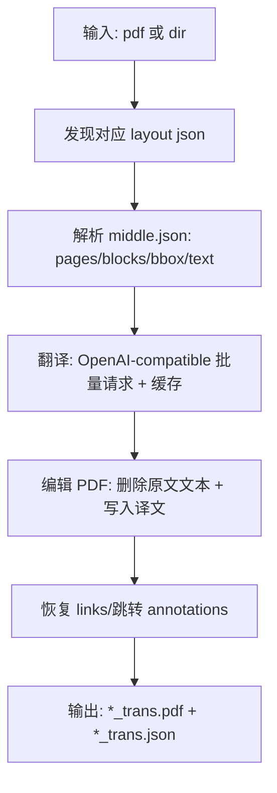

Q: 我现在有以下需求，最终效果是达到我发给你的图片那样的效果，为我详细搜索探讨我应该在哪些阶段使用哪些技术，要求非常非常非常详细，不吝啬篇幅和字数：我现在需要一个新的功能,目的很简单,对pdf中的文本进行翻译并且不改变原来pdf中的排版和功能(比如跳转,超链接等等),所以输入一个pdf(或者文件夹),输出也是一个pdf,与输入pdf在同级目录(或者在提供的文件夹下).本质上是使用mineru输出的layout json文件来看文本和对应的位置,要求其他语言的文本写入后仍要好看,不超格,不重叠等等.翻译引擎使用openai api这样的,一并翻译保存文本并写入pdf,同时我希望原pdf文件保留,相当于新生成了一个新的翻译版pdf。我希望达到的效果是像原来pdf 使用latex渲染出来一样优雅好看,排版,字体等等都非常讲究,同时也不要使用白底进行覆盖了,因为有些页面底色不是白色。源pdf中比如论文/书籍是有跳转的,比如引用论文会跳转到Refernce,还有书籍的目录,点击会跳转到对应的标题行等等

# Skill 得出的 Plan and Task 


```markdown
# Plan：PDF 保排版翻译（MinerU layout json → 写回 PDF）

版本：`v2026-04-20`  
Track：Software  
Level：L2  
WorkType：Build  
Execution Authorization：required

---

## 0. 执行授权（Execution Authorization）【L2 强制】

> 门禁：状态不是 `received` 时，不进入 Execute（保持 Plan Mode）。

- 状态：required
- 授权口令：`开始执行`
- 授权方式：请用户**单独回复**（独立消息或独立一行）`开始执行`
- 授权时间：TBD
- 授权范围（scope）：
  - 代码改动范围：仅 `original-style-translate2/`
  - 测试数据读取：`pdf_with-layout_test/`（只读）
  - 运行产物：允许输出到用户指定 `--output-dir`（默认与输入同级目录）

---

## 1. 目标（Goal）

一句话目标：实现一个新功能：对 PDF 的文本进行翻译并写回生成**新的翻译版 PDF**，尽量不改变原有排版与交互功能（跳转/超链接/目录等）。

### 1.0 用户意图锁定（User Intent Lock）【L2 强制】

- 用户原始诉求摘要：
  - 输入一个 PDF（或文件夹），输出也是 PDF
  - 输出 PDF 与输入同级目录（或用户提供的输出目录下）
  - 使用 MinerU 输出的 layout json（例如 `*_middle.json`）获取文本及其位置
  - 写入后排版要好看：不超格、不重叠；达到 `pdf_with-layout_test/reference` 图片那样的效果
  - 不要用白底覆盖（因为页面底色可能不是白色）
  - 必须尽可能保留原 PDF 功能：跳转、超链接、目录点击跳转等
  - 翻译引擎用 OpenAI-compatible API：`http://172.17.0.1:5003/v1/chat/completions`
  - 原 PDF 必须保留（新生成一个翻译版 PDF）
- 不可违背项：
  - 不修改仓库除 `original-style-translate2/` 外的任何文件
  - 输出 PDF 不覆盖原 PDF
  - 不用白色矩形盖住原文
  - 尽量保留链接/跳转（至少不应因为翻译而丢失 annotations）

### 1.1 成功标准（验收）

- [ ] 能对单个 PDF 生成翻译版 PDF：页数一致、页面尺寸一致、可正常打开
- [ ] 对带有 hyperlinks / internal links 的 PDF：输出 PDF 的 link annotations 数量与输入一致（或至少不显著丢失），点击仍可跳转
- [ ] 译文排版不超出各自 bbox（不重叠、不越界）；字号可自适应但不至于不可读
- [ ] 不使用白底覆盖：删除原文时不影响底色/底图（背景保持）
- [ ] 同时保存翻译文本产物（便于复查与二次写回）

### 1.2 非目标（Non-goals）（本迭代先不做/可后续）

- 不保证数学公式（尤其复杂 LaTeX 级别）与原版完全一致的排印效果
- 不保证对“纯扫描图 PDF（无文本层）”可用
- 不做跨页重排（严格保持每个 layout block 的边界内排版）

---

## 2. 输入材料（Inputs）

- 用户约束：仅改 `original-style-translate2/`；测试数据 `pdf_with-layout_test/`；翻译引擎 endpoint 指定
- 仓库内可复用模块（只读引用）：
  - `pdf_parse_translate/openai_compat.py`：OpenAI-compatible client
  - `pdf_parse_translate/config.py`：YAML 配置读取
  - `pdf_parse_translate/mineru_cli.py`：如需要生成 `*_middle.json` 可复用 CLI 封装
  - `pdf_parse_translate/path_utils.py`：目录递归工具
- 测试夹具：
  - `pdf_with-layout_test/**/**_origin.pdf`
  - `pdf_with-layout_test/**/**_middle.json`
  - `pdf_with-layout_test/reference/*.png`（目标视觉参考）

### 2.1 阅读与理解（Read Log）【L2 强制】

| 条目 | 类型 | 路径 | 摘要（读到的事实） | 关键约束/坑点 | 待验证 |
|---|---|---|---|---|---|
| R-001 | doc | `README.md` | 仓库现有能力：MinerU 解析 PDF→Markdown + 翻译 Markdown | 新需求是“写回 PDF”而非 md | 需要确定 layout json 结构与坐标系 |
| R-002 | code | `pdf_parse_translate/mineru_cli.py` | 可通过 keep=middle_json 产出 `*_middle.json` | 若输入只有 pdf，可考虑先生成 layout json | MinerU 输出路径/命名规律 |
| R-003 | code | `pdf_parse_translate/openai_compat.py` | 已有 OpenAI-compatible client，可复用 endpoint/base_url | 需要批量/并发/重试与超时 | 响应格式稳健解析 |
| R-004 | code | `scripts/translate_md.py` | 翻译脚本现有 CLI/配置风格可参考 | 本任务要翻译 PDF block 并写回 | 翻译 prompt 与 batch 策略 |
| R-005 | data | `pdf_with-layout_test/*/*_middle.json` | `pdf_info` 是 page 列表；每页 `para_blocks` 含 `bbox/lines/spans/content` | bbox 坐标看起来与页面 rect 一致（0,0 左上） | 需要确认对旋转页/多列的鲁棒性 |
| R-006 | experiment | PyMuPDF API | `page.apply_redactions(text=0, images=0, graphics=0)` 只删除文本但会导致 link annotations 丢失 | 必须在编辑前缓存并在保存前恢复 links | 是否影响其它 annotations/outline |

---

## 3. 产出物（Deliverables）

- 新增：`original-style-translate2/` 下的实现代码（CLI + 模块）
- 新增：`original-style-translate2/` 下的说明文档（使用方式、参数、限制）
- 运行产物（不纳入仓库改动范围）：翻译版 PDF + 翻译文本缓存（json）

---

## 4. 约束与边界

- 代码只能写在 `original-style-translate2/`
- 不能改动 `requirements.txt` 等仓库文件（如需新依赖只能依赖环境已有库；当前已确认 PyMuPDF / reportlab 可用）
- 不引入“静默降级”：例如链接丢失时不能假装成功，必须记录并在验证阶段暴露

---

## 5. 方案概览（Approach）

### 5.1 候选方案与推荐

- 方案 A（推荐）：**PyMuPDF 原地改写**
  - 读取 `*_middle.json` → 获取 block bbox 与文本
  - 调用 OpenAI-compatible API 翻译文本（批量+缓存）
  - 用 PyMuPDF：
    - 备份并临时移除 `page.get_links()`（避免 redaction 误伤）
    - 对待翻译块对应 bbox 做 text-only 删除（不填充、不碰图片/图形）
    - 在相同 bbox 内 `insert_textbox` 写入译文（自适应字号/行距/对齐）
    - 重新插入 links
  - 保存为新 PDF，原 PDF 不动
- 方案 B：生成 overlay PDF（reportlab）再合并
  - 优点：排版能力更强（段落/字体控制）
  - 缺点：实现复杂，且仍需处理“删除原文/保留链接”问题

推荐理由：方案 A 更直接，修改更少，且在不改变 PDF 结构的前提下更易保留原交互。

### 5.2 技术链路图（Tech Chain）



图注：从输入 PDF 出发，利用 MinerU layout json 获取“文本+位置”，翻译后写回 PDF 的同一 bbox，过程中需要显式保护并恢复 link annotations。

---

## 6. 验证方案（Validation）

### 6.1 Checkpoint（最小验证）

- 对 `pdf_with-layout_test/Prompt Engineering 68页/*_origin.pdf`：
  - 生成翻译 PDF
  - 统计并对比 `sum(len(page.get_links())`：输出与输入一致

### 6.2 Milestone（覆盖更多类型）

- 再覆盖：
  - 含多列论文：`pdf_with-layout_test/2509.14476/*_origin.pdf`
  - 另一份 PDF：`pdf_with-layout_test/Agent Tools & Interoperability with Model Context Protocol (MCP)/*_origin.pdf`

### 6.3 失败判据（Fail Criteria）

- 输出 PDF 无法打开 / 页数不一致
- link annotations 数量大幅减少（或为 0）
- 明显出现大片白底覆盖（违背 Non-negotiables）


```

```markdown
# Task：PDF 保排版翻译（MinerU layout json → 写回 PDF）

目录：`original-style-translate2/`

任务状态标记：
- `[ ]` 待执行
- `[~]` 进行中
- `[x]` 已完成
- `[!]` 阻塞/需要用户输入

---

## 1. 路由与上下文

- [x] 1.1 Track/Level 判定：Software / L2（写入 `original-style-translate2/State.md`）
- [x] 1.2 Execution Authorization=required（写入 `original-style-translate2/Plan.md` / `original-style-translate2/State.md`）
- [x] 1.3 输入材料清单与 Read Log（写入 `original-style-translate2/Plan.md`）
- [x] 1.4 明确验收标准（写入 `original-style-translate2/Plan.md`）

---

## 2. 规划（Plan Mode）

- [x] 2.1 产出 `original-style-translate2/Plan.md`
- [x] 2.2 产出 `original-style-translate2/Task.md`
- [x] 2.3 产出 `original-style-translate2/State.md`

### 2.4 执行授权门禁（L2 强制）

- [!] 2.4.1 等待用户**单独回复**授权口令 `开始执行`
  - 说明：收到授权后将进入 Execute，开始新增/修改 `original-style-translate2/` 下的实现代码，并对 `pdf_with-layout_test/` 做只读验证。

---

## 3. 实施（Execute 后按任务组推进）

### 3.A Task Group：CLI / 输入输出约定

- [ ] 3.A.1 新增 CLI：支持 `--pdf` / `--dir`，以及可选 `--output-dir`
- [ ] 3.A.2 发现 layout json：
  - 默认查找同目录的 `*_middle.json`
  - 兼容 `_origin.pdf` → 去掉 `_origin` 寻找对应 json
  - 找不到时给出明确错误（不静默降级）
- [ ] 3.A.9 Validate Checkpoint（checkpoint）
  - 验收：能正确找到 fixture 的 middle.json 并解析出 pages/blocks 计数

### 3.B Task Group：翻译引擎（OpenAI-compatible）

- [ ] 3.B.1 复用 `pdf_parse_translate/openai_compat.py` 与 `pdf_parse_translate/config.py`（只读 import）
- [ ] 3.B.2 设计 prompt：学术中文、尽量短、保留专有名词/引用；不翻译代码块/公式块（或保持不变）
- [ ] 3.B.3 实现 batch 翻译与缓存（例如 `*_trans.json`），避免重复请求
- [ ] 3.B.9 Validate Checkpoint（checkpoint）
  - 验收：对单页若干 block 能得到可解析的翻译结果并落盘缓存

### 3.C Task Group：PDF 写回（保排版 + 保链接）

- [ ] 3.C.1 用 PyMuPDF 打开输入 PDF，保存每页 `page.get_links()` 并临时删除 links
- [ ] 3.C.2 按 middle.json 的 bbox 定位要替换的 blocks（先支持 `type in {text,title,list,ref_text}`；跳过 `code/table/image/interline_equation`）
- [ ] 3.C.3 删除原文：text-only（不填充、不影响底色/底图）
- [ ] 3.C.4 写入译文：`insert_textbox` + 自适应字号（避免越界/重叠）
- [ ] 3.C.5 恢复 links（insert_link）
- [ ] 3.C.9 Validate Checkpoint（checkpoint）
  - 验收：输出 PDF 可打开、页数一致；并对比 links 计数一致

---

## 4. 里程碑验证（Milestone Validate）

- [ ] 4.1 在 `pdf_with-layout_test/` 选 2–3 个不同类型 PDF 跑通端到端
- [ ] 4.2 生成最小证据：命令行、输出路径、links 计数对比

---

## 5. Final Validate（最终验证）

- [ ] 5.1 覆盖所有验收标准（Plan 1.1）
- [ ] 5.2 生成交付说明（实现文件清单 + 使用方式 + 已知限制）


```


# 我所希望的 Plan

```markdown
下面这件事，准确地说不是“把 PDF 里的英文换成中文”这么简单，而是一个 **PDF 版式外科手术系统**：先识别原 PDF 的文字、图像、公式、链接、目录、注释、页面坐标和字体风格，再把可翻译文本变成结构化翻译任务，最后在不破坏原页面对象和交互对象的前提下，删除原文字并重新排版写入译文。目标效果接近你图里那种：图片、公式、页眉、页码、栏宽、链接、目录跳转都保留，译文像重新排过版，而不是白色矩形遮盖。

---

## 1. 总体技术路线：不要“覆盖 PDF”，而要“保留背景、移除文字、重绘译文、恢复功能”

你的目标效果建议采用这个主流程：

```text
输入 PDF / 文件夹
  ↓
预检：PDF 类型、权限、字体、页面盒、链接、目录、扫描页、损坏页
  ↓
MinerU 解析：layout / middle.json / span / block / line / bbox
  ↓
PyMuPDF 二次抽取：原始文字样式、字体大小、颜色、旋转、链接、目录、注释
  ↓
构建 Layout DOM：页面 → 栏 → 块 → 行 → span → 可翻译单元
  ↓
保护公式、引用、URL、DOI、代码、页码、图表编号
  ↓
OpenAI API 翻译：结构化 JSON 输出 + 缓存 + 批处理 + 术语表
  ↓
排版适配：字体选择、字号搜索、行距、换行、避让、压缩/改写
  ↓
删除原文字：透明 redaction / 内容流处理，不使用白底覆盖
  ↓
写入译文：HTML/CSS 文本盒或 Pango/HarfBuzz/Cairo 高级文字引擎
  ↓
恢复链接、目录、书签、注释、页面标签、元数据
  ↓
渲染 QA：溢出、重叠、旧文字残留、链接可点击、目录可跳转
  ↓
输出同级 translated PDF，原 PDF 保留
```

核心原则是：**原 PDF 页面本身尽量原地修改，不重新生成整份 PDF**。重新生成整页虽然容易把版面做漂亮，但目录、内部跳转、注释、表单、页面标签、附件、元数据、命名目标等很容易丢。你的需求更像“保留原 PDF 的对象结构，只替换可见文本层”。

---

## 2. 先确认边界：哪些 PDF 可以做到很像 LaTeX，哪些需要降级

### 2.1 最适合的 PDF 类型

最适合的是 **born-digital PDF**，也就是由 LaTeX、Word、InDesign、出版社系统、网页打印等生成的 PDF。特点是：文字仍然是 PDF 文字对象，图像和背景是独立对象，链接是注释对象。这种文件可以做到：

* 原背景、插图、公式、线条、页眉页脚基本不动。
* 原文字被物理移除，而不是白底盖住。
* 新译文是可选中、可复制、可搜索的文本。
* 内部跳转、URL、目录、书签可以保留或重建。

### 2.2 最麻烦的 PDF 类型

扫描 PDF、图片型 PDF、旧 OCR PDF、或出版社把整页压成图片的 PDF最麻烦。因为文字已经变成图片像素，你无法“删除文字后自然露出原背景”。这时只有三种选择：

1. **图像修复 / inpainting**：把原文字区域像图像修复一样补背景，再写译文。复杂背景、纸张纹理、图片上文字会很难。
2. **半透明贴片**：不使用纯白，而是采样区域背景色或生成纹理贴片。效果比白底好，但严格来说仍是覆盖。
3. **标记为低可信页，人工审校**：对学术扫描书籍尤其重要。

MinerU 本身支持 PDF、图片、Office 文件输入，并能输出 Markdown、JSON 等结构化结果，适合做后续处理；它还会输出 layout.pdf、span.pdf、model.json、middle.json、content_list.json 等文件用于调试和二次开发。MinerU 官方文档也提醒，VLM backend 在 2.5 版本的输出结构有重大变化，并且与 pipeline backend 不兼容，所以你的系统必须做版本适配层，而不能硬编码某一种 JSON 结构。([OpenDataLab][1])

---

## 3. 阶段一：PDF 预检，决定后续走哪条处理路线

这一阶段建议不要直接跑翻译，而是为每个 PDF 生成一个 `preflight.json`。它决定该文件能不能做高质量替换、是否需要 OCR、是否要 inpaint、是否存在数字签名、是否有链接/目录/表单需要恢复。

### 3.1 要检查的内容

每个 PDF 至少检查这些字段：

```json
{
  "input_path": ".../paper.pdf",
  "output_path": ".../paper.zh-CN.pdf",
  "page_count": 12,
  "is_encrypted": false,
  "can_modify": true,
  "has_digital_signature": false,
  "has_outline": true,
  "has_links": true,
  "has_forms": false,
  "has_named_destinations": true,
  "born_digital_ratio": 0.96,
  "scan_like_pages": [7],
  "page_boxes": {
    "0": {
      "mediabox": [0, 0, 595.28, 841.89],
      "cropbox": [0, 0, 595.28, 841.89],
      "rotation": 0
    }
  },
  "risk_level": "medium"
}
```

### 3.2 推荐技术

**PyMuPDF** 用于快速打开、抽取页面文字、页面盒、页面旋转、链接、目录、渲染预览、后续删除和写入文本。PyMuPDF 文档说明它能抽取页面文本、图片并向 PDF 页面添加文本、图片等对象。([PyMuPDF][2])

**pikepdf / qpdf** 用于低层 PDF 对象检查、修复、线性化、元数据、命名目标、页面标签、附件、对象树等。pikepdf 是 qpdf 的 Python 封装，适合低层 PDF 操作、修复、线性化、处理加密 PDF，但它不是渲染器，不能把页面渲染成图片。([pikepdf 文档][3])

**pdfium / poppler** 用于渲染 QA。不要只用一个渲染器判断效果，因为不同 PDF 阅读器对字体、透明度、注释、裁剪的处理可能略有差异。

### 3.3 数字签名的特殊处理

如果 PDF 带数字签名，只要你改动正文内容，签名通常会失效；即便使用增量保存，也只有某些允许的改动类型可能不破坏签名。你的系统应该保留原文件，并在译文文件中标记“翻译版已修改原始内容，不保持原签名有效性”。([Nutrient][4])

---

## 4. 阶段二：用 MinerU 做版面理解，但不要只依赖 MinerU

MinerU 是很好的 layout parser，但你的目标不是只拿 Markdown 翻译，而是要把译文写回原 PDF 坐标。因此要把 MinerU 当成 **版面语义识别器**，再用 PyMuPDF 当成 **PDF 真实对象校验器**。

### 4.1 MinerU 负责什么

MinerU 的 `middle.json` 很关键。它包含每页 `pdf_info`，每页有 `page_idx`、`page_size`、`images`、`tables`、`interline_equations`、`para_blocks` 等；块结构可以到 block → line → span，span 含 `bbox`、`type`、`content` 或 `image_path`。这些字段正好适合构造你的翻译单元。([OpenDataLab][5])

你应该使用 MinerU 做：

* 页面阅读顺序识别。
* 标题、正文、列表、脚注、页眉页脚、图注、表注、参考文献的分类。
* 公式识别，尤其是 `inline_equation`、`interline_equation`。
* 图像、表格、图注、表注的关联。
* 多栏论文的阅读顺序和块级 bbox。
* 复杂页面的 layout debug，可用 MinerU 输出的 layout.pdf 和 span.pdf 做人工对照。

### 4.2 PyMuPDF 负责什么

PyMuPDF 的 `rawdict` / `dict` 文字抽取可以得到更接近 PDF 真实文本绘制的信息：block、line、span、字体、字号、颜色、flags、字符 bbox 等。PyMuPDF 文档说明，一个 text page 由 block、line、span 构成，span 是具有相同字体属性的一组相邻字符，包含字体名、字号、flags、颜色等。([PyMuPDF][6])

你应该用 PyMuPDF 补充：

* 原字体名、字号、颜色、粗体/斜体特征。
* 每行 baseline、行高、字符 bbox。
* 旋转文字、页边竖排文字、倾斜文字。
* 链接热区和链接目标。
* PDF 真实 page box、cropbox、rotation。
* 原文字是否真的存在于文本层，而不是图片层。

### 4.3 坐标统一非常重要

MinerU VLM backend 的 bbox 是 `[x0, y0, x1, y1]`，原点在页面左上角，坐标是 0 到 1 的归一化百分比；pipeline backend 中则会出现 `page_size` 和具体 bbox。PyMuPDF / MuPDF 也采用左上角为原点、y 轴向下的坐标系，单位通常是 PDF point，1 point = 1/72 inch。原生 PDF 坐标是左下角原点，所以如果你用 pikepdf 直接写内容流，需要做坐标转换。([OpenDataLab][5])

建议所有内部 layout DOM 统一使用：

```python
# 统一坐标系
origin = "top-left"
unit = "pt"
x_right_positive = True
y_down_positive = True
```

MinerU VLM bbox 转 PyMuPDF bbox：

```python
x0_pt = x0_norm * page_width_pt
y0_pt = y0_norm * page_height_pt
x1_pt = x1_norm * page_width_pt
y1_pt = y1_norm * page_height_pt
```

如果 MinerU 输出是像素坐标：

```python
x0_pt = x0_px / image_width_px * page_width_pt
y0_pt = y0_px / image_height_px * page_height_pt
x1_pt = x1_px / image_width_px * page_width_pt
y1_pt = y1_px / image_height_px * page_height_pt
```

---

## 5. 阶段三：抽取并保护 PDF 功能层

你提到论文引用跳转到 Reference，书籍目录跳转到标题行，这些功能在 PDF 里通常不是正文文本的一部分，而是注释、链接、目录 outline、命名目标、页面标签等对象。

### 5.1 需要保存的功能对象

在修改任何页面前，先把这些对象完整快照：

```json
{
  "toc": [],
  "page_links": {
    "0": [
      {
        "kind": "LINK_GOTO",
        "from": [120.1, 300.2, 140.5, 312.8],
        "page": 10,
        "to": [72, 100],
        "xref": 123
      }
    ]
  },
  "annotations": {},
  "widgets": {},
  "page_labels": {},
  "named_destinations": {},
  "metadata": {},
  "attachments": []
}
```

PyMuPDF 的 Link 对象代表指向文档内部、外部文档或互联网的指针，并且链接存在于每一页上。目录/书签可以通过 `Document.get_toc()` 从 outline chain 中读取，`set_toc(get_toc())` 也能在同坐标语义下保持目标位置。([PyMuPDF][7])

pikepdf 适合处理更底层的 outline 和 destination。pikepdf 文档说明，outlines 也就是书签，用于 PDF 查看器侧边栏导航；destination 决定点击书签后跳转到哪里，既可以指向页，也可以使用 named destination。([pikepdf 文档][8])

### 5.2 链接不是简单“保留原矩形”就够

如果你只是把原链接矩形原样复制回去，某些场景能用，但不是完美：

* 目录页：每一行仍在原位置，原链接矩形大概率可复用。
* 论文引用 `[12]`：翻译后行内位置可能变化，原链接矩形可能不再盖住 `[12]`。
* 图表引用 “Figure 3”：译成“图 3”后文字变短，原链接矩形可能偏移。
* URL：换行后链接区域应重新按新文字位置生成多个矩形。

所以生产级方案应当做 **链接锚点映射**：

1. 在原 PDF 中读取 link rectangle 覆盖的文本，例如 `[7]`、`Section 2.1`、`Figure 3`。
2. 在翻译前把该文本保护成占位符，例如 `<LINK_42>[7]</LINK_42>`。
3. 翻译后要求模型保留占位符。
4. 排版时记录占位符在新文本中的 glyph bbox。
5. 写入译文后，用新 bbox 重新 `insert_link()`。

PyMuPDF 页面 API 支持 `insert_link`、`update_link`、`Page.links`、`Page.load_links` 等方法。([GitHub][9])

---

## 6. 阶段四：构建 Layout DOM，而不是直接翻译字符串

你要达到论文/书籍那种优雅效果，必须把 PDF 结构抽象成自己的中间表示。

### 6.1 推荐数据结构

```python
@dataclass
class DocumentLayout:
    path: str
    pages: list["PageLayout"]
    toc: list
    metadata: dict
    named_destinations: dict

@dataclass
class PageLayout:
    page_index: int
    width: float
    height: float
    rotation: int
    blocks: list["Block"]

@dataclass
class Block:
    id: str
    page_index: int
    block_type: str  # title, text, list, caption, footnote, table_cell, reference...
    bbox: Rect
    reading_order: int
    lines: list["Line"]
    original_text: str
    protected_text: str
    translated_text: str | None
    style: "TextStyle"
    links: list["LinkAnchor"]
    fit_result: "FitResult | None"

@dataclass
class TextStyle:
    font_family_source: str
    target_font_family: str
    font_size: float
    color: tuple[float, float, float]
    bold: bool
    italic: bool
    align: str
    line_height: float
    writing_mode: str
```

### 6.2 块级分类策略

不同块不能用同一种翻译和排版规则：

* `doc_title` / `title`：允许略微改写，使标题紧凑、正式。
* `text`：忠实翻译，保持段落语义。
* `list`：保留编号、缩进、项目符号。
* `image_caption` / `table_caption`：短句优先，不能挤压图表。
* `footnote`：字号小，但不能低于可读阈值。
* `header` / `footer` / `page_number`：通常不翻译，或只翻译固定页眉。
* `ref_text` / references：学术参考文献建议默认不全文翻译，只翻译 “References” 标题或按配置翻译题名。
* `inline_equation` / `interline_equation`：不翻译，只保护和回填。
* `code` / `algorithm`：默认不翻译代码，只翻译注释或标题。

MinerU 的输出类型里包含 text、title、equation、image、caption、table、ref_text、header、footer、page_number 等，正好可用于这一步。([OpenDataLab][5])

---

## 7. 阶段五：翻译引擎设计，重点是“结构化、可恢复、可缓存”

### 7.1 不要整页翻译

整页翻译会破坏：

* 块 ID。
* 链接锚点。
* 公式占位符。
* 图表编号。
* 脚注编号。
* 列表编号。
* 缓存复用。
* 失败重试粒度。

推荐按“段落块”翻译，但提供上下文：

```json
{
  "target_language": "zh-CN",
  "domain": "quantum chemistry",
  "units": [
    {
      "id": "p003_b012",
      "type": "body",
      "text": "For the N-particle system, we choose our unperturbed Hamiltonian...",
      "context_before": "and perturbation theory.",
      "context_after": "using the formalism presented in Chapter 6.",
      "protected_tokens": [
        {"token": "<EQ_1>", "value": "N E_0^{(0+1+2)}"},
        {"token": "<CITE_1>", "value": "(7.70)"}
      ],
      "style_hint": {
        "max_chars_preferred": 120,
        "formal": true,
        "preserve_equations": true
      }
    }
  ]
}
```

### 7.2 OpenAI API 用法

建议使用 OpenAI Responses API 做在线翻译请求，因为它是当前 OpenAI 用于生成模型响应的统一接口，支持文本/图像输入和文本输出，也支持函数调用等能力。对于输出格式，使用 Structured Outputs，让模型返回严格符合 JSON Schema 的结果，避免漏 ID、乱改占位符、返回散文式答案。([OpenAI开发者][10])

对于文件夹批量处理，使用 Batch API。官方文档给出的 Batch API 限制是单个 batch 最多 50,000 个请求，输入 JSONL 文件最大 200 MB，并且 batch rate limits 与普通 per-model rate limits 分开。([OpenAI开发者][11])

### 7.3 翻译结果 schema

```json
{
  "type": "object",
  "additionalProperties": false,
  "required": ["units"],
  "properties": {
    "units": {
      "type": "array",
      "items": {
        "type": "object",
        "additionalProperties": false,
        "required": [
          "id",
          "translation",
          "preserved_tokens",
          "needs_review",
          "length_risk"
        ],
        "properties": {
          "id": {"type": "string"},
          "translation": {"type": "string"},
          "preserved_tokens": {
            "type": "array",
            "items": {"type": "string"}
          },
          "needs_review": {"type": "boolean"},
          "length_risk": {
            "type": "string",
            "enum": ["low", "medium", "high"]
          }
        }
      }
    }
  }
}
```

### 7.4 翻译缓存

必须有缓存，否则大文件迭代排版会非常贵、非常慢。

缓存 key：

```text
sha256(
  normalized_source_text
  + target_language
  + glossary_version
  + prompt_version
  + model_name
  + translation_policy
)
```

缓存内容：

```sql
CREATE TABLE translation_cache (
  key TEXT PRIMARY KEY,
  source_text TEXT,
  translated_text TEXT,
  source_lang TEXT,
  target_lang TEXT,
  model TEXT,
  glossary_version TEXT,
  prompt_version TEXT,
  created_at TEXT,
  quality_flags TEXT
);
```

### 7.5 二次改写请求

排版时如果译文塞不进原 bbox，不要一味缩小字体。应该有第二轮“压缩译文”请求：

```json
{
  "id": "p003_b012",
  "current_translation": "...",
  "max_visual_lines": 4,
  "max_width_pt": 235.0,
  "font_size_pt": 8.8,
  "instruction": "在不丢失核心含义、不删除公式占位符的前提下，压缩为更适合窄栏论文排版的中文。"
}
```

这一步比把字号缩到 5pt 更重要。学术论文尤其如此：中文翻译常常可以通过术语压缩、从句合并、删除冗余连接词来变短。

---

## 8. 阶段六：字体与排版引擎，决定最终是否“像 LaTeX”

### 8.1 字体选择策略

不要直接复用原 PDF 里的嵌入字体来写译文。很多 PDF 嵌入的是子集字体，可能只包含原文用到的字形；英文字体也不包含中文。你应该用完整的目标语言字体，并在输出 PDF 中嵌入子集。

推荐：

* 英文、数字、公式附近：优先保持原 PDF 的拉丁字体观感。
* 中文正文：`Source Han Serif SC` / `Noto Serif CJK SC` 一类宋体/明朝风格，更像论文和书籍。
* 中文标题：可用同一字体的 Semibold/Bold。
* 图注、表注、脚注：同一字体小字号，不要混太多字体。
* UI 或说明类 PDF：可以用 `Source Han Sans` / `Noto Sans CJK`。
* 多语言：使用 Noto/Source Han 作为 fallback。

Source Han Serif 是 Adobe 的开源 Pan-CJK OpenType 字体项目；Noto CJK 字体也提供 Sans 和 Serif CJK 系列。([GitHub][12])

PyMuPDF FAQ 也提醒，内置 Base-14 字体只支持有限字符，扩展字符和 CJK 应使用合适的 Unicode 字体或 CJK fallback。([PyMuPDF][13])

### 8.2 排版引擎分三档

#### A 档：PyMuPDF `insert_htmlbox()` 快速实现

适合 MVP 和多数论文正文。PyMuPDF 的 `insert_textbox()` 可以把文本写入矩形并自动换行；`insert_htmlbox()` 可以使用 HTML/CSS，支持更丰富的文字效果和溢出缩放。PyMuPDF 文档说明，插入文本盒时会按盒宽自动换行，文本可包含 Latin、Greek、Cyrillic、Chinese、Japanese、Korean，richtext/HTML 可以提供更丰富效果。([PyMuPDF][14])

优点：

* 开发快。
* 直接写回原 PDF 页面。
* 支持透明叠加。
* 支持 HTML/CSS 风格。
* 与 PyMuPDF 删除、链接恢复流程整合简单。

缺点：

* 对极致微排版控制有限。
* 对复杂脚本、精确字距、断行惩罚、避头尾标点等控制不如完整排版引擎。
* 有些情况下需要反复试字号。

#### B 档：Pango + HarfBuzz + Cairo，自研 foreground layer

适合你追求“像 LaTeX 一样优雅”的生产级方案。HarfBuzz 负责 text shaping，也就是把 Unicode 字符映射成字体 glyph 并正确定位；PangoLayout 提供段落级排版，包括换行、对齐、两端对齐、省略等。([HarfBuzz 手册][15])

优点：

* 对复杂脚本、双向文本、连字、字形定位更可靠。
* 可拿到每个 glyph 的位置，方便重建链接热区。
* 可实现更复杂的 fit solver。
* 可输出更精确的视觉效果。

缺点：

* 工程量明显更大。
* 需要把 Pango/Cairo 的输出变成 PDF overlay，或把 glyph positions 转成 PDF text operators。
* 字体嵌入、ToUnicode、子集化要更认真处理。

#### C 档：HTML/CSS 全页重排，例如 WeasyPrint

WeasyPrint 是 HTML/CSS 到 PDF 的分页渲染引擎，适合从 HTML 生成漂亮 PDF。([Court Bouillon][16])
但对于你的任务，它更适合作为“重建型”备选方案，而不是默认方案。原因是：它会生成一份新 PDF，而不是原地修改原 PDF；原始内部跳转、注释、命名目标等需要额外迁移，难度更高。

### 8.3 Fit Solver：不要只做“字号缩小”

每个文本块需要一个排版求解器。目标是译文放进原 bbox，且美观、不重叠、不明显变小。

候选参数：

```python
font_size_scale = [1.00, 0.97, 0.94, 0.91, 0.88, 0.85, 0.82, 0.78]
line_height = [1.05, 1.10, 1.15, 1.20]
tracking = [0, -0.01, -0.02]  # 中文慎用
font_variant = ["regular", "condensed_if_available"]
paragraph_rewrite = [False, True]
```

评分函数：

```python
penalty =
    100000 * overflow_area
  + 10000  * collision_area
  + 5000   * clipped_glyph_count
  + 400    * abs(font_size_scale - 1.0)
  + 100    * bad_line_break_count
  + 80     * orphan_punctuation_count
  + 50     * line_count_deviation
  + 20     * raggedness_score
```

通过顺序：

1. 原字号尝试。
2. 轻微调行距。
3. 轻微缩字号。
4. 改用更紧凑翻译。
5. 最多缩到阈值，例如正文不低于原字号的 82% 或绝对 6.5pt。
6. 仍失败则标记人工审校或允许扩大到相邻空白区域。

### 8.4 中文排版细节

要像书籍/论文，中文不能只是换行：

* 标点避头尾：逗号、句号、分号、冒号、右括号、右引号不能出现在行首。
* 左括号、左引号不能出现在行尾。
* 英文缩写、变量、单位不能拆开。
* 公式占位符不要跨行断裂。
* 引文编号 `[12]`、`(7.70)` 不要拆开。
* 图表编号“图 2”、“表 1”不要拆开。
* 两栏论文建议左对齐或轻微两端对齐，不要产生过大字距。
* 页脚脚注不要为了塞进去把字号降得过小，宁可压缩译文。

---

## 9. 阶段七：删除原文字，不使用白底覆盖

这是你需求里最关键的一点。

### 9.1 正确思路

对 born-digital PDF，推荐用 **redaction 删除文字内容，但不填充背景**：

1. 对每个要翻译的文字区域生成 redaction 矩形。
2. `fill=False`，让 redaction 应用后不画白色填充。
3. `images=PDF_REDACT_IMAGE_NONE`，避免把图片区域打白。
4. `graphics=PDF_REDACT_LINE_ART_NONE`，避免删掉线条、表格边框、背景块。
5. 应用 redaction 后，原文字从内容流中物理删除。
6. 再写入译文。

PyMuPDF 的 redaction 文档说明，`fill=False` 可以抑制填充色，使矩形保持透明；`apply_redactions` 可以控制图片和矢量图形如何处理；文本删除是按字符 bbox 与 redaction 矩形是否重叠执行的。文档也明确提醒，所有与 redaction 矩形重叠的 links 会被移除，所以必须提前快照并在后面重建链接。([GitHub][9])

### 9.2 不建议直接用 redaction 的 replacement text

PyMuPDF 的 redaction 支持传入替换文字，但不适合你的高质量排版目标。文档说明 replacement text 字体支持有限，并且如果替换文字更长，可能出现难看的外观、换行或根本插不进去。([GitHub][9])

因此建议：

```python
# 只用 redaction 删除原文字
page.add_redact_annot(rect, fill=False, cross_out=False)
page.apply_redactions(
    images=fitz.PDF_REDACT_IMAGE_NONE,
    graphics=fitz.PDF_REDACT_LINE_ART_NONE,
    text=fitz.PDF_REDACT_TEXT_REMOVE
)

# 然后用独立排版引擎写译文
page.insert_htmlbox(rect, html, css=css, overlay=True, ...)
```

### 9.3 redaction 矩形不能粗暴等于整段 bbox

如果整段 bbox 包含行间背景、图形、链接、边框，风险会变高。更好的策略：

* 按行或字符 union 生成多个窄矩形。
* 对每行 bbox 左右略微扩展 0.3–0.8 pt。
* 上下不要扩太多，避免误删上下行。
* 对含公式的行，把公式 span 从 redaction 区域排除。
* 对链接区域先记录，redaction 后重建。
* 对表格单元格，矩形不要碰到表格线。

示意：

```python
for line in block.lines:
    text_spans = [s for s in line.spans if s.type == "text"]
    rect = union([s.bbox for s in text_spans])
    rect = rect.inflate(x=0.5, y=0.2)
    redaction_rects.append(rect)
```

### 9.4 扫描页的降级策略

如果页面是图片型文字，redaction 删除不了图像里的文字。此时你可以做：

```text
检测文字区域
  ↓
裁剪文字区域 + 周边背景
  ↓
背景复杂度判断
  ↓
简单背景：颜色/纹理采样补洞
复杂背景：图像修复模型 / OpenCV inpainting / LaMa 类模型
  ↓
写入译文
  ↓
QA 标记该页为 raster-inpainted
```

但是要诚实记录：这类页面无法保证“像原生 LaTeX 重新排版”，因为你没有原始背景，只能猜。

---

## 10. 阶段八：写入译文，保持透明背景和原排版质感

### 10.1 每类文本的写入规则

**正文块**

* 使用原 block bbox。
* 字体选择目标语言正文衬线字体。
* 字号初始值接近原字号。
* 行距 1.08–1.18。
* 多栏论文中尽量不跨栏。
* 默认不画背景。

**标题块**

* 字号可比原字号略小一点，因为中文标题视觉密度更高。
* 保留居中、加粗、颜色。
* 长标题可分两行，但不能压到作者信息。

**图注/表注**

* 小字号。
* 保留 “Figure 2.” → “图 2.” 或按配置保留英文。
* 不移动图片和表格。
* 图注不能压进图片。

**页眉页脚**

* 多数情况下不翻译页码。
* 期刊页眉、章节页眉可翻译，也可配置跳过。
* 页脚 DOI、版权声明默认不翻译。

**公式**

* 行间公式不翻译、不删除、不重绘。
* 行内公式作为占位符参与文本排版，或保持原公式 span 不删除。
* 如果公式嵌在英文句子中，最好将公式作为不可断 token 回填。

### 10.2 使用 PyMuPDF 写入的 MVP 方式

```python
css = f"""
body {{
  font-family: "{font_name}";
  font-size: {font_size}pt;
  line-height: {line_height};
  color: rgb({r},{g},{b});
  text-align: {align};
}}
"""

page.insert_htmlbox(
    rect,
    html_text,
    css=css,
    overlay=True,
    scale_low=0.85
)
```

PyMuPDF 文档说明 `insert_htmlbox` 在内容无法放入矩形时，可以选择只报告放不下，或者通过 `scale_low=0` 等策略缩放到适配。([GitHub][9])

### 10.3 高级方式：先生成透明 foreground PDF，再合成

对排版要求很高时，可以用 Pango/HarfBuzz/Cairo 生成一层只含译文的透明 PDF，再把它叠加到已删除原文字的 PDF 上。

```text
original.pdf
  ├─ remove original text → background_without_text.pdf
  └─ layout translated text → translated_text_layer.pdf
           ↓
      merge as foreground
           ↓
      translated.pdf
```

好处是文字排版完全受你控制。坏处是链接热区、字体嵌入、ToUnicode、层叠顺序、透明度都要自己管。

---

## 11. 阶段九：链接、目录、跳转的恢复策略

### 11.1 页面顺序和页数不要变

你的目标是保留原目录和引用跳转，所以默认应保持：

* page count 不变。
* 每页 mediabox/cropbox 不变。
* 页面顺序不变。
* 原图像和公式位置不变。
* 章节标题所在页不变。

这样，很多 outline/bookmark 目标仍然有效。

### 11.2 redaction 后必须重建重叠 links

因为 redaction 会删除重叠链接，处理顺序应是：

```python
links_snapshot = [page.get_links() for page in doc]
toc_snapshot = doc.get_toc(simple=False)

# 删除文字
apply_redactions()

# 写译文
insert_translated_text()

# 重建链接
for page_no, links in links_snapshot:
    for link in rebuild_link_rects(links):
        page.insert_link(link)

# 恢复 / 修正目录
doc.set_toc(toc_snapshot)
```

### 11.3 链接重建分三种

**第一种：整行级链接**

目录页、书籍目录、参考文献目录，链接通常覆盖整行。翻译后行位置基本不变，可以复用原 link rectangle。

**第二种：行内引用链接**

如 `[12]`、`(Smith, 2020)`、“Section 3”。这类应该通过占位符追踪新位置。最好让排版引擎返回占位符 bbox，再创建新的 link rectangle。

**第三种：URL 链接**

URL 如果不翻译，可以在写入后搜索 URL 文本并生成 link。若 URL 换行，需要多个矩形。PyMuPDF 的 `search_for` 可以返回命中文本的矩形，但重复 URL 时要用上下文 disambiguation。

---

## 12. 阶段十：表格、公式、图片、参考文献的特殊处理

### 12.1 表格

表格是翻译 PDF 中最容易翻车的部分。策略建议：

1. **优先保留表格线和背景**。
2. 删除单元格里的文字，不碰线条。
3. 每个单元格单独翻译和 fit。
4. 单元格文字不够放时，优先压缩译文，而不是缩到不可读。
5. 表头可适当改写。
6. 数字、单位、显著性标记、p 值、±、括号不要翻译。
7. 跨行跨列表格要识别 cell 合并。

如果 MinerU 只给 table bbox 和 HTML，不给每个 cell 的精确 PDF 坐标，可以用 PyMuPDF 的 table finder、Camelot、pdfplumber 或自研线条检测补充。复杂表格建议先跳过或输出人工审校标记。

### 12.2 公式

公式的最佳策略是 **不重画**：

* 行间公式：保留原 PDF 公式对象，不 redaction。
* 公式编号：如果是文字对象，可以翻译周边文本但保留编号。
* 行内公式：把公式区域从删除矩形中排除，或在译文中留出占位空间。
* MinerU 可以识别公式并转 LaTeX，但你不一定要用 LaTeX 重绘；重绘会产生字体和基线不一致的问题。

### 12.3 图片和图中文字

* 图片本体默认不翻译。
* 图注翻译。
* 图内标注如果是 PDF 文本对象，可以翻译；如果是图片像素，走 inpainting 或跳过。
* 坐标轴标签如果是文本对象，翻译时要考虑旋转。
* 图例、色条、legend 文字很短，适合单独处理。

### 12.4 参考文献

参考文献建议配置化：

```yaml
references:
  translate_section_title: true
  translate_article_titles: false
  translate_journal_names: false
  preserve_author_names: true
  preserve_doi: true
  preserve_url: true
```

学术 PDF 中 Reference 的链接目标很多，如果你翻译参考文献条目导致行数变化，可能影响引用跳转视觉位置。默认保留参考文献原文更稳。

---

## 13. 阶段十一：QA，决定系统能不能生产使用

你需要的不只是生成 PDF，而是自动判断它是否“好看、没坏、功能还在”。

### 13.1 渲染级 QA

每次输出后，渲染成图片：

```text
before/page_001.png
after/page_001.png
diff/page_001.png
```

检查：

* 是否有旧文字残留。
* 是否有译文超出 bbox。
* 是否文字重叠图片/公式/边框。
* 是否出现黑框、乱码、缺字。
* 是否透明背景正常。
* 是否某页变成空白或图像丢失。

### 13.2 几何级 QA

对每个译文 block：

```python
assert translated_text_bbox <= allowed_bbox
assert not intersects(translated_text_bbox, protected_formula_bboxes)
assert not intersects(translated_text_bbox, image_body_bbox)
assert font_size >= min_font_size
```

还要检查相邻块：

```python
for a, b in nearby_blocks:
    if overlap(a.translated_bbox, b.translated_bbox) > threshold:
        mark_error("overlap")
```

### 13.3 文本级 QA

* 翻译后不能漏掉 block ID。
* 保护 token 必须全部出现。
* 公式占位符数量一致。
* 引用编号数量一致。
* URL / DOI / email 不被改写。
* 页码不被错误翻译。
* 章节编号不丢失。
* 译文不能为空。
* 不出现模型解释性废话，如“以下是翻译”。

Structured Outputs 能显著降低结构化输出错误，因为它要求模型响应符合指定 JSON Schema。([OpenAI开发者][17])

### 13.4 功能级 QA

自动点击/检查：

* TOC entries 是否仍指向合法页。
* 内部 GoTo links 的 page index 是否存在。
* URL links 是否仍是 URI。
* 引用链接是否仍跳到 Reference。
* 书签数量是否与原 PDF 一致。
* 表单字段是否还存在。
* 注释是否还存在。
* 附件是否还存在。

### 13.5 生成 QA 报告

输出一个 HTML 或 JSON 报告：

```json
{
  "status": "needs_review",
  "pages": {
    "3": {
      "overflow_blocks": ["p003_b012"],
      "missing_tokens": [],
      "link_warnings": ["link_42 rectangle approximated"],
      "visual_diff_score": 0.18
    },
    "7": {
      "scan_page": true,
      "inpainting_used": true,
      "quality": "low"
    }
  }
}
```

---

## 14. 阶段十二：文件夹批处理、同级输出、原文件保留

你的 CLI 可以设计成：

```bash
pdf-translator input.pdf --to zh-CN
pdf-translator /books --to zh-CN --recursive
pdf-translator /papers --to zh-CN --workers 4 --engine openai-batch
```

### 14.1 输出规则

单 PDF：

```text
/path/a/book.pdf
/path/a/book.zh-CN.pdf
/path/a/book.zh-CN.translation.json
/path/a/book.zh-CN.report.html
```

文件夹：

```text
/input/A.pdf
/input/A.zh-CN.pdf

/input/sub/B.pdf
/input/sub/B.zh-CN.pdf
```

默认不覆盖：

```text
A.zh-CN.pdf
A.zh-CN.2.pdf
A.zh-CN.3.pdf
```

或者提供：

```bash
--overwrite
--output-dir /translated
--suffix ".translated.zh-CN"
```

### 14.2 任务恢复

对大 PDF 和文件夹必须支持断点续跑：

```text
.work/
  doc_hash/
    preflight.json
    mineru/
    layout_dom.json
    translation_cache.sqlite
    fitted_layout.json
    links_snapshot.json
    pages_done/
      0001.done
      0002.done
```

一页失败不能导致整本书全失败。最终报告里列出失败页和原因。

---

## 15. 推荐工程架构

### 15.1 模块划分

```text
pdf_translator/
  cli.py
  config.py

  preflight/
    inspect_pdf.py
    detect_scan.py
    detect_permissions.py

  mineru_adapter/
    run_mineru.py
    parse_pipeline_middle.py
    parse_vlm_model.py
    normalize_layout.py

  pdf_extract/
    pymupdf_styles.py
    links.py
    outlines.py
    annotations.py
    named_destinations.py

  layout_dom/
    model.py
    merge_spans.py
    reading_order.py
    protect_tokens.py

  translate/
    openai_client.py
    batch_builder.py
    schema.py
    cache.py
    glossary.py

  typeset/
    font_manager.py
    measure_pymupdf.py
    measure_pango.py
    fit_solver.py
    line_break.py

  render/
    erase_text.py
    draw_text_pymupdf.py
    draw_text_cairo.py
    restore_links.py
    save_pdf.py

  qa/
    render_pages.py
    visual_diff.py
    overlap_check.py
    link_check.py
    text_check.py
    report.py
```

### 15.2 配置文件示例

```yaml
target_language: zh-CN

output:
  mode: sibling
  suffix: ".zh-CN"
  overwrite: false
  keep_sidecars: true

mineru:
  backend: pipeline
  use_gpu: true
  fallback_to_ocr: true

translation:
  provider: openai
  mode: batch
  model: configurable
  structured_output: true
  glossary_path: ./glossary.yml
  cache_path: ~/.cache/pdf-translator/translations.sqlite

layout:
  preserve_page_count: true
  preserve_images: true
  preserve_equations: true
  translate_headers: false
  translate_footers: false
  translate_references: false
  min_body_font_size_pt: 6.5
  max_font_shrink: 0.82
  allow_rewrite_to_fit: true

fonts:
  zh-CN:
    serif: "Source Han Serif SC"
    sans: "Source Han Sans SC"
    fallback: "Noto Serif CJK SC"

links:
  restore_original_links: true
  rebuild_inline_links: true
  link_anchor_strategy: token_bbox

qa:
  render_dpi: 180
  fail_on_overlap: true
  fail_on_missing_tokens: true
  generate_html_report: true
```

---

## 16. MVP 到生产级路线图

### 16.1 MVP：先把 born-digital 论文跑通

目标：

* 支持英文论文 PDF → 中文 PDF。
* 保留图片、公式、页数。
* 原文物理删除，不用白底。
* 写入译文不溢出。
* URL 和目录大体保留。

技术：

* MinerU pipeline `middle.json`。
* PyMuPDF 抽取 style、link、toc。
* OpenAI Responses API + Structured Outputs。
* PyMuPDF redaction `fill=False` 删除文字。
* PyMuPDF `insert_htmlbox()` 写译文。
* 简单字号二分 fit。
* 简单 render QA。

先不要做：

* 扫描 PDF。
* 表格复杂翻译。
* 行内链接精确重建。
* 多语言复杂脚本。
* 全量命名目标修复。

### 16.2 Beta：解决论文/书籍常见问题

增加：

* 文件夹批处理。
* Batch API。
* 翻译缓存。
* 图注、表注、脚注分类排版。
* 公式 token 保护。
* 引用 token 保护。
* 链接快照和重建。
* TOC 精确保留。
* 表格 cell-level 翻译。
* QA HTML 报告。
* 失败页跳过和恢复。

### 16.3 Production：追求稳定、可审校、可回归

增加：

* Pango/HarfBuzz 测量引擎。
* glyph-level link bbox。
* 多渲染器 QA。
* OCR/扫描页降级路线。
* 人工审校界面。
* 术语库和项目级翻译记忆。
* 页面级并发。
* 安全日志脱敏。
* 许可证合规检查。
* PDF/A、元数据、附件、表单处理。

PyMuPDF 和 MuPDF 当前采用 AGPL 或商业许可双授权；如果做商业闭源产品，应提前确认许可证路径。([PyMuPDF][18])

### 16.4 Publisher-grade：接近你图里“像重新排版”的效果

增加：

* 自研段落排版器。
* 中文标点禁则。
* 断行惩罚模型。
* 自动压缩译文。
* 局部重排相邻块。
* 图文避让。
* 字重匹配。
* 字距和行距微调。
* 标题层级视觉系统。
* 页面整体视觉评分。

---

## 17. 最容易踩的坑

### 坑一：直接在 PDF 内容流里替换字符串

不要把 PDF 当 HTML 或 TXT。PDF 里的文字经常不是 Unicode 字符串，而是字体编码、glyph id、子集字体、CMap、ToUnicode 映射和定位指令的组合。直接查找替换内容流很容易乱码、漏字、破坏字距、破坏字体资源。更稳的是：抽取文字 → 删除原文字 → 用新字体重绘译文。

### 坑二：用白色矩形覆盖

这正是你明确不想要的。白底覆盖在非白页面、渐变背景、图片、彩色框、扫描纸张上会立刻露馅。正确方式是透明 redaction 删除文本对象；扫描页才考虑背景修复。

### 坑三：只用 MinerU，不看 PDF 原对象

MinerU 给你 layout 语义，但不一定知道 PDF 的链接、目录、命名目标、注释、字体资源、真实页面盒。必须结合 PyMuPDF/pikepdf。

### 坑四：链接提前没保存

redaction 会删除重叠链接。你必须先 snapshot，再删除文字，再重建链接。

### 坑五：翻译太忠实，排版太难看

“忠实”不等于“逐词冗长”。论文窄栏需要紧凑译文。建议允许二次压缩，尤其标题、图注、表注、脚注。

### 坑六：字体没有 CJK 字形

如果使用原英文字体写中文，必然缺字或 fallback 混乱。应使用完整 CJK 字体，并嵌入子集。

### 坑七：只看生成 PDF，不做渲染对比

PDF 在一个阅读器里看着没问题，不代表另一个阅读器没问题。至少用一个稳定渲染器自动渲染；生产环境建议用两个。

---

## 18. 我建议你的最终技术选型

最实用、可落地、效果好的组合是：

```text
版面识别：
  MinerU pipeline backend 为主，VLM/OCR 作为扫描页 fallback

PDF 操作：
  PyMuPDF 负责文本抽取、redaction、写入译文、链接/目录基本处理、渲染
  pikepdf/qpdf 负责低层对象、命名目标、元数据、附件、修复、线性化

翻译：
  OpenAI Responses API + Structured Outputs
  大批量用 Batch API
  SQLite translation memory

排版：
  第一版用 PyMuPDF insert_htmlbox
  生产版加入 Pango/HarfBuzz 测量
  更高要求用 Pango/Cairo foreground PDF layer

字体：
  Source Han Serif / Noto Serif CJK 作为中文论文书籍正文
  Source Han Sans / Noto Sans CJK 作为无衬线 fallback
  fontTools/pyftsubset 做字体子集化

QA：
  pdfium/poppler 渲染对比
  几何 overlap 检测
  token preservation 检测
  link/toc 自动检查
  HTML 报告
```

---

## 19. 最小可行伪代码

```python
def translate_pdf(input_pdf: Path, target_lang: str) -> Path:
    output_pdf = make_sibling_output_path(input_pdf, target_lang)

    # 1. 原文件不动，复制到临时工作文件
    work_pdf = copy_to_workdir(input_pdf)

    # 2. 预检
    preflight = inspect_pdf(work_pdf)

    # 3. MinerU layout
    mineru_result = run_mineru(work_pdf)
    layout = parse_mineru_to_layout_dom(mineru_result)

    # 4. PyMuPDF 补充 PDF 真实信息
    doc = fitz.open(work_pdf)
    style_info = extract_styles_with_pymupdf(doc)
    links_snapshot = snapshot_links(doc)
    toc_snapshot = doc.get_toc(simple=False)

    # 5. 合并样式和 layout
    layout = enrich_layout(layout, style_info, links_snapshot)

    # 6. 保护公式、引用、链接锚点
    units = build_translation_units(layout)

    # 7. 翻译
    translations = translate_units_with_cache(units, target_lang)

    # 8. fit solver
    fitted_blocks = []
    for block in layout.translatable_blocks:
        result = fit_translation_into_box(
            block=block,
            translation=translations[block.id],
            font_manager=font_manager,
        )
        fitted_blocks.append(result)

    # 9. 删除原文字，不填白底
    for page_index, page in enumerate(doc):
        redaction_rects = build_redaction_rects(layout.pages[page_index])
        for rect in redaction_rects:
            page.add_redact_annot(rect, fill=False, cross_out=False)

        page.apply_redactions(
            images=fitz.PDF_REDACT_IMAGE_NONE,
            graphics=fitz.PDF_REDACT_LINE_ART_NONE,
            text=fitz.PDF_REDACT_TEXT_REMOVE,
        )

    # 10. 写入译文
    for fitted in fitted_blocks:
        page = doc[fitted.page_index]
        page.insert_htmlbox(
            fitted.rect,
            fitted.html,
            css=fitted.css,
            overlay=True,
            scale_low=fitted.scale_low,
        )

    # 11. 重建 links / toc
    rebuild_links(doc, links_snapshot, fitted_blocks)
    doc.set_toc(toc_snapshot)

    # 12. 保存
    doc.save(
        output_pdf,
        garbage=4,
        deflate=True,
        clean=True,
    )
    doc.close()

    # 13. QA
    report = run_qa(input_pdf, output_pdf, layout, fitted_blocks)
    write_report(report, output_pdf.with_suffix(".report.html"))

    return output_pdf
```

---

## 20. 最终建议

你的功能可以做成两个模式：

**默认模式：Faithful PDF Translation**

* 保持页数、页面尺寸、图像、公式、目录、链接。
* 每个文本块在原位置内重排。
* 不白底覆盖。
* 最适合论文、教材、技术文档。

**高级模式：Beautiful Re-typeset Translation**

* 允许局部移动块、压缩/扩展段落、重排脚注。
* 效果更像真正翻译排版书。
* 链接和目录需要更复杂的重建。
* 适合高价值书籍或出版级处理。

从工程落地看，先做默认模式，核心攻克 **透明删除原文字 + block 级 fit + 链接恢复 + QA**。等这个稳定后，再上 Pango/HarfBuzz 和更高级的中文排版规则。这样最接近你图里的效果，也不会一开始就陷入“重新实现 InDesign/LaTeX”的巨大工程。

[1]: https://opendatalab.github.io/MinerU/ "MinerU - MinerU"
[2]: https://pymupdf.readthedocs.io/en/latest/tutorial.html?utm_source=chatgpt.com "Tutorial - PyMuPDF documentation"
[3]: https://pikepdf.readthedocs.io/en/latest/index.html "pikepdf Documentation — pikepdf 10.5.1 documentation"
[4]: https://www.nutrient.io/guides/web/signatures/digital-signatures/troubleshooting/document-modified-since-signature/?utm_source=chatgpt.com "Modify PDF after digital signing"
[5]: https://opendatalab.github.io/MinerU/reference/output_files/ "Output File Format - MinerU"
[6]: https://pymupdf.readthedocs.io/en/latest/app1.html "Appendix 1: Details on Text Extraction - PyMuPDF documentation"
[7]: https://pymupdf.readthedocs.io/en/latest/link.html "Link - PyMuPDF documentation"
[8]: https://pikepdf.readthedocs.io/en/latest/topics/outlines.html "Outlines — pikepdf 10.5.1 documentation"
[9]: https://github.com/pymupdf/PyMuPDF/blob/main/docs/page.rst "PyMuPDF/docs/page.rst at main · pymupdf/PyMuPDF · GitHub"
[10]: https://developers.openai.com/api/reference/responses/overview/ "Responses Overview | OpenAI API Reference"
[11]: https://developers.openai.com/api/docs/guides/batch "Batch API | OpenAI API"
[12]: https://github.com/adobe-fonts/source-han-serif?utm_source=chatgpt.com "adobe-fonts/source-han-serif - 思源宋體香港"
[13]: https://pymupdf.readthedocs.io/en/latest/faq/index.html "FAQ - PyMuPDF documentation"
[14]: https://pymupdf.readthedocs.io/en/latest/page.html "Page - PyMuPDF documentation"
[15]: https://harfbuzz.github.io/why-do-i-need-a-shaping-engine.html "Why do I need a shaping engine?: HarfBuzz Manual"
[16]: https://doc.courtbouillon.org/weasyprint/stable/ "WeasyPrint 68.1 documentation"
[17]: https://developers.openai.com/api/docs/guides/structured-outputs "Structured model outputs | OpenAI API"
[18]: https://pymupdf.readthedocs.io/en/latest/about.html?utm_source=chatgpt.com "Features Comparison - PyMuPDF documentation"

```