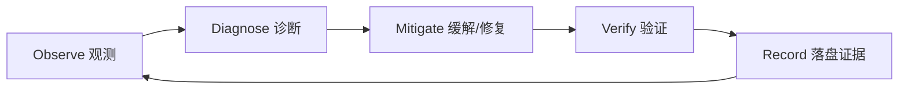

# Quality / Operations / Maintenance（质量 / 运维 / 维护）检查表

适用：Software Track（尤其 L3、长期维护或要交付给他人使用的项目）。

---

## 触发条件

- 要交付的东西不是“一次性脚本”，而是要长期演化
- 出现可靠性/可观测性/部署/回滚/维护成本担忧
- Review 分数低但功能“能跑”，需要系统性提升质量

---

## A. Quality（质量）：质量不是“加测试”，是“把风险显式化并可验证”

检查项：
- [ ] 质量目标明确：正确性、可维护性、可诊断性、安全、性能（按任务取舍）
- [ ] 质量成本被承认并在 Plan 中显式记录（trade-offs）
- [ ] 关键质量项可验证（证据入口写入 State.md）

来源：
- SWEBOK v4.0a — Chapter 12 *Software Quality*, §1.1 *Software Engineering Culture and Ethics*, §1.2 *Value and Costs of Quality*

---

## B. Operations（运维）：把“怎么跑”当成一等公民

检查项：
- [ ] 有 Runbook（启动/停止/健康检查/常见失败模式）（建议使用 `templates/Ops-Runbook.template.md`）
- [ ] 启动/停止/健康检查路径明确（哪怕只是命令清单）
- [ ] 关键失败模式可诊断（错误信息/日志能定位原因）
- [ ] 运行边界明确（端口/资源/依赖服务）

### B.1 Monitoring（监控）：把“盯着看”变成可复查证据

检查项：
- [ ] 明确观察点：logs / metrics / artifacts（产物文件）
- [ ] 明确阈值：什么算异常（例如 OOM、吞吐退化、训练 loss 长时间不下降）
- [ ] 告警触发后动作明确：先诊断什么、再缓解什么、最后如何验证
- [ ] 证据落盘：将日志片段/指标截图/产物路径写入 `State.md` Evidence Index

（可选）Ops 闭环图：

来源：
- `Reference/Software Engineering Body of Knowledge v4.0a/Software Engineering Body of Knowledge v4.0a.md` — Chapter 06 *Software Engineering Operations*, §1（Fundamentals/Processes）

---

## C. Maintenance（维护）：为变化做设计，而不是为当前做一次性补丁

检查项：
- [ ] 变更影响面被限制在模块边界内（避免连锁修改）
- [ ] 可替换性：未来要换实现时，接口不会崩
- [ ] 文档/注释不漂移：关键抽象边界与决策有记录

来源：
- SWEBOK v4.0a — Chapter 07 *Software Maintenance*, §1（Fundamentals）
- Ousterhout — Ch.16/17（修改既有代码、保持一致性）

---

## D. Review 时的“质量整改”打法（建议）

当功能可用但质量薄弱：
1) 先补证据：让关键 AC-XXX 有验证入口（Validate）
2) 再降复杂度：信息隐藏、深模块、去除重复与泄漏
3) 再补运维：启动/诊断/边界
4) 最后再谈性能优化（避免过早优化）
