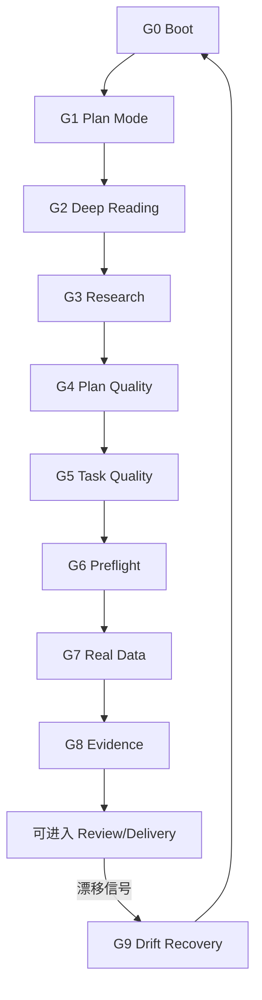

# 00-hard-gates：AgentSkill v0.3.0 硬门禁协议

适用范围：
- Track：Research / Software / Writing
- Level：L2 / L3（强制）

目的：
把“建议”升级为“状态机门禁”。任何大任务都必须能被**追溯**（Plan/Task/State）、能被**复跑**（命令与数据）、能被**验证**（证据门禁）、能在**上下文压缩后恢复**（Resumption Block）。

本协议只定义门禁与失败处理；细节模板与清单见：
- `templates/PlanQualityGate.template.md`
- `templates/ExecutionPreflight.template.md`
- `templates/ValidationMatrix.template.md`
- `templates/ResumptionBlock.template.md`
- `templates/FallbackRegister.template.md`
- `protocols/01-plan-mode-and-deep-plan.md`
- `protocols/04-validation-real-data-first.md`
- `protocols/05-resumption-and-anti-drift.md`
- `protocols/07-fallback-and-boundaries.md`

---

## 1) Gate Result Schema（统一门禁结果结构）

每次“准备进入下一阶段 / 准备执行一批任务 / 准备宣称完成”时，都必须产生一条可落盘的门禁结果（写入 `State.md` 的 Gate Summary 或作为段落附在 Plan/Validate/Review 中）。

```yaml
gate_id: "G0"
name: "Boot Gate"
status: "pass" # pass | blocked | fail | skip
why: "一句话说明通过/阻塞/失败的原因"
evidence:
  - "证据入口（文件/命令/日志/截图/链接）"
next_action:
  - "下一步 1"
  - "下一步 2"
```

状态含义：
- `pass`：满足继续推进条件
- `blocked`：缺输入/缺数据/缺权限导致无法继续（必须停下并把阻塞点写清）
- `fail`：违反硬约束或质量门禁（必须回退修复，不得继续）
- `skip`：仅允许 L0/L1 或明确不适用时使用（必须写明原因）

硬规则：
- 任一关键 Gate 为 `blocked/fail` 时，不得进入后续阶段。
- 任一 Gate 为 `fail` 时，不得用“兜底/降级”绕过；只有在 Plan 阶段写入并经用户确认的 Fallback 才允许执行。

---

## 2) 门禁清单（G0–G9）

### G0：Boot Gate（每轮启动门禁）

触发：
- 每条用户新消息开始时
- 任何工具调用/执行批次开始前
- 上下文压缩/重启/中断后恢复时

通过条件：
- 已读取/确认 `State.md`（存在则必须读；不存在则创建）
- 已读取当前迭代 `Plan.md` / `Task.md`（存在则必须读；不存在则按 Level 建立）
- 已明确写出当前：`Mode / Track / Level / ExecutionAuth / Current Task Group / Next Action`
- 已确认边界：禁止访问的目录、允许修改的范围

失败处理：
- 缺 State/Plan/Task：先补齐，不得直接进入执行
- 边界不清：先落盘边界（Allowed/Forbidden），再继续

---

### G1：Plan Mode Gate（计划硬锁门禁）

触发：Level ≥ L2 且 Execution Authorization 不是 `received`

通过条件：
- 当前处于 Plan Mode（只允许：深读材料、调研、讨论、写/改 Plan/Task/State/需求文档）
- 未发生执行型改动（业务代码/配置/数据迁移/破坏性命令/长时间训练与监控）

失败处理：
- 一旦越权执行：立即停线（Stop-the-line），进入 Recovery Protocol：
  1) 记录事故（State Decision Log）
  2) 明确影响范围与补救计划
  3) 回到 Plan Mode 重新对齐并重新走授权门禁

---

### G2：Deep Reading Gate（深读门禁）

触发：Level ≥ L2 且进入 Plan/Research/Design 前

通过条件（至少满足其一并落盘证据）：
- 已深读用户提供的材料（文档/代码/日志/数据说明），并在 Plan 写明“读了什么、读到哪里、结论是什么”
- 已完成仓库勘测（模块图/依赖图/入口点/关键文件清单），并落盘

失败处理：
- 未读就开写：判定为 Gate 失败；回到 Plan 补齐读材料与记录

---

### G3：Research Gate（高质量调研门禁）

触发：任务需要外部事实/论文/标准/官方文档/版本信息，且这些信息会影响方案与验收

通过条件：
- 已做外部检索，并在 Plan/Research Log 中记录：
  - 关键来源（优先一手资料：官方文档/标准/论文/源码）
  - 关键结论与对方案的影响
  - 仍不确定的点（Open Questions）

失败处理：
- 无来源硬写结论：Gate 失败；先补齐来源或把结论降级为“待证实的假设”

---

### G4：Plan Quality Gate（深度规划质量门禁）

触发：请求执行授权前；或准备从 Plan Mode 进入 Execute/Write 前

通过条件：
- Plan 满足 `protocols/01-plan-mode-and-deep-plan.md` 的 Deep Plan 最低结构
- Plan 不含明显占位符（`<...>`、`TODO`、`TBD`、`path/to/...` 等）
- 已写 Acceptance Contract（验收契约）
- 已写 Validation Matrix（验收→验证→证据映射）
- 已写 Real Data Strategy（真实数据优先）
- （当需要外部事实）Research Log 达到最低研究包，并记录版本/日期与对方案的影响
- 已给出“阶段流水线”与阶段→技术→验证映射（避免流程/技术栈敷衍）
- （当涉及第三方库/格式内核）已写 Tech Stack / Versions / License Notes
- （当涉及可感知质量/交互功能/格式保持）已写 QA & Evidence Plan（渲染/几何/功能/证据产物）
- 已写 Fallback Policy（默认禁止兜底；允许项已登记并获得确认）
- 已写 Resumption Block（可续跑块）

失败处理：
- Plan 不达标：不得请求 `开始执行`，先补齐 Plan/Task

---

### G5：Task Quality Gate（任务拆分质量门禁）

触发：进入执行前；或每次要开始一个新的 Task Group 前

通过条件：
- Task 按 Task Group 组织，并包含：
  - Tasks（可勾选、可执行、可验证）
  - Checkpoint Validation（组末检查点）
  - Milestone/Final Validation（阶段/全局验证）
- 每个 Task Group 能映射回 Plan 的某一段（需求/模块/里程碑/风险）
- 验证节奏明确：micro-check / checkpoint / milestone / final

失败处理：
- Task 粒度不清或无法验证：回到 Plan/Task 重写拆分

---

### G6：Execution Preflight Gate（执行预检门禁）

触发：每个执行批次开始前；每个 Task Group 开始前

通过条件：
- 已完成执行预检（环境/依赖/数据/权限/回滚点/观测点/预计成本）
- 已记录“本批次要跑哪些命令/修改哪些文件/如何验证”

失败处理：
- 预检不通过：不得开始本批次执行；先修环境/补数据/补权限/改计划

---

### G7：Real Data Validation Gate（真实数据优先门禁）

触发：任何需要验证“正确性/效果/性能/排版/交互功能/训练曲线/可观测性”的任务

通过条件：
- 按 `protocols/04-validation-real-data-first.md` 的数据优先级使用数据
- 若未使用真实/脱敏真实数据：必须在 Plan/State 写明原因，并获得用户确认

失败处理：
- 在可获得真实数据时仍用 synthetic：Gate 失败；结论视为不可信，回退重验

---

### G8：Evidence Gate（证据门禁）

触发：宣称“完成/通过/修复/可复现/可部署/可监控”前

通过条件：
- Validate 输出包含：
  - 运行命令
  - 数据来源与数据类型
  - 关键日志/指标/截图等证据入口
  - 失败项与剩余风险（如有）
- `State.md` Evidence Index 已更新（能定位到证据）

失败处理：
- 无证据宣称完成：Gate 失败；结论必须改为 `missing` 并补齐证据

---

### G9：Drift Recovery Gate（漂移恢复门禁）

触发（任一命中）：
- 忘记执行授权门禁而开始执行
- 逐轮忽视 Plan/Task/State
- 未经确认引入兜底/降级
- 真实数据门禁被绕过
- 上下文压缩后直接续跑但不做恢复

通过条件：
- 按 `protocols/05-resumption-and-anti-drift.md` 完成恢复步骤
- 明确写出：当前 Mode/ExecutionAuth/Next Action/Blockers

失败处理：
- 不通过不得继续；回到 Plan 修复工件与门禁

---

## 3) 门禁执行顺序（推荐）



注：
- 这是“最保守”的默认顺序。具体任务可以跳过不适用门禁，但必须写明 `skip` 理由。
