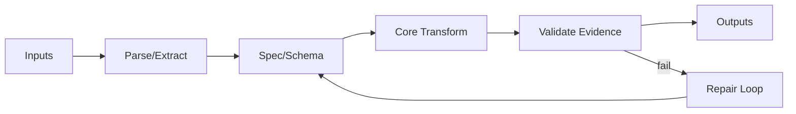

# 01-plan-mode-and-deep-plan：深度规划协议（Plan Mode）

适用范围：
- Track：Research / Software / Writing
- Level：L2 / L3（强制）

目标：
让 Plan Mode 成为“硬锁”，并把 Plan.md 升级为高密度规格文档：能指导实现、能指导验证、能支撑复现与交付、能在长对话与上下文压缩后稳定续跑。

相关门禁：
- `protocols/00-hard-gates.md`：G1/G2/G3/G4/G5

---

## 1) Plan Mode 的定义

Plan Mode 的核心不是“写文档”，而是把不确定性提前消掉，让执行变成按图施工。

### 1.1 Plan Mode 允许做的事（允许）
- 深读用户材料：文档、代码、日志、数据、约束
- 仓库勘测与现状盘点（不改业务文件）
- 高质量外部检索（必要时联网）：官方文档、论文、标准、源码、一手资料
- 头脑风暴与方案对比（给出默认推荐路线）
- 编写/更新这些工件（允许写入）：
  - `Plan.md`
  - `Task.md`
  - `State.md`
  - `AcceptanceContract.md`（若任务级别需要）
  - 需求文档与版本 Docs（若存在约定目录）

### 1.2 Plan Mode 禁止做的事（禁止）
- 修改业务代码/实现文件/配置文件（除 Plan/Task/State 等治理工件）
- 运行破坏性命令（删除、覆盖、迁移、不可逆操作）
- 进入长时间训练/长任务运行/持续监控（除非仅为获得必需证据且已获得执行授权）
- 在没有执行授权时生成“最终交付物”（例如发布包、最终 PDF、最终模型权重等）
- 未经确认引入兜底/降级（见 `protocols/07-fallback-and-boundaries.md`）

---

## 2) 需求理解原则（Plan Mode 的交互规则）

原则：Plan Mode 不是“一轮问完”，而是“每轮都必须缩小不确定性并落盘”。

每轮必须产出（写进回复与工件）：
- **新增理解**：本轮新增确认了什么
- **新增证据**：本轮读了什么、搜了什么、证据在哪里
- **Plan/Task 更新**：新增了哪些段落/哪些任务组
- **仍阻塞的最小输入**：阻塞点必须可操作（用户能提供什么；或需要联网检索什么）
- **下一步**：下一步 1–3 个动作（按顺序）

对齐方式：
- 默认给出“推荐路线 + 取舍理由”，并把它写入 Plan。
- 提问只问“推进 Plan 收敛所必需”的少数关键点；避免把方案选择成本转嫁给用户。

---

## 3) User Intent Lock（用户意图锁）

所有 L2/L3 Plan 必须包含一个“用户意图锁”，用于防止执行中漂移、偷换验收、擅自扩/缩范围。

推荐结构（写入 Plan.md，必要时同步到 State.md）：

```yaml
primary_goal: ""
secondary_goals: []
must_preserve: []  # 必须保留/不得破坏的性质（功能/性能/格式/合规/接口/跳转等）
must_avoid: []     # 必须避免的事（例如：白底覆盖、擅自兜底、改接口等）
non_goals: []      # 明确不做的内容
quality_bar: ""    # 输出质量标准（例如“像 LaTeX 那样克制统一”）
style_preferences: ""  # 语言/文风/交付习惯
scope_boundary: ""     # 范围边界（含允许修改与禁止访问）
latest_user_feedback: ""
```

硬规则：
- 后续任何执行与验证都必须能映射回此锁定内容；发现不一致必须回 Plan 修复或走变更控制（见 `templates/ChangeControl.template.md`）。

---

## 4) Deep Plan 的最低内容（Plan.md 结构门槛）

L3：必须达到以下结构密度。  
L2：默认采用同一结构，但允许合并段落；不得省略关键门禁内容（验收/验证/数据/边界/风险/任务映射）。

最低结构（建议按此顺序）：

1) **Protocol State**
   - Track / WorkType / Level
   - Current Mode=Plan
   - Execution Authorization=not_received（直到用户单独回复授权口令）
2) **User Intent Lock**（见上）
3) **Problem Frame**
   - 一句话目标 + 背景 + 成功后的状态
4) **Current State / Gap Analysis**
   - 现状、缺口、失败样例、为什么现在做不到
5) **Inputs and Materials Read（深读清单）**
   - 用户材料清单 + 读到哪里 + 关键发现
   - 仓库地图（入口点、关键模块、关键约束）
6) **Research Log（调研记录）**
   - 来源（优先一手）
   - 关键结论
   - 对方案的影响
7) **Requirements（需求）**
   - Functional（功能）
   - Non-functional（性能/资源/可靠性/兼容性/安全/可维护性）
   - Documentation（文档交付要求）
   - Ops/Monitoring（运行与监控要求，若适用）
8) **Non-goals（不做什么）**
9) **Constraints and Boundaries（约束与边界）**
   - Allowed / Forbidden
   - 允许修改的路径范围
   - 禁止访问/禁止修改的范围
   - Fallback Policy（默认禁止；允许项需登记）
   - （当涉及第三方库/工具/格式内核）必须写明：
     - 技术栈清单（库/工具/版本/许可证与风险点）
     - 版本兼容与已知变化点（需要调研证据支撑）
10) **Candidate Solutions（候选路线）**
   - 至少两条路线对比（保守/推荐/长期）
   - 风险、代价、验证难度
11) **Architecture Decision（架构决策）**
   - 选择哪条路线 + 理由
   - 关键权衡（tradeoffs）
   - 关键决策记录（可链接 `templates/ADR.template.md`）
12) **Technical Chain / Method Chain（技术链路/方法链路）**
   - 数据流、控制流、模块边界、接口边界
   - 至少一张图（Mermaid/PlantUML/ASCII）
   - （强制）把链路进一步拆成“阶段流水线”，并给出 **阶段→技术→验证** 映射（至少一张表）：
     - 每个阶段：输入/输出工件、候选技术栈、推荐技术栈、关键风险、验证方法与证据入口
     - 目的：避免“流程/技术栈敷衍”，让执行能按阶段推进并在检查点验证
13) **Specification（规格优先）**
   - Data Model / Interfaces / State / Error Handling
   - Logging/Monitoring（观测点）
   - Performance/Resource Targets
   - Security/Privacy（如适用）
14) **Development / Work Strategy（开发/工作策略）**
   - 说明采用的策略组合（例如 SDD(spec-d-d) + 行为锁定 + 原型验证 + 契约先行 + 可观测性优先）
   - 明确哪些部分先做 Spike、哪些部分先固化验收与证据
15) **Acceptance Contract（验收契约）**
   - AC-XXX：可操作、可验证、可证据化
16) **Validation Matrix（验收→验证→证据映射）**
   - 见 `templates/ValidationMatrix.template.md`
17) **Real Data Strategy（真实数据策略）**
   - 数据优先级、数据获取方式、脱敏策略、缺失处理
18) **QA & Evidence Plan（QA 与证据计划）**
   - 对“可感知质量/交互功能/格式保持”类任务，这是硬门禁
   - 必须明确：渲染 QA（截图/可视化 diff）、几何 QA（溢出/重叠/越界）、功能 QA（链接/目录/跳转）、多渲染器验证（按需）
   - 必须明确证据产物的命名与落盘位置（Evidence Index 可定位）
19) **Risk Register（风险登记）**
20) **Fallback Register（兜底登记，默认空）**
   - 只有 Plan 阶段写入且经确认的项才允许执行
21) **Documentation Plan（配套文档计划）**
22) **Milestones（里程碑）**
   - 每个里程碑必须写“阶段范围 + 产出物 + 验证门禁 + 证据入口”
   - 建议附带一条“从 MVP 到可生产使用”的路线图（避免一开始就陷入无限工程）
23) **Task Mapping（Plan→Task 映射）**
   - 每个里程碑/模块对应哪些 Task Group
24) **Ready-to-Execute Gate（请求执行授权前的自检）**
25) **Resumption Block（可续跑块）**
   - 见 `templates/ResumptionBlock.template.md`

---

## 5) Deep Reading 标准（读材料要可复查）

“深读”不是一句话，需要能被复查：
- 读了哪些文件/哪些章节/哪些模块
- 关键结论是什么
- 哪些结论改变了方案
- 哪些问题仍需确认

推荐在 Plan 的 “Inputs and Materials Read” 段落中用表格落盘：

| Material | Type | Scope | Key takeaways | Impact on plan |
|---|---|---|---|---|
| `<path-or-link>` | code/doc/data/log | `<where>` | `<...>` | `<...>` |

---

## 6) Research Log 标准（调研要可追溯）

调研记录至少包含：
- Query（关键词）
- Source（来源与链接）
- Extracted facts（抽取的事实）
- Decision impact（对方案的影响）
- Open questions（仍不确定的点）

优先级：
1) 官方文档 / 标准 / 论文 / 源码（第一优先）
2) 权威二手总结（需要交叉验证）
3) 论坛/博客（只能作为线索，不得作为唯一依据）

---

## 7) 候选方案与架构决策（必须给出默认推荐）

Plan 必须包含至少两条可行路线，并给出“推荐路线”：
- 推荐不等于强推：它必须绑定用户意图锁与约束、并解释取舍。
- 任何“质量/性能/可维护性”的承诺必须对应到验证矩阵。

---

## 8) 技术链路（必须可画出来）

技术链路要求把“端到端”讲清：
- 输入是什么、输出是什么
- 中间经过哪些模块/阶段
- 数据如何流转
- 错误在哪里发生、如何恢复

示意图（示例，仅结构参考）：



---

## 9) 规格优先（Spec 驱动）

硬规则：
- Plan 中定义的规格（验收/接口/错误语义/不变量/数据约束）必须落到 Task 与验证中。
- 任何执行期发现的“规格缺口”，必须回 Plan 补齐并更新 Task，而不是在实现里临时拍脑袋。

---

## 10) Ready-to-Execute Gate（请求执行授权前的自检）

在向用户请求执行授权之前，Plan 必须通过自检（G4/G5）：
- Plan 结构达标（Deep Plan minimum）
- Task 拆分达标（Task Group + 验证节奏）
- 验收与验证矩阵已写
- 真实数据策略已写
- 兜底/降级策略为空或已登记并获得确认
- Resumption Block 已写（上下文压缩后能恢复）

自检建议用模板：
- `templates/PlanQualityGate.template.md`

---

## 11) Plan Mode 的标准输出骨架（对外回执）

Plan Mode 对外回复建议固定骨架（用于防漂移与防“写完就执行”）：

1) 当前 Mode/Level/ExecutionAuth
2) 本轮新增理解/证据
3) 已更新的工件（Plan/Task/State）
4) 当前阻塞点（最小输入）
5) 下一步（按顺序 1–3 条）
