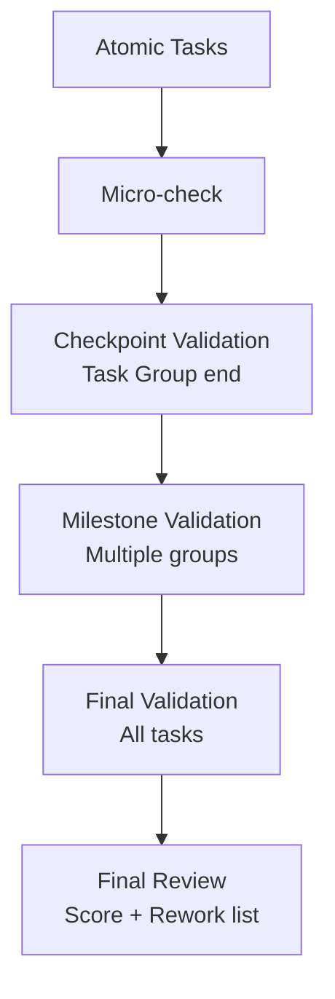

# 04-validation-real-data-first：真实数据优先验证协议

适用范围：
- Track：Research / Software / Writing
- Level：L2 / L3（强制）

目标：
把验证从“感觉差不多”升级为“可复跑的证据门禁”，并强制执行**真实数据优先**。

相关门禁：
- `protocols/00-hard-gates.md`：G7（Real Data）/ G8（Evidence）

---

## 1) 数据优先级（Real-data-first ladder）

验证数据按优先级从高到低选择。除非前一档不可获得并记录了证据，否则不得跳到后一档。

1. **用户提供的真实数据 / 真实样本 / 真实日志（real）**
2. **仓库内真实样例 / fixtures / golden outputs（real）**
3. **公开可得的真实基准数据或权威数据集（real）**
4. **脱敏真实数据（sanitized-real）**
5. **合成数据 / 人工构造数据（synthetic）**（最后一档）

说明：
- “脱敏真实数据”仍属于真实世界失败模式的代表，优先级高于 synthetic。
- synthetic 只能用于：单元验证、边界条件、不可获得真实样本的场景补洞；不得作为最终结论的唯一依据。

---

## 2) 真实数据缺失处理（必须记录尝试与结论）

当需要验证但手头没有真实数据时，必须按顺序执行并落盘到 Plan/State 的 Data Acquisition Log：

1) **列出需要的数据种类**（样本格式、大小、隐私约束、最小子集）
2) **尝试获取**（至少三种路径，能做多少做多少）：
   - 用户材料中是否已经包含（再次深读）
   - 仓库是否有 example/fixture
   - 是否有公开基准/公开样例可用
   - 是否能从日志/截图/导出里构造脱敏样本
3) **记录失败原因**（为什么拿不到）
4) **请求用户确认“确实没有可用真实/脱敏真实数据”**（这是进入 synthetic 的前置条件）
5) **在验证结论中标注 data_type 与风险**（synthetic 的结论只能作为“低置信度”）

---

## 3) 验证维度（不仅是正确性）

Level≥L2 默认至少覆盖以下维度；具体取舍必须写入 Validation Matrix。

### 3.1 Correctness（正确性 / 验收满足）
- 对照 Acceptance Contract（AC-XXX）逐条给结论与证据入口

### 3.2 Spec & Contract Compliance（规格与契约一致性）
- 接口、错误语义、不变量、边界条件是否符合 Plan 的 Specification
- 禁止“实现里临时决定规格”

### 3.3 Robustness（鲁棒性）
- 错误输入、缺字段、空数据、极端长度、异常编码等

### 3.4 Performance / Resource（性能与资源）
- 至少 smoke-check：时间/内存/显存/吞吐/延迟
- 需要基准时：先建立 baseline，再做对比

### 3.5 Security / Privacy（安全与隐私，若适用）
- 权限、密钥、PII、日志脱敏、注入风险、路径遍历等

### 3.6 UX / Visual Quality（视觉与可感知质量，若适用）
- PDF/排版/图表/界面/文档：必须有可复查证据（截图/渲染对比/样例输出）

### 3.7 Reproducibility（可复现）
- 命令、环境、版本、随机种子（若适用）、输入数据与输出产物可定位

### 3.8 Operability（可运行与可维护）
- Runbook、观测点、失败模式、恢复步骤是否齐全（Ops/长任务强制）

---

## 4) 分层验证节奏（平衡效率与可验证性）

Task 仍拆成可勾选最小单元，但验证不必每个小任务都跑全套。采用四层节奏：

### 4.1 Micro-check（廉价检查）
适用：单个小任务结束后的快速自检，用于早发现低级错误。

例：
- 语法/格式检查、类型检查
- 关键函数可导入、CLI 可启动
- 单个样例输入输出跑通（最小样本）
- 文档链接/示例命令可运行

### 4.2 Checkpoint validation（组末检查点）
触发：一个 Task Group 完成后必须执行。

要求：
- 覆盖本组新增/修改的主路径
- 产出证据入口（日志/报告/截图/产物路径）

### 4.3 Milestone validation（里程碑验证）
触发：多个相关 Task Group 完成后必须执行。

要求：
- 更宽的回归范围
- 性能/资源 smoke-check（必要时基准）
- 规范一致性与文档可读性检查

### 4.4 Final validation（最终验收验证）
触发：所有 Task 完成后必须执行。

要求：
- 对照 Acceptance Contract 全量给结论
- 证据索引可复跑
- 残余风险与限制清单完整

---

## 5) 验证结果枚举（统一口径）

每一条验证输出必须给出以下状态之一：
- `pass`：满足验收并有证据
- `fail`：不满足验收或证据显示失败
- `blocked`：缺数据/缺权限/缺依赖导致无法验证
- `partial`：部分满足（必须明确哪些未满足、风险与下一步）
- `missing`：没有做验证或证据不足（禁止用作通过结论）

---

## 6) 失败处理（必须回溯，不得掩盖）

当验证 `fail/blocked/missing`：
1) 停止宣称“完成”
2) 写清失败原因（缺数据/实现错误/规格不清/环境问题）
3) 回到 Plan 或 Execute：
   - 规格不清/验收变更：回 Plan（更新 Plan/Task/Acceptance/Matrix）
   - 实现错误：回 Execute（修复→重跑同一层级验证）
4) 更新 `State.md`：
   - Evidence Index（失败证据也要索引）
   - Next Action（下一步动作必须可执行）

