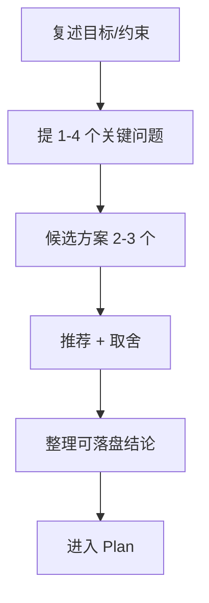
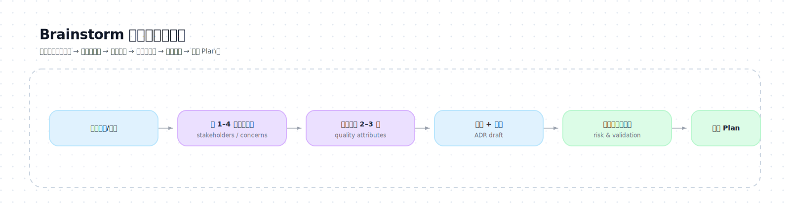

# Brainstorm（构思与对齐）

## 进入条件

满足任一：
- 目标/验收/边界不清
- 需要技术选型/架构取舍/路线对比
- 科研方向模糊，需要把“方向”变成“可验证问题 + 可落地方案”
- 写作任务缺少受众/风格/结构/必须图示要求

---

## Stage Contract（阶段契约）

### 输入（Inputs）
- Router 的路由结果（Track/Level/风险）
- 已知目标/约束/材料（来自用户与 State.md）

### 输出（Outputs）
- 候选方案 2–3 个 + 推荐方案
- MVP/MVE（第一步验证）
- 待确认问题清单（3–6 个）
- 可落盘结论（写入 Plan 与 Decision Log）

### 工件更新（Artifacts Updated）
- `State.md`：更新 Decision Log（DEC-XXX）、Risks & Assumptions
- `Plan.md`：写入方案摘要/验证框架（下一阶段完成）

### 退出条件（Exit Criteria）
- 能给出一个可执行的推荐路线，并且能进入 Plan 拆任务

### 返回用户条件（Return to User）
- 关键问题未澄清会导致方案完全不同（例如：是否允许联网、数据权限、算力预算）

---

## library 索引（按触发条件查）

- 验收标准写不清：`library/requirements-acceptance.md`
- 架构取舍与质量属性：`library/architecture-tradeoffs.md`
- 迭代与反馈回路：`library/iteration-feedback.md`
- 风险/合规：`library/risk-security.md`

---

## 输出（必须产出）

（Level≥L2 建议强制）每轮对外回复开头必须带：

```text
【Mode】Brainstorm | Level=<L?> | ExecutionAuth=<required/not_required>
```

1) **候选方案 2–3 个**（每个都要写：成本、风险、验证方式）
2) **推荐方案 1 个**（给出选择理由与拒绝理由）
3) **最小可行版本（MVP/MVE）**：先做什么才能尽快验证方向
4) **待确认问题**：最多 3–6 个，优先提“会改变方案”的问题
5) **可落盘结论**：可直接写入 Plan 的“方案摘要 + 决策点 + 风险”

（SWE 加强项，建议至少覆盖）
- Stakeholders & Concerns：谁关心什么（性能/成本/安全/可维护性/复现性）
- 质量属性（Quality Attributes）Top 3–7：排序并写清取舍
- ADR 草案：关键决策点 + 备选方案 + 拒绝理由（写入 State.md Decision Log）

---

## 工作步骤（保持短闭环）

### Step 1：复述目标与约束（先对齐）

用 3–6 句把以下信息说清：
- 目标是什么（Goal）
- 不做什么（Non-goals）
- 交付物是什么（Deliverables）
- 已知约束是什么（Constraints）

### Step 2：提问（少而关键）

规则：
- 一次最多 3–6 个问题（每个问题都必须“会改变方案/验收/边界/验证方式”之一）
- 给推荐默认值：避免把选择权无限外包给用户导致发散
- 用“确认/不确认”的问法收敛，不用条件分叉式句式把决策无限外包给用户
- 问“会改变方案”的问题，不问能从材料里推断的问题

必问主题（按需）：
- 验收标准：什么算成功？
- 边界：哪些模块/数据/环节不碰？
- 资源：时间/算力/数据权限
- 风格：写作的受众/语气/长度/图示密度

### Step 3：生成候选方案（2–3 个）

每个方案必须包含：
- 方案一句话摘要
- 关键步骤（3–7 条）
- 风险（2–5 条）
- 验证方式（对应风险与假设）
- 适用条件（什么时候选它）

并且必须明确：
- 该方案优先满足哪些质量属性？牺牲了什么？

### Step 4：推荐与取舍

必须写清：
- 为什么推荐（成本/风险/可验证性）
- 为什么不选其它（关键拒绝理由）
- 推荐方案的“第一步”（MVP/MVE）

### Step 5：落盘准备

把以下内容整理成可直接写入 Plan 的片段：
- 方案摘要
- 关键决策点（可写入 Decision Log）
- 验证方案框架
- 风险与缓解

下一步：进入 `stages/plan/SKILL.md` 产出 Plan/Task。

---

## 按 Track 的补充要求

### Research
- 必须把“方向”落到：Research Question + Hypothesis + Metrics + Baselines
- 必须给出：最小可行实验（MVE）

### Software
- 必须明确：架构边界、数据流/接口、最小验证（测试/手动路径）
- 明确禁止：无意义拆分函数、模糊兜底掩盖错误；兜底/降级只能在 Plan 阶段明示并经用户确认
- 必须给出：技术链路/选型建议（至少 2 个候选 + 1 个推荐），并说明取舍与风险（可用对比表）

### Writing
- 必须明确：目标读者、结构、必须图示清单、来源策略（哪些需要引用）

---

## 流程图（示意）



**SVG（精排版）**：
