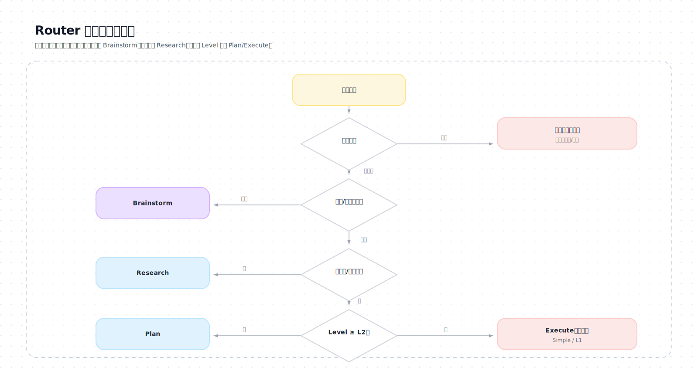

# Router（入口路由）

## 目标

在不“先读一大坨规则”的前提下，完成三件事：
1) 判定 **Track**：Research / Software / Writing / Simple
   - Software 额外判定 **WorkType**：Build / Debug / Ops
2) 判定 **Level**：L0 / L1 / L2 / L3
3) 给出**下一阶段**与**最小落盘要求**（State / Plan / Task / Evidence），并标记是否需要 **Execution Authorization**

> 渐进式披露原则：Router 只做“分流与门禁”。细节在对应 `stages/*/SKILL.md`。

---

## Stage Contract（阶段契约）

### 输入（Inputs）
- 用户当前消息（目标/约束/材料/期望输出）
- 现有工件（如有）：`State.md`、Plan、Task

### 输出（Outputs）
- `Track` / `WorkType`（Software 时）/ `Level`
- `ExecutionAuth`：required / received / not_required
- 风险信号（命中则必须停下确认）
- 下一阶段（只选一个）：Brainstorm / Research / Plan / Execute / Write / Validate / Review

### 工件更新（Artifacts Updated）
- L2/L3：更新 `State.md` 写入 Track/WorkType/Level/边界/风险/ExecutionAuth
- L1/Simple：可选更新 `State.md`（至少记录风险信号与影响范围）

### 进入条件（Entry Criteria）
- 任何新输入都必须先经过 Router（统一入口）

### 退出条件（Exit Criteria）
- 能唯一决定下一阶段（或因风险命中而停下等待用户确认）

### 返回用户条件（Return to User）
- 风险命中需要授权
- 关键材料缺失，无法继续判定

---

## library 索引（按触发条件查）

- 风险/安全/合规：`library/risk-security.md`
- L3 治理触发与组织方式：`library/project-governance.md`
- 验收标准写不出来：`library/requirements-acceptance.md`
- 深计划质量标准（反敷衍门禁）：`library/plan-quality-standard.md`
- 调研与证据标准（来源/Impact）：`library/research-and-evidence-standard.md`

---

## 输入

- 用户当前消息（目标、约束、材料、期望输出）
- 已存在工件（如有）：`State.md`、Plan、Task、已有代码/文档

---

## 输出（必须明确）

- Track /（Software 时）WorkType / Level
- ExecutionAuth：required / received / not_required
- 风险信号（有/无；若有必须停下确认）
- 下一阶段：Brainstorm / Research / Plan / Execute / Write / Validate / Review
- 需要更新的工件：State / Plan / Task

建议对用户的路由回执（尽量短）：

```text
【Route】Track=<...> | WorkType=<Build/Debug/Ops/-> | Level=<...> | ExecutionAuth=<required/received/not_required>
下一步：读取 stages/<next>/SKILL.md 并执行
需要工件：<State/Plan/Task/无>
```

当命中“外科手术型任务”（格式/交互/排版保持）信号时，回执里额外附带 playbook 指针（用于写深 Plan）：
- 通用：`library/format-surgery-systems.md`
- PDF 保排版翻译：`library/pdf-layout-translation-playbook.md`

（L2/L3 强制）每轮对外回复开头必须带：

```text
【Mode】<Plan/Execute/Write/Validate/Review> | Level=<L?> | ExecutionAuth=<required/received/not_required>
```

---

## Step 0：重锚定（Anti-drift Boot）

在判定之前先做两件事（防漂移）：
1) 若存在 `State.md`：先读取并刷新“边界/执行授权/阻塞点/下一步”。
2) 若存在 `Plan.md`/`Task.md`：它们是当前迭代的契约；Router 不得无视它们重新发散路线。

（快速自检建议）
- 读一遍 `protocols/10-gotchas.md`（最常见失控源清单）。
- 若本轮属于“上下文压缩/交接摘要后恢复”：按 `protocols/05-resumption-and-anti-drift.md` 执行恢复步骤，然后再路由。

---

## Step 1：风险扫描（命中必须停下）

命中任一项：先输出风险说明 + 选项，让用户确认继续/调整。

- 生产环境/真实数据（prod/live/production 等）
- 破坏性操作（删除、覆盖、不可逆迁移）
- 密钥/令牌/隐私数据（PII）
- 学术诚信风险（无来源硬写结论、拼接引用、疑似抄袭）
- 可能的信息危害（可用于攻击/绕过/滥用）

---

## Step 2：判定 Track（任务类型）

### Track = Research（科研/算法/资料检索/验证）
信号：需要论文/资料；需要实验验证；要提出可复现 idea；要做对比/消融/指标。

### Track = Software（工程实现/脚本/架构/编码）
信号：要改代码/写脚本/搭架构/修 bug/加功能/重构/跑测试。

### Track = Writing（教程/文档/论文/报告）
信号：主要产出是文本；要求结构、风格、图示、引用；读者与语气重要。

### Track = Simple（一次性小任务）
信号：单一目标、低风险、步骤少、无需长链依赖；允许直接执行。

> 不确定时：先按 Software 或 Research（更保守），再在 Brainstorm/Research 里澄清。

---

## Step 2.5：判定 WorkType（仅 Software）

> 目的：把 “写代码/修 bug/跑训练监控” 这种不同工作形态区分开，避免用同一套检查点硬套。

WorkType 取值：
- **Build**：实现功能/搭架构/重构/加测试/写文档（开发建设）
- **Debug**：定位问题/复现 bug/修复回归/排查性能退化（诊断修复）
- **Ops**：跑任务、监控训练/服务、采集日志/指标、写 Runbook/告警阈值（运行维护）

判定提示：
- 用户提到 “bug/报错/回归/复现/定位/为什么” → Debug
- 用户提到 “上线/部署/监控/训练盯盘/告警/健康检查/回滚” → Ops
- 其它默认 → Build

---

## Step 3：判定 Level（复杂度等级）

### L0：问答/解释
- 不改文件；输出主要是解释/建议/最小示例

### L1：小任务
- 预计 1–3 个短步骤；影响面小；可直接执行

### L2：多步骤任务（默认门槛）
- 需要拆任务；涉及多文件/多段落；需要明确验收与验证
- **必须**产出 Plan + Task（或显式复用已有 Plan/Task）

### L3：项目级
- 多里程碑、跨模块、依赖外部资料或复杂验证（完整测试/复现实验/评审闭环）
- **必须**维护 State + Plan + Task，并持续补证据索引

判定提示（任一命中则升级）：
- 需求/验收不清
- 技术选型或架构取舍
- 风险较高（安全/合规/不可逆）
- 需要“可复现/可验证”的证据链
- **格式/交互/排版保持的“外科手术型任务”**（默认按 L3 处理）：
  - 需要在不破坏原有结构/功能的前提下改写产物（例如 PDF/Office/富文本/图像渲染产物）
  - 需要保留功能对象（链接/目录/书签/注释/表单/命名目标/元数据/附件等）
  - 需要坐标系/字体/排版 fit/视觉 QA/多渲染器一致性验证
  - 典型例子：PDF 保排版翻译（写回 PDF、保持链接/目录/书签、禁止白底覆盖）

---

## Step 3.5：需求完整性快评（SWE 门禁，Level≥L2 建议执行）

> 目的：把“需求不清”变成可操作门禁，避免在 Execute 阶段才发现方向错误。

评分（0–10）：
- 目标明确性（0–3）：做什么？为什么？
- 验收标准（0–3）：什么算成功？证据是什么？
- 范围边界（0–2）：做/不做什么？
- 约束条件（0–2）：时间/资源/安全/合规/工具限制？

门禁：
- < 7 分：默认路由到 Brainstorm（先补齐关键信息）
- ≥ 7 分：可进入 Plan；若已具备 Plan/Task 且 **ExecutionAuth=received** 且风险低，可进入 Execute/Write

提示：这不是“写更多文档”，而是为了缩短反馈回路。

---

## Step 4：决定下一阶段（按需加载）

### “Plan/Task 就绪”的判定（防止写了个草稿就冲进执行）

当 Level≥L2，只有同时满足才算就绪：
- Plan.md 的 Plan Mode 退出门禁已满足（验收/边界/Read Log/Spec/验证数据与节奏/Task 拆分）
- Task.md 已按任务组组织，并包含每组 Validate Checkpoint + 里程碑/最终验证项
- Plan/Task 不得残留明显占位符（例如 `<...>`、`TODO`、`path/to/file` 等）；若存在占位，必须回 Plan 解决
- Execution Authorization 状态已落盘（required/received/not_required）

### 优先级（从上到下命中即停）

1) **风险命中** → 停下问确认（不进入后续 stage）
2) **方向不清/要做方案对比** → `Brainstorm`
3) **缺资料/需找论文/需证据** → `Research`
   - 典型触发：需要第三方库/标准/内部格式细节，且这些细节会影响架构、验收或验证
   - 典型例子：PDF/排版/字体/坐标/链接与目录保持、GPU/驱动/框架版本差异、协议兼容性等
   - 要求：在 Plan 前先形成可落盘的 Research Brief（来源清单 + 关键事实 + 对方案的影响）
4) **Level≥L2 且 Plan/Task 未就绪或未获授权** → `Plan`（Plan Mode：只对齐与落盘，不执行）
5) **Writing 且 Plan/Task 就绪且 ExecutionAuth=received** → `Write`（先结构后填充）
6) **Software/Research 且 Plan/Task 就绪且 ExecutionAuth=received** → `Execute`
7) **Simple/L1** → 直接 `Execute`（但保留最小验证与影响说明）

补充规则（外科手术型任务）：
- 一旦命中“格式/交互/排版保持”信号：**下一步必须先 `Research` 再 `Plan`**（先补齐外部事实与坑点，避免 Plan/技术栈敷衍）。
  - 只有当以下条件同时满足，才允许跳过 Research 直接进入 Plan：
    1) `State.md` / 当前 Plan 已包含可追溯来源（URL/论文入口/官方文档/源码/issue）并满足最低研究包；且
    2) 关键边界行为已被证据确认（例如：redaction 是否移除 links、坐标系/旋转页处理、版本 breaking changes）；且
    3) 用户没有要求“最新/版本兼容/可分发”等会引入新外部事实的目标
  - 用户明确禁止联网时：Research Gate 必须标记为 `blocked`，Plan 不得进入执行授权请求。

补充规则（执行授权）：
- 当 `ExecutionAuth=required`（尚未 received）时：
  - 用户未单独回复 `开始执行` → 不进入 Execute/Write，下一步保持为 Plan（Plan Mode）。
  - 用户单独回复 `开始执行` 且 Plan/Task 已就绪 → 可路由到 Execute/Write，并把 ExecutionAuth 记录落盘（State/Plan，含 time+scope）。
- 当 `ExecutionAuth=received`（已落盘）时：
  - 不需要在每轮重复口令；Router 应继续路由到 Execute/Write（除非用户提出新想法/不满意/范围变化，需要回 Plan）。
- 不得从“确认/继续/好的/ok/收到/你看着办”等语句推断授权。

补充规则（范围变化与反馈）：
- 用户提出新想法/不满意/发现偏离规范 → 下一步默认回到 Plan（更新验收与 Task，再走授权门禁），不要在 Execute 阶段硬改。

---

## Track×Level → 工件要求（最小集）

| Track | L0 | L1 | L2 | L3 |
|---|---|---|---|---|
| Research | 可选更新 State | 建议 State | Plan+Task | State+Plan+Task |
| Software | 可选更新 State | 建议 State | Plan+Task | State+Plan+Task |
| Writing | 可选 State | 建议 State | Plan+Task | State+Plan+Task |
| Simple | 无 | 可选 Task | 不应落到 L2 | 不应落到 L3 |

注记（执行授权）：
- Track=Research/Software/Writing 且 Level≥L2：进入 Execute/Write 前必须满足 `ExecutionAuth=received`。

---

## 路由图（示意）

```mermaid
flowchart TD
  A[用户输入] --> B{风险扫描}
  B -->|命中| STOP[停下：说明风险 + 让用户确认]
  B -->|未命中| C{方向/方案是否清晰?}
  C -->|不清| BS[Brainstorm]
  C -->|清晰| D{是否缺资料/需证据?}
  D -->|是| RS[Research]
  D -->|否| E{Level>=L2?}
  E -->|是| PL[Plan]
  E -->|否| EX[Execute(轻量)]
```

**SVG（精排版）**：

---

## 何时必须返回用户（不要硬推）

- 关键验收标准缺失，导致无法判断“做完没”
- 风险项需要用户授权/决策
- 用户给的材料不足以继续（缺代码/缺数据/缺权限/缺链接）
