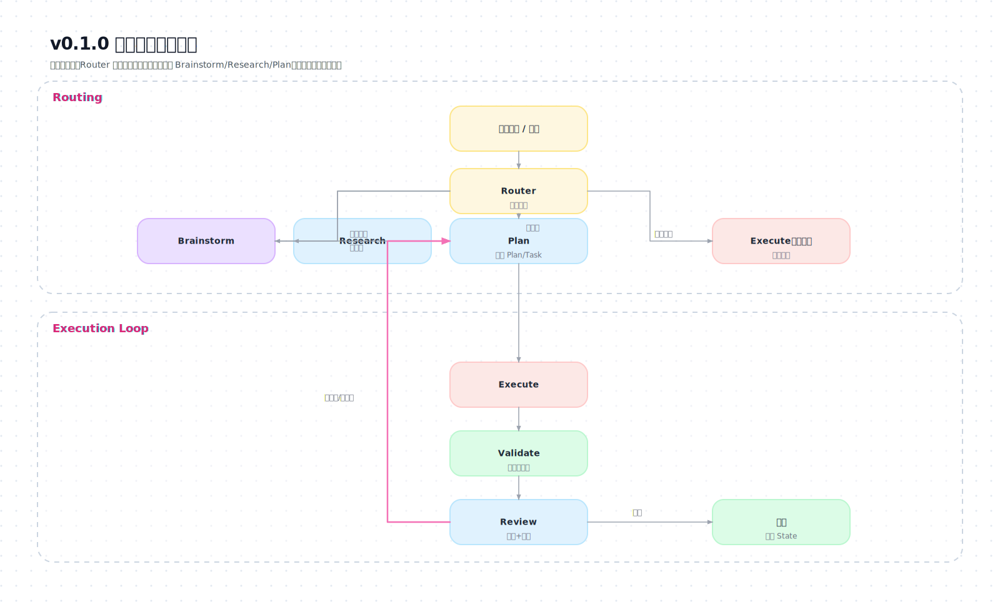

# AgentSkill v0.1.0 — 渐进式披露工作流（规划）

版本：`v0.1.0`  
位置：`droid_gpt-5.2-xhigh_codex_gpt-5.2-xhigh/AgentSkill/`  
语言：简体中文（术语保留英文）

---

## 1. 背景与目标

本版本要落地一套**“渐进式披露（Progressive Disclosure）”的 AgentSkill 工作流**：面对从科研到软件工程、从资料检索到论文/教程写作等不同类型任务时，先做最小信息判定与分流，只加载当下必需的规则与模板；在复杂度升级时再逐步展开更重的流程（Plan/Task、架构、验证、评审、记忆/证据落盘）。

核心目标：
- **泛化性**：覆盖科研/算法/工程/写作/简单脚本等广域场景，但不陷入行业细节堆叠。
- **可落地**：每条流程都能导向可执行的 Task 列表，最终产出能验证、能复现。
- **工程规范**：以软件工程方法作为“质量门禁”，避免凭感觉推进。
- **无“AI 味”**：措辞直接、证据驱动、少空话；不写“作为AI…”。

约束：
- 禁止读取：`codex_gpt-5.2-xhigh/**` 与 `codex_gpt-5.4-xhigh/AgentSkill/**`。
- 输出目录：`droid_gpt-5.2-xhigh_codex_gpt-5.2-xhigh/AgentSkill`。
- 采用**模块化结构**：主 `SKILL.md` + `stages/*/SKILL.md` + `templates/*`。
- 版本化：以语义版本目录保存本版本规划与任务清单：`v0.1.0/Plan.md`、`v0.1.0/Task.md`。

---

## 2. 需求清单（逐条落地）

### 2.1 必须满足

1) **渐进式披露**：
   - 入口先做路由（任务类型/复杂度/风险/是否需要外部资料/是否要写入文件）。
   - 仅在命中条件时才展开对应 stage 细则。

2) **多场景覆盖**（至少覆盖并可扩展）：
   - 科研：方向模糊→检索→头脑风暴→可实现 idea；方向明确→审查打分→修改建议；已有方案→协助实现→验证复现。
   - 软件开发：从零或接手不完整代码；需要架构/选型讨论；深读材料与代码；按任务推进；测试；评审打分；避免“兜底代码/无意义小函数”。
   - 文档/教程/论文：先深读资料与探索；必要时 Web 搜索；按用户风格写；图示丰富；先对齐需求再写；可长可短。
   - 简单任务：直达执行（不强制 Plan/Task），但仍保留最小验证与回溯。

3) **Plan/Task 双文档机制**：
   - 对于非简单任务，必须生成（或更新）计划与任务清单。
   - Task 必须使用带方框的最小执行单元。

4) **主 SKILL.md 需包含总架构 + 大量图示**：
   - 至少提供：总流程图、路由决策图、阶段状态机/门禁图、工件（State/Plan/Task）关系图。

5) **进度与记忆落盘**：
   - 引入统一 `State.md`，用于长期任务的记忆、进度、风险、证据索引与关键决策（Decision Log）。
   - 明确更新时机（每阶段完成、发现新信息、风险变化、提交前）。

6) **评审与打分**：
   - 研究 idea 审查：给出评分与可执行修改建议（可选项：轻量/严格）。
   - 代码/方案评审：给出评分与明确整改项（带优先级）。

7) **验证与复现**：
   - 任何“完成/可用/正确/通过”声明必须有证据（命令输出、截图、复现实验、引用等）。
   - 科研/算法：必须包含可复现实验要素（环境、随机种子、数据版本、指标、基线、消融）。

### 2.2 不做（v0.1.0 不覆盖或只给接口）

- 不为每个学科写细分手册（CUDA/物理/语言学等只提供“可扩展挂点”与通用研究/验证框架）。
- 不引入复杂脚手架/代码生成器；以 markdown 规范与流程为主。

---

## 3. 交付物与目录结构（v0.1.0）

### 3.1 目录树（目标态）

```text
droid_gpt-5.2-xhigh_codex_gpt-5.2-xhigh/AgentSkill/
├── SKILL.md
├── State.md
├── stages/
│   ├── router/SKILL.md
│   ├── brainstorm/SKILL.md
│   ├── research/SKILL.md
│   ├── plan/SKILL.md
│   ├── execute/SKILL.md
│   ├── validate/SKILL.md
│   ├── review/SKILL.md
│   └── write/SKILL.md
├── templates/
│   ├── Plan.template.md
│   ├── Task.template.md
│   ├── State.template.md
│   ├── ReviewRubric-Research.template.md
│   ├── ReviewRubric-Software.template.md
│   └── ReviewRubric-Writing.template.md
└── v0.1.0/
    ├── Plan.md
    └── Task.md
```

### 3.2 每个工件的职责边界

- `SKILL.md`：总架构、路由入口、阶段如何按需加载、全局门禁（证据、风险、写作风格）。
- `stages/*/SKILL.md`：各阶段的操作细则（只在被路由命中时读取）。
- `templates/*`：可复制的模板（Plan/Task/State/评分表），减少“临场发挥”。
- `State.md`：项目级长期记忆与进度（可跨任务/跨会话）。
- `v0.1.0/Plan.md`、`v0.1.0/Task.md`：本版本的实施规划与任务清单（开发本 skill 时使用）。

---

## 4. 总体架构：渐进式披露 + 双轴路由（任务类型 × 复杂度）

### 4.1 总流程（概览图）

```mermaid
flowchart TD
  U[用户输入/材料] --> R[Router: 最小判定]

  R -->|简单任务| X[Execute(轻量)]
  R -->|需要想法/方案不清| B[Brainstorm]
  R -->|需要外部资料/论文| S[Research]
  R -->|需要可执行规划| P[Plan: 产出 Plan/Task]

  B --> P
  S --> P

  P --> E[Execute: 按 Task 推进]
  E --> V[Validate: 证据与复现]
  V --> Q[Review: 打分+整改清单]

  Q -->|通过| DONE[交付 + 更新 State]
  Q -->|未通过/需迭代| P
```

**SVG（精排版）**：

### 4.2 路由的两条主轴

**轴 A：任务类型（Track）**
- `Research`（科研/算法/资料检索/验证）
- `Software`（编码/架构/重构/脚本）
- `Writing`（教程/文档/论文/报告）
- `Simple`（一次性小任务）

**轴 B：复杂度等级（Level）**
- `L0`：问答/解释/观点澄清（不写文件，最多给最小示例）
- `L1`：小改动/小脚本/小段落（可直接执行；可选写 Task）
- `L2`：多步骤、需要拆任务（必须 Plan + Task）
- `L3`：项目级（多里程碑、多来源资料、复现实验/完整测试与评审；必须 Plan/Task/State）

> 备注：v0.1.0 将以“保守策略”为默认：复杂度不确定时按 `L2/L3` 处理，直到用户明确要求简化。

---

## 5. 关键机制设计（要写进 skill 的硬约束）

### 5.1 State.md（统一记忆与进度）

State 必须包含并长期维护：
- **Memory**：项目背景、术语表、关键约束、用户偏好、不可触碰边界。
- **Decision Log**：关键决策（含替代方案与拒绝理由）。
- **Progress**：当前阶段、已完成/进行中/阻塞项。
- **Risks & Assumptions**：风险、假设、缓解措施。
- **Evidence Index**：证据索引（命令输出摘要、截图路径、引用条目、实验记录位置）。

更新时机（硬性）：
- 路由完成后：写入任务类型/复杂度/边界。
- Plan 完成后：写入目标、验收标准、里程碑。
- 执行中发现新信息或风险变化：即时更新。
- 交付前：补齐证据索引与遗留问题。

### 5.2 Plan.md / Task.md（面向执行的最小协议）

- Plan 必须包含：目标、非目标、输入材料清单、产出物、验收标准、里程碑、风险、验证方案。
- Task 必须：
  - 以最小可执行单元拆分；每条任务有“产出物”与“验收方式”。
  - 使用方框状态（`[ ]`/`[x]`/`[~]`/`[!]` 等，最终在模板里统一）。

### 5.3 证据优先（Verification Gate）

写进 `validate/` 与主 skill：
- 未运行/未观察到证据，不得宣称“通过/完成/修复”。
- 软件工程：至少包括测试/静态检查/手动跑通路径之一（视项目实际）。
- 科研：至少包括实验设置与可复现脚本/参数（即使先做最小实验）。
- 写作：至少列出引用与来源，明确哪些内容来自哪些材料。

### 5.4 评审打分（Review）

v0.1.0 先定义三类评分表模板：
- Research：新颖性、可行性、验证性、复现性、风险/伦理。
- Software：正确性、可读性、可维护性、测试充分性、性能/安全。
- Writing：结构、清晰度、覆盖面、风格贴合、图示质量。

评分输出必须带：
- 分数（0–10 或 1–5，最终在模板定标）
- 证据点（每个主要评分维度至少 1 条证据或理由）
- 可执行整改清单（按 P0/P1/P2 优先级）

---

## 6. 分场景流程（v0.1.0 必须可用）

### 6.1 场景 1：科研/算法任务

**入口分流**
- 方向模糊：Router → Research → Brainstorm → Plan → Execute → Validate → Review
- 方向明确但需审查：Router → Review（必要时补 Research）
- 已有详细方案要实现：Router → Plan → Execute（研发流程）→ Validate → Review

**硬门禁**
- 必须明确：研究问题（Research Question）、评价指标（Metrics）、对比基线（Baselines）、最小可行实验（MVE）。

### 6.2 场景 2：软件开发

**入口分流**
- 从零：Router → Brainstorm（架构/选型）→ Plan/Task → Execute → Validate → Review
- 接手代码：Router → Research（读代码/资料）→ Plan/Task → Execute → Validate → Review

**硬门禁**
- 深读用户提供代码/资料：在 Plan 中列出“读过的文件/资料”清单。
- 避免兜底代码：任何兜底必须写明触发条件与成本；不写无意义拆分函数。

### 6.3 场景 3：文档/教程/论文写作

**入口分流**
- 资料不足：Router → Research（补资料）→ Plan/Task → Write → Validate（引用/一致性/示例可运行）→ Review

**硬门禁**
- 先对齐：受众、语气、长度目标、章节结构、必须包含的图示类型。
- 图示：至少 1 张总览图 + 关键流程图/结构图若干（以模板要求为准）。

### 6.4 场景 4：简单任务

**入口分流**
- Router 判定为 `Simple/L1`：允许直接 Execute。

**最低要求**
- 仍需：列出做了什么 + 最小验证方式 + 影响范围。

---

## 7. v0.1.0 实施步骤（本仓库内的工作计划）

1) **对齐现有范式**：以 `helloagents_v1` 的“路由→按需加载→模板化工件”的结构为基线，但扩展到 Research/Writing。
2) **先写模板**：先定 `State/Plan/Task/ReviewRubric` 模板，保证后续 stage 文档有具体落点。
3) **写 Router（最小判定）**：明确定义 Track × Level 的判定表与升级/降级规则。
4) **写 stage 文档**：每个 stage 只写“进入条件 + 输出物 + 步骤 + 退出条件 + 返回用户条件”。
5) **写主 SKILL.md**：总架构 + 图示 + 目录树 + 按需加载说明 + 全局门禁。
6) **自检与示例回放**：用 4 类场景各跑一遍“从输入到产出”的演练，检查是否会卡死、是否能落到 Plan/Task/Evidence。

---

## 8. 验收标准（Definition of Done）

### 8.1 结构与内容
- [ ] `AgentSkill/` 下存在本规划约定的目录与文件骨架（允许先缺少示例）。
- [ ] 主 `SKILL.md`：包含不少于 4 个 Mermaid 图（总流程、路由决策、阶段门禁/状态机、工件关系）。
- [ ] `stages/*/SKILL.md`：每个都包含进入条件、输出物、步骤、退出条件、返回用户条件。
- [ ] `templates/*`：至少包含 Plan/Task/State 与三类评分表模板。

### 8.2 行为可用（用例覆盖）
- [ ] 对场景1（科研）给出“模糊方向→可验证 idea”路径的明确产出清单。
- [ ] 对场景2（软件）给出“从零/接手”两条路径的门禁与任务拆分规范。
- [ ] 对场景3（写作）能产出可直接填充的结构与图示要求。
- [ ] 对场景4（简单任务）明确允许直达执行，但仍有最小验证与影响说明。

### 8.3 风格与质量
- [ ] 全文无“AI自述/道歉式口吻/空泛鼓励”，表达直接、可执行。
- [ ] 所有“完成/通过”类语句在模板中被强制绑定到证据字段。

---

## 9. 风险与缓解

- **范围失控**：用 Track×Level 路由限制展开深度；L1 以下禁止强行上 Plan。
- **模板太重**：模板以“最小必填 + 可选扩展”分层；复杂度升级再启用扩展段。
- **引用/事实不可靠**：Research/Write 阶段强制来源列表与证据索引；不确定内容必须标注假设。

---

## 10. 后续讨论点（不阻塞 v0.1.0，但会影响 v0.2+）

- 评分量表：0–10 还是 1–5？是否需要“门槛分”触发返工？
- 图示规范：是否统一用 Mermaid（默认）+ 何时用 ASCII？
- 是否增加“学术写作（论文）”的专用子模板（结构、相关工作、实验、复现附录）。
