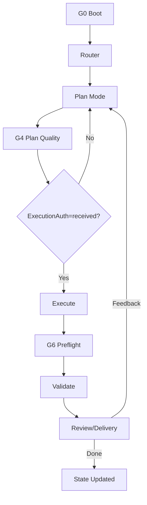

# Plan：AgentSkill v0.3.0 Hardening（Plan-Locked + Evidence-Driven + Long-Run）

Version: v0.3.0  
Track: Software  
WorkType: Build  
Level: L3  
Current Mode: Plan  
Execution Authorization: not_required  
Last Updated: 2026-04-20  

---

## 0. Template Notice

本 Plan 是该版本改造的控制文档，用于把 v0.3.0 的硬化目标落成可执行工件：协议层（protocols）、深模板（templates）、自检脚本（scripts）、阶段挂接（stages）与可追溯索引（library/traceability）。

---

## 1. User Intent Lock

```yaml
primary_goal: "把 improvement/doc1.md 与 improvement/doc2.md 的思想合并进 AgentSkill，并形成可长期运行的 v0.3.0 硬化层"
secondary_goals:
  - "Plan Mode 多轮对齐，无授权不执行"
  - "真实数据优先验证 + 证据门禁"
  - "上下文压缩后可恢复，不因摘要停机"
  - "执行期禁止擅自兜底/降级"
must_preserve:
  - "渐进式披露：Router 决定唯一下一阶段"
  - "State/Plan/Task 作为可续跑契约"
  - "禁区不可访问 + 输出目录固定"
must_avoid:
  - "未授权执行与越权改动"
  - "忽视 Plan/Task/State 导致漂移"
  - "在可获得真实数据时用 synthetic 得出通过结论"
  - "执行期私自加入兜底/降级"
non_goals:
  - "重写仓库中其它 skill 目录"
  - "把所有学科知识写成百科手册"
quality_bar: "规则可执行、可落盘、可复查、可续跑；门禁不通过能停线回溯"
style_preferences: "中文、无机械口吻、图示充分、输出结构清晰"
scope_boundary: "仅修改 droid_gpt-5.2-xhigh_codex_gpt-5.2-xhigh/AgentSkill/**"
latest_user_feedback: "模板与示例仅供参考；执行期不得擅自兜底；真实数据优先；Plan/Task 必须非常详细；长程防漂移与可恢复"
```

---

## 2. Problem Frame

### 2.1 一句话目标

把 v0.2.0 的“写在纸上的流程”升级为 v0.3.0 的“可执行状态机”：Plan 硬锁、证据门禁、长程抗漂移、可恢复、可复盘。

### 2.2 背景

用户反馈暴露出真实失控模式：Plan 只坚持一轮就进入执行、执行中无视 Plan/Task、真实数据门禁被绕过、上下文压缩后停机、模板/示例过简带偏。

### 2.3 成功后的状态

- L2/L3 大任务必然先进入 Plan Mode，并通过门禁后才允许请求执行授权。
- 执行批次有 Preflight；验证按 micro-check/checkpoint/milestone/final 分层推进并落证据。
- 出现漂移信号能停线回溯；上下文压缩后能从 Resumption Block 恢复继续。

### 2.4 当前风险

- 规则与模板过多时易出现重复与不一致，需要 protocols 作为硬约束中心，并用 traceability 做追溯。

---

## 3. Current State / Gap Analysis

已存在基础能力（v0.2.0 与早期 v0.3.0 草案）：
- Track×Level 路由（router）
- Plan/Execute/Validate/Review/Write 分阶段
- State 记忆落盘
- 真实数据优先原则（已有，但需强化为协议门禁）

差距（本版本必须补齐）：
- 缺少“协议层（protocols）+ 门禁状态机（G0–G9）”的中心化定义
- 缺少 L3 深模板与门禁自检模板（Plan/Task/Matrix/Preflight/Resumption）
- 缺少自检脚本（禁止短语、Plan/Task 质量、State 最小字段）
- templates/examples 顶部免责声明不统一，易被当成实际输出下限
- 长任务运行（Ops/训练监控）需要协议化与 Runbook 绑定

---

## 4. Inputs and Materials Read

本次合并依据（本地材料）：
- droid_gpt-5.2-xhigh_codex_gpt-5.2-xhigh/AgentSkill/improvement/doc1.md
- droid_gpt-5.2-xhigh_codex_gpt-5.2-xhigh/AgentSkill/improvement/doc2.md
- droid_gpt-5.2-xhigh_codex_gpt-5.2-xhigh/AgentSkill/improvement/plan-comparison.md
- droid_gpt-5.2-xhigh_codex_gpt-5.2-xhigh/AgentSkill/improvement/plan-comparison_2.md

现有基线与已改造文件（节选）：
- droid_gpt-5.2-xhigh_codex_gpt-5.2-xhigh/AgentSkill/SKILL.md
- droid_gpt-5.2-xhigh_codex_gpt-5.2-xhigh/AgentSkill/State.md
- droid_gpt-5.2-xhigh_codex_gpt-5.2-xhigh/AgentSkill/stages/*
- droid_gpt-5.2-xhigh_codex_gpt-5.2-xhigh/AgentSkill/templates/*
- droid_gpt-5.2-xhigh_codex_gpt-5.2-xhigh/AgentSkill/library/*
- droid_gpt-5.2-xhigh_codex_gpt-5.2-xhigh/AgentSkill/examples/*

---

## 5. Research Log

本任务以“本地工件合并与工程化落盘”为主，但 v0.3.0 的 L3 标准要求：关键约束与关键设计决策必须能指向可追溯来源。因此这里给出一个最小研究包，用于支撑：
- 渐进式披露的目录组织（主入口导航化、细则下沉）
- 需求工程/验收/可追溯性/质量模型的写法
- Markdown 工件（Task checklist/表格/图示）作为长期契约的可读性与可维护性

| Query | Source (link) | Source type | Extracted facts | Impact on plan | Open questions |
|---|---|---|---|---|---|
| progressive disclosure pattern | https://www.nngroup.com/articles/progressive-disclosure/ | official | 渐进式披露用于在不压垮读者的前提下分阶段呈现复杂信息；先给最少必要信息，再按需展开 | 支撑“主 SKILL 只做入口导航、细则放到 protocols/stages/library”的组织方式 | 如何把披露层级与门禁状态机绑定得更显式 |
| GFM task list items | https://github.github.com/gfm/#task-list-items-extension- | official | Markdown 任务列表有明确语法与渲染规则，可作为可勾选执行清单 | Task.md 采用方框清单作为最小执行单元，且可长期维护 | 不同渲染器对 task list 的兼容性差异是否需要额外约束 |
| GitHub Flavored Markdown spec | https://github.github.com/gfm/ | official | GFM 定义了表格、代码块、任务列表等扩展；适合用作“工件协议”承载结构化信息 | 允许 Plan/Task/State 使用表格承载规格/验证矩阵/证据索引 | Mermaid 与 GFM 的组合在不同平台的支持范围 |
| Mermaid flowchart syntax | https://mermaid.js.org/syntax/flowchart.html | official | Flowchart/graph 语法可用于表达状态机与端到端链路；适合工程化文档 | 主 SKILL 与各 stage 用 Mermaid 作为默认图示语言（流程、门禁、恢复） | PlantUML 何时更合适（类图/时序图）需要在库中补充判断准则 |
| JSON Schema overview | https://json-schema.org/ | official | JSON Schema 可用于约束结构化输出/中间工件，支撑“可校验、可恢复、可续跑” | 支撑结构化工件（Validation Matrix / report / cache）的 schema 约束思路 | 是否需要为关键工件提供最小 schema 示例与校验脚本 |
| 12-factor app (ops discipline) | https://12factor.net/ | official | 强调配置/日志/可观测性/可部署性等原则，利于长期运行与可恢复 | 支撑 Ops/Debug/长任务运行协议中“可观测性优先、Runbook 落盘”的要求 | 对离线/本地工程的适配写法是否需要补充 |
| Google SRE books | https://sre.google/books/ | official | SRE 强调可观测性、错误预算、恢复流程、事后复盘；长任务要可运行可恢复 | 支撑 `protocols/08-long-running-ops.md` 与 Evidence/Resumption 的设计动机 | 如何把 SRE 的事故复盘结构映射进 Review/Delivery 模板 |
| ISO/IEC/IEEE 29148 requirements engineering | https://www.iso.org/standard/72089.html | standard | 需求工程强调需求信息项、可追溯性、验证与确认等过程要素 | 支撑“Plan=规格、验收契约、验证矩阵、追溯表”的结构化要求 | 是否需要引入更多标准条目（质量模型/风险管理）作为扩展 playbook |
| ISO/IEC 25010 quality model | https://www.iso.org/standard/35733.html | standard | 质量模型覆盖功能适合性、性能效率、兼容性、可用性、可靠性、安全性、可维护性、可移植性 | 支撑 Validation 维度与 Review 打分维度的覆盖面 | 如何把质量属性目标写成可验证断言并映射到证据 |

---

## 6. Requirements

### 6.1 Functional Requirements

- FR-001：新增协议层 protocols，集中定义硬门禁与状态机
- FR-002：Plan Mode 硬锁 + Deep Plan 标准可复用
- FR-003：执行预检 Preflight 模板化并挂接到 Execute
- FR-004：真实数据优先验证协议化 + 分层验证节奏
- FR-005：Resumption Block 与 Drift Recovery 协议化，解决上下文压缩与长期漂移
- FR-006：边界/兜底/降级必须协议化：Plan 内登记并确认，执行期禁止擅自新增
- FR-007：交付与评审固定格式（Delivery Report），并把过程合规变成硬门禁
- FR-008：自检脚本：禁止短语扫描、Plan/Task 质量门禁、State 最小字段校验

### 6.2 Non-functional Requirements

- NFR-001：渐进式披露：主 SKILL 导航化，细则在 protocols/stages/library
- NFR-002：可追溯：需求条目能映射到协议/模板/阶段（traceability）
- NFR-003：可维护：避免重复粘贴导致不一致（以 protocols 为硬规则中心）
- NFR-004：可续跑：State 作为单一真相，支持压缩后恢复

### 6.3 Documentation Requirements

- DR-001：templates 与 examples 顶部免责声明统一
- DR-002：主 SKILL 中提供协议加载地图（按阶段加载协议）
- DR-003：新增协议必须有清晰标题、适用范围、门禁关联

### 6.4 Operations / Monitoring Requirements

- OR-001：长任务运行/训练监控必须落盘 Runbook 与证据入口
- OR-002：Ops/Debug 工作形态在协议层可引用

---

## 7. Non-goals

- 不把整个仓库所有 skill 统一到同一套目录；本版本仅完善本输出目录内的 AgentSkill
- 不引入复杂脚手架或强依赖构建系统；以 Markdown 工件协议为主，脚本只做最小自检

---

## 8. Constraints and Boundaries

### 8.1 Allowed

- 允许修改范围：droid_gpt-5.2-xhigh_codex_gpt-5.2-xhigh/AgentSkill/**

### 8.2 Forbidden

- 禁止访问：codex_gpt-5.2-xhigh/**
- 禁止访问：codex_gpt-5.4-xhigh/AgentSkill/**
- 禁止访问：droid_gpt-5.2-xhigh/AgentSkill/**

### 8.3 Files / Areas Allowed to Modify

- 仅本目录下 protocols/templates/scripts/stages/library/examples/State/SKILL 与版本文件

### 8.4 Files / Areas Forbidden to Access or Modify

- 上述禁区目录与其子目录

### 8.5 Fallback Policy

- 默认禁止兜底/降级
- 需要兜底必须在 Plan 阶段登记（Fallback Register）并获得确认
- 执行阶段遇到不可实现项必须停线回到 Plan

---

## 9. Candidate Solutions

### Option A：Minimal patch

只在现有 stages/templates 中补文字约束。

缺点：
- 规则分散，长期运行易漂移
- 缺少自检与恢复结构，无法抵抗上下文压缩

### Option B：Recommended（协议层 + 深模板 + 自检脚本）

新增 protocols、深模板与脚本，把“建议”升级为“门禁状态机”，并让 stages 引用协议。

### Option C：Long-term / Advanced

在 Option B 基础上增加更强的自动化检查与更细的版本化治理（本版本不做）。

---

## 10. Architecture Decision

采用 Option B：
- 新增 protocols 作为硬规则中心
- 新增深模板与门禁模板
- 新增 scripts 自检
- 更新 stages 与主 SKILL 导航，完成引用挂接

---

## 11. Technical Chain / Method Chain

端到端状态机（示意）：



---

## 11.1 Pipeline Stages（阶段→技术→验证映射）

> 本 Plan 面向“Skill 硬化工程”本身。为避免“流程/技术栈敷衍”，仍按外科系统的要求写出阶段映射，确保每一段工作都有工件、有门禁、有证据。

| Stage | Goal | Inputs → Outputs | Candidate tech | Recommended tech | Key risks | Validation & evidence |
|---|---|---|---|---|---|---|
| Boot | 重锚定与边界锁定 | State/Plan/Task → 本轮 Next Action | State.md / Decision Log | State.md 为 SSOT | 漂移/越权 | State Next Action 可定位 |
| Gap analysis | 找到真实失控点 | 反馈/对比 → Gap 清单 | Read Log / 对比文件 | 写入 Plan Gap Analysis | 只写“建议”不落盘 | Plan 明确差距与门禁 |
| Protocols | 硬门禁集中化 | doc1/doc2 → protocols/*.md | 分散写在 stages | protocols 作为硬规则中心 | 重复/冲突 | 全局引用一致性抽查 |
| Templates | 深模板与门禁模板 | protocols → templates/*.md | 轻量模板 | deep + gate templates | 模板带偏/太短 | 顶部免责声明统一 + 占位符清零 |
| Stage hook-up | stages 引用协议 | protocols/templates → stages/* | 自由发挥 | 必读协议清单 + 关键模板引用 | 漏读导致失控 | stages 断链扫描（rg） |
| Playbooks/library | 防浅计划与外科任务支持 | plan-comparison_2 → library/* | 仅写概念 | format-surgery + PDF playbook | 技术栈敷衍 | library 索引与 stage 挂接 |
| Examples | 给“期望密度”样例 | templates + playbooks → examples/* | 简化示例 | 深度 PDF 示例包 | 示例被当下限 | 示例免责声明 + 结构完整性 |
| Scripts | 自检门禁最小化 | artifacts → scripts/* | 纯人工 | scan + validate_state + validate_plan_task | 漏掉明显违规 | 脚本 PASS 输出 |
| Milestone validate | 形成可复查证据 | scripts → PASS | 口头声明 | 退出码 + 输出记录 | 无证据 | Evidence Index 更新 |
| Final review | 固化交付回执 | 变更集合 → Changelog | 无结构总结 | CHANGELOG + State 结论 | 无法交接 | 文档可定位 + 路由可复用 |

---

## 11.2 Workdir & Resume Strategy（断点续跑与恢复）

- workdir layout（本任务）：
  - `droid_gpt-5.2-xhigh_codex_gpt-5.2-xhigh/AgentSkill/`：主目录与工件
  - `droid_gpt-5.2-xhigh_codex_gpt-5.2-xhigh/AgentSkill/v0.3.0/Plan.md`：本版本控制文档
  - `droid_gpt-5.2-xhigh_codex_gpt-5.2-xhigh/AgentSkill/v0.3.0/Task.md`：本版本最小执行单元
- resume markers：
  - 以 `State.md` 的 Resumption Block 作为唯一恢复入口（Mode/Level/Auth/Task Group/Next Action）
  - 每次完成一个 Task Group 的 checkpoint 后，必须更新 State 的 Evidence Index 与 Next Action
- partial failure policy：
  - 任一门禁脚本失败 → 视为 blocker；先修复，再继续推进后续任务（不带病进入交付）

---

## 11.3 QA Plan（文档/门禁/引用一致性）

本任务 QA 不是“跑单测”，而是“协议是否可执行、是否抗漂移、是否能产出深 Plan”。

- render/结构 QA：
  - 主 SKILL 的“协议加载地图”能把读者带到正确的 stages/protocols/library
  - templates/examples 的免责声明一致且不误导为输出下限
- 链接/引用 QA：
  - stages 引用的 protocols/templates 路径存在且无断链（可用 `rg`/脚本抽检）
- 门禁 QA：
  - `scripts/scan_forbidden_phrases.py` PASS（排除 improvement 与 diagrams）
  - `scripts/validate_workflow_state.py` PASS（State 最小字段齐全）
  - `scripts/validate_plan_task_quality.py` PASS（L3 Plan 必含 Pipeline/QA/Resume/Matrix）
- 漂移/恢复 QA（抽样人工）：
  - 从“上下文压缩恢复”视角，用 Resumption Block 能明确下一步动作与边界

---

## 12. Specification

### 12.1 Data Model

- Gate status：pass/blocked/fail/skip（见 protocols/00-hard-gates）
- Validation data_type：real/sanitized-real/synthetic
- Validation scope：micro-check/checkpoint/milestone/final

### 12.2 Interfaces

- protocols 为硬约束来源；stages 引用 protocols；templates 为落盘结构；scripts 为自检门禁

### 12.3 State

- State.md 是单一真相来源（SSOT）
- 每轮必须维护 Next Action 与 Resumption Block

### 12.4 Error Handling

- 门禁不通过必须停线回溯，不允许靠兜底掩盖

### 12.5 Logging / Monitoring

- Ops/训练监控必须有 Runbook 与 Evidence Index 入口

---

## 13. Development / Work Strategy

策略组合：
- SDD(spec-d-d)：以 Plan/Task/验收/验证矩阵作为规格骨架
- 协议优先：protocols 定义硬门禁，避免重复粘贴导致漂移
- 证据门禁：scripts 作为最低自检手段，保证可复查与可续跑

---

## 14. Acceptance Contract

- AC-001：protocols 目录存在，并包含 hard gates、plan mode、validation、resumption、fallback、delivery 等协议文件
- AC-002：templates 增加 deep Plan/Task 与 Gate/Matrix/Preflight/Resumption/ChangeControl/FallbackRegister 模板
- AC-003：scripts 存在并可运行：禁止短语扫描、Plan/Task 质量门禁、State 最小字段校验
- AC-004：stages 与主 SKILL 明确引用 protocols/templates/scripts（协议加载地图可复用）
- AC-005：templates 与 examples 顶部免责声明统一，不被误当成输出下限
- AC-006：v0.3.0 的 Plan/Task 通过自检脚本（无占位符、结构门禁满足）

---

## 15. Validation Matrix

| AC | Data | Cadence | Method | Command | Evidence |
|---|---|---|---|---|---|
| AC-003 | real | milestone | script | python3 droid_gpt-5.2-xhigh_codex_gpt-5.2-xhigh/AgentSkill/scripts/scan_forbidden_phrases.py | 退出码 + 输出 |
| AC-003 | real | milestone | script | python3 droid_gpt-5.2-xhigh_codex_gpt-5.2-xhigh/AgentSkill/scripts/validate_workflow_state.py | 退出码 + 输出 |
| AC-006 | real | milestone | script | python3 droid_gpt-5.2-xhigh_codex_gpt-5.2-xhigh/AgentSkill/scripts/validate_plan_task_quality.py | 退出码 + 输出 |

---

## 16. Real Data Strategy

本任务验证的“真实数据”定义：
- 以仓库内真实文件为验证对象（protocols/templates/stages/library/examples/State/Plan/Task），通过脚本与全局扫描验证结构与门禁。

---

## 17. Risk Register

| ID | Risk | Impact | Mitigation |
|---|---|---|---|
| R-001 | 协议与 stage 内容重复导致不一致 | 漂移、规则冲突 | protocols 做硬规则中心；traceability 定位唯一落点；多处引用同一协议文件 |
| R-002 | 模板被误当作输出下限 | Plan/Task 变浅、验证变弱 | templates/examples 顶部免责声明统一；review 的 Plan/Task 敷衍门禁阻断 |

---

## 18. Fallback Register

默认空（本任务不需要兜底与降级）。

---

## 19. Documentation Plan

- 更新主 SKILL：目录结构 + 协议加载地图
- 更新 stages：每阶段增加“必读协议”与关键模板引用
- 更新 traceability：新增协议/模板/脚本的落点映射

---

## 20. Milestones

- M1：Hard Gates & Protocols（protocols 目录落盘）
- M2：Deep Plan / Task & Gate Templates（深模板与门禁模板）
- M3：Execution Hardening（Preflight + fallback/boundaries + ops）
- M4：Validation Hardening（真实数据优先协议 + 节奏）
- M5：Long-run Stability（Resumption Block + drift recovery）
- M6：Templates and Examples Disclaimer Unification（免责声明统一）
- M7：Review and Delivery（交付与评审协议 + 固定交付格式）

---

## 21. Task Mapping

- M1 → Task Group：Hard Gates
- M2 → Task Group：Deep Templates
- M3 → Task Group：Execution Discipline
- M4 → Task Group：Validation
- M5 → Task Group：Long-run Anti-drift
- M6 → Task Group：Templates and Examples
- M7 → Task Group：Review and Delivery

---

## 22. Ready-to-Execute Gate

本版本改造属于“文档与协议落盘”，执行授权不需要外部输入；进入收尾前必须满足：
- protocols/templates/scripts/stages 已完成挂接
- v0.3.0 Plan/Task 不含占位符
- 自检脚本可运行且通过

---

## 23. Resumption Block

```yaml
RESUMPTION_BLOCK_v0.3:
  mode: "Plan"
  track: "Software"
  work_type: "Build"
  level: "L3"
  execution_auth: "not_required"
  current_task_group: "v0.3.0-hardening"
  checkpoint_level: "final"
  next_actions:
    - "运行 scripts 自检并把结果写入 State Evidence Index"
    - "做一次全局 review：traceability 与 stage/protocol 一致性审计"
  blockers: []
  last_evidence:
    - "droid_gpt-5.2-xhigh_codex_gpt-5.2-xhigh/AgentSkill/library/traceability.md"
  risks:
    - "协议与阶段文档出现冲突"
  forbidden:
    - "no unauthorized execution"
    - "no unplanned fallback"
```
